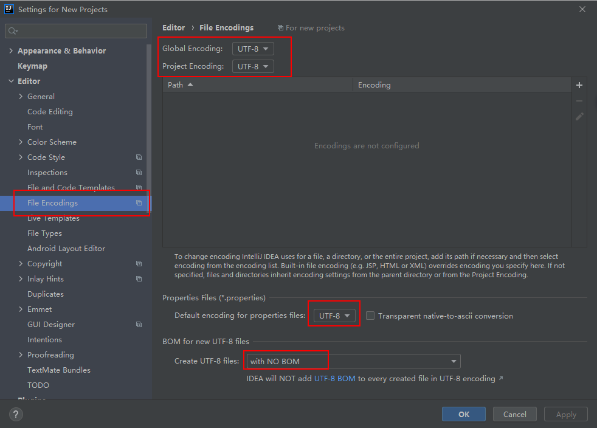
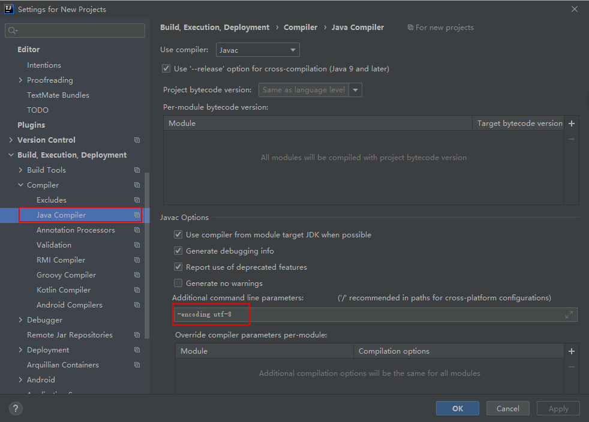
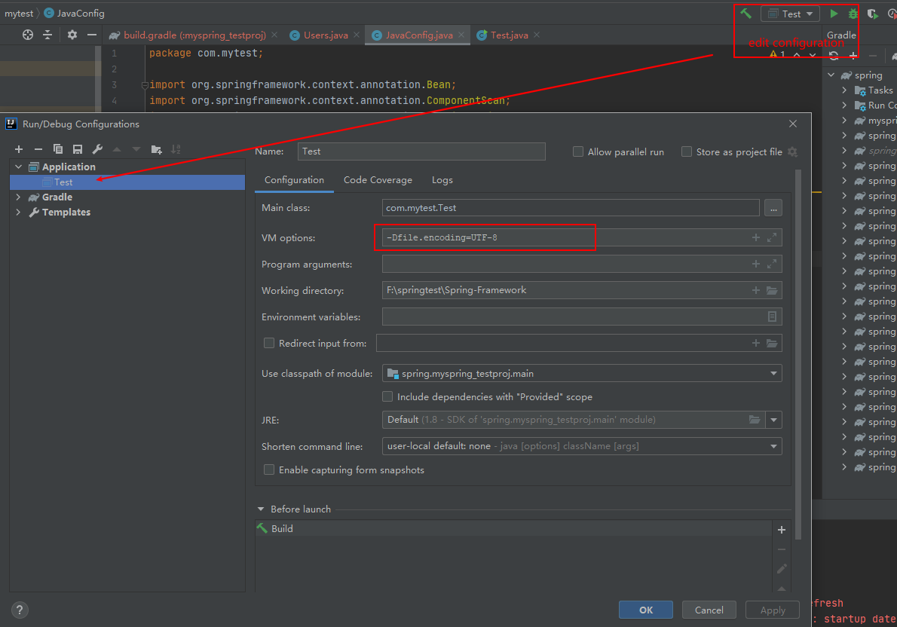
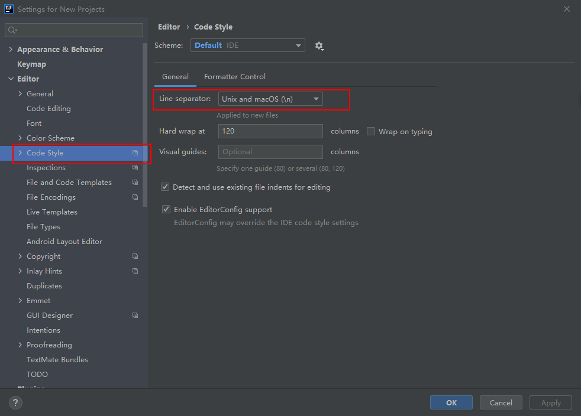

1. idea设置编码格式  

设置全局的编码格式为：utf-8
file - setting - file encodings  
设置效果如下：  

设置编译编码格式 
file - setting - compile - Java compiler  
设置效果如下：  
  

设置tomcat编码格式
待处理
 

2. 换行符设置  
file - setting - code style 
 设置效果如下：  
 

参考  
[1] https://blog.csdn.net/qq_41860358/article/details/107440268  
[2] https://blog.csdn.net/qq_39816581/article/details/105384973?utm_medium=distribute.pc_relevant.none-task-blog-BlogCommendFromMachineLearnPai2-1.channel_param&depth_1-utm_source=distribute.pc_relevant.none-task-blog-BlogCommendFromMachineLearnPai2-1.channel_param