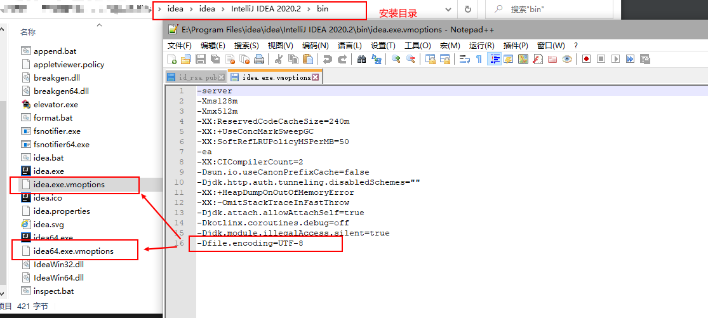
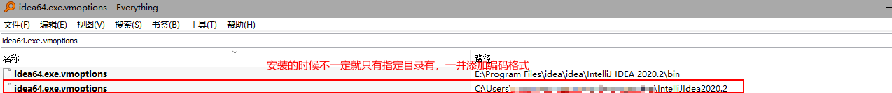

说明：以下操作适用于idea 2020.1 ultimate，其他版本可能有所出入，参考时请注意区分

1. idea设置编码格式  

设置全局的编码格式为：utf-8
file - setting - file encodings  
设置效果如下：  

设置编译编码格式 
file - setting - compile - Java compiler  
设置效果如下：  
  

设置tomcat或其他类型项目编译编码格式
   

设置idea启动相关编码格式  `-Dfile.encoding=UTF-8`
   

全局搜索idea64.exe.vmoptions和idea.exe.vmoptions，添加编码格式如上
 

2. 换行符设置  
file - setting - code style 
 设置效果如下：  
 

参考：  
[1] https://blog.csdn.net/qq_41860358/article/details/107440268  
[2] https://blog.csdn.net/qq_39816581/article/details/105384973?utm_medium=distribute.pc_relevant.none-task-blog-BlogCommendFromMachineLearnPai2-1.channel_param&depth_1-utm_source=distribute.pc_relevant.none-task-blog-BlogCommendFromMachineLearnPai2-1.channel_param  
[3] https://www.cnblogs.com/lwcode6/p/11598632.html  
[4] https://blog.csdn.net/lhc95/article/details/106931381