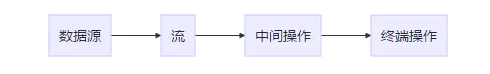
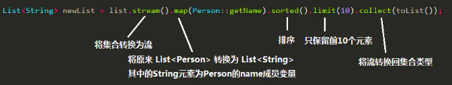

Stream知识与Lambda密切相关

1.流的概念  
=  
Stream中文称为 “流”，将集合转换为这么一种叫做 “流” 的元素序列，通过声明性方式，能够对集合中的每个元素进行一系列并行或串行的流水线操作。（指定处理规则，流帮你自动处理输入的数据）  
  
  

2.流与[集合](../Java集合/Java集合.md)
=  
区别：  
>首先，虽然集合中的元素可以进行添加删除等操作，但是其中的元素都是确定好的，计算好的；流不一样，按需进行计算，要多少，处理多少；  
>其次，集合的迭代是外部迭代，迭代过程中，我们需要对其中的每一条数据进行一条一条的处理（亲自去实现迭代的过程，并行还需要自己实现）；但是，流不用，流只要制定好规则就可以，他会自动的去执行迭代的过程（串行或者并行）；

**注意：**  
流和迭代器一样，都是一次性的，只能只用一次，否则会报错的。  


3.实践中学习  
=  
准备工作，准备好操作对象  
```java
public class Demo{
    private String demoName;
    private int num;
    //省略getter与setter方法，构造方法
}

List<Demo> list = new Arraylist<>();
list.add(new Demo("demo1",1));
list.add(new Demo("demo2",2));
list.add(new Demo("demo3",3));
```

3.1stream/paraStream()   
-  
该方法的作用就是将集合转换为流（并行的流）  
```java
List list = new ArrayList();
list.stream();
```

3.2filter(T -> boolean)  
-  
保留boolean为true的元素
```java
list = list.stream()
            .filter(demo -> demo.getNum() == 2)
            .collect(toList());//保留数字为2的元素
```

3.3distinct()  
-  
去除重复的元素，通过类的 equals 方法来判断两个元素是否相等  


3.4sorted()/sorted((T, T) -> int)  
-   
元素的类实现了 Comparable 接口，即有自己的排序规则，那么可以直接调用 sorted() 方法对元素进行排序;要不然，就需要调用 sorted((T, T) -> int) 实现 Comparator 接口
```java
//如果元素的类实现了 Comparable 接口
list = list.stream()
           .sorted()
           .collect(toList());
//没有实现 Comparable 接口
list = list.stream()
           .sorted((p1, p2) -> p1.getAge() - p2.getAge())
           .collect(toList());
//简化后效果相同
list = list.stream()
           .sorted(Comparator.comparingInt(Person::getAge))
           .collect(toList());
```

3.5limit(long n)与skip(long m)  
-  
limit(long n)：返回前 n 个元素  
skip(long m)：调过前m个元素  
这两个在一起可以玩出花样：去除集合中的第m到n个，怎么实现


3.6map(T -> R)  
-  
将流中的每一个元素 T 映射为 R（就是将一个对象转换成另一个对象，把老对象映射到新对象上），跟上collect输出一个流  
几个比较详细的[使用示例](https://blog.csdn.net/qq_43472877/article/details/104162295)  


3.7flatMap(T -> Stream<R>)  
-  
将流中的每一个元素 T 映射为一个流，再把每一个流连接成为一个流   
一个[例子](https://blog.csdn.net/mark_chao/article/details/80810030)，同时可以观察与map的区别  

3.8anyMatch(T -> boolean)、allMatch(T -> boolean)与noneMatch(T -> boolean)  
anyMatch(T -> boolean)： 是否有一个元素匹配给定的 T -> boolean 条件  
allMatch(T -> boolean)： 是否所有元素都匹配给定的 T -> boolean 条件  
noneMatch(T -> boolean)：是否没有元素匹配给定的 T -> boolean 条件  

3.9findAny() 和 findFirst()  
findAny()：找到其中一个元素  
findFirst()：找到第一个元素  
这两的使用上的[区别](https://blog.csdn.net/huanghanqian/article/details/102807972)  
值得注意的是，这两个方法返回的是一个 Optional<T> 对象，它是一个容器类，能代表一个值存在或不存在  

3.10reduce(T, (T, T) -> T)  
用于组合流中的元素，如求和，求积，求最大值等，其中的第一个参数T表示初始值，后面跟一个lambda表达式，初始值可以没有（但是由于没有初始值，需要考虑结果可能不存在的情况，因此返回的是 Optional 类型）  

3.11count()  
返回六中元素的个数，结果为long类型  

3.12collect()  
收集方法,参数是一个收集器Collector接口  
### 3.12.1收集  
toList,toSet,toCollection,toMap(转map的时候，key重复会报错，需要提供合并策略，具体的见java8 Collectors.toMap方法重载)  
### 3.12.2汇总  
#### 3.12.2.1counting
计算总和，效果等同于count(),`long l = list.stream().collect(counting());`    
#### 3.12.2.2summingInt ，summingLong ，summingDouble  
计算总和，效果等同于数值流的sum(),reduce也可以实现类似操作效果  
#### 3.12.2.3averagingInt，averagingLong，averagingDouble   
求平均数，效果等同于数值流的average()  
#### 3.12.2.4summarizingInt，summarizingLong，summarizingDouble  
返回结果比较特殊，summarizingInt返回 IntSummaryStatistics 类型，包含了计算出来的平均值，总数，总和，最值    
### 3.12.3取最值
maxBy，minBy 两个方法，需要一个 Comparator 接口作为参数  
```java
Optional<Person> optional = list.stream().collect(maxBy(comparing(Person::getAge)));
```
### 3.12.4joining连接字符串
其底层实现用的是专门用于字符串连接的 StringBuilder  
```java
String s = list.stream().map(Person::getName).collect(joining(","));
```
### 3.12.5groupingBy 分组
groupingBy 用于将数据分组，最终返回一个 Map 类型
```java
Map<Integer, List<Person>> map = list.stream().collect(groupingBy(Person::getAge));
```
还可以多级分组，
```java
Map<Integer, Map<T, List<Person>>> map = list.stream().collect(groupingBy(Person::getAge, groupingBy(...)));
```
分组收集数据
```java
Map<Integer, Integer> map = list.stream().collect(groupingBy(Person::getAge, summingInt(Person::getAge)));
```
### 3.12.6partitioningBy 分区  
分区是按照 true 和 false 来分的，因此partitioningBy 接受的参数的 lambda 是 T -> boolean
```java
Map<Boolean, List<Person>> map = list.stream().collect(partitioningBy(p -> p.getAge() <= 20));
```


3.13forEach()  
循环

4.其他操作  
=  
4.1数值流与流  
-  
由于在流操作过程中，会在没有关注的情况下发生数据类型的装箱与拆箱操作，会降低效率；引入了数值流 IntStream, DoubleStream, LongStream，这种流中的元素都是原始数据类型，分别是 int，double，long  
```
//流转换为数值流
mapToInt(T -> int) : return IntStream
mapToDouble(T -> double) : return DoubleStream
mapToLong(T -> long) : return LongStream

//数值流转换为流
Stream<Integer> stream = intStream.boxed();
```
数值流操作方法有：sum()，max()，min()，average() 等...   
数值范围分为： range（半开区间，小的闭） 和 rangeClosed（闭区间） 

4.2创建流  
-  
### 4.2.1值创建流   
```java
Stream<String> stream = Stream.of("aaa","bbb",...,"xxx", "yyy", "zzz");
//Stream.empty() : 生成空流
```
### 4.2.1数组创建流  
```java
//将数组的部分转换为流
Arrays.stream(T[ ], int, int)
```
### 4.2.3文件创建流  
```java
//每个元素是指定文件的其中一行
Stream<String> stream = Files.lines(Paths.get("data.txt"));
```
### 4.2.4函数生成流  
```java
//iterate ： 依次对每个新生成的值应用函数
Stream.iterate(0, n -> n + 2)
//generate ：接受一个函数，生成一个新的值
Stream.generate(Math :: random)
```


参考：  
1.https://www.jianshu.com/p/0bb4daf6c800?from=groupmessage  
2.https://zhangzw.com/posts/20191205.html
