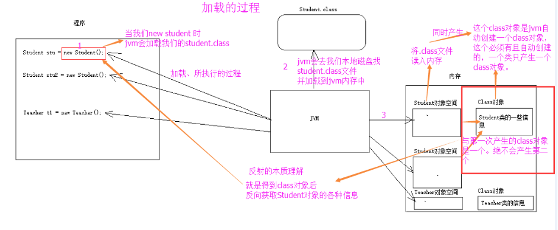
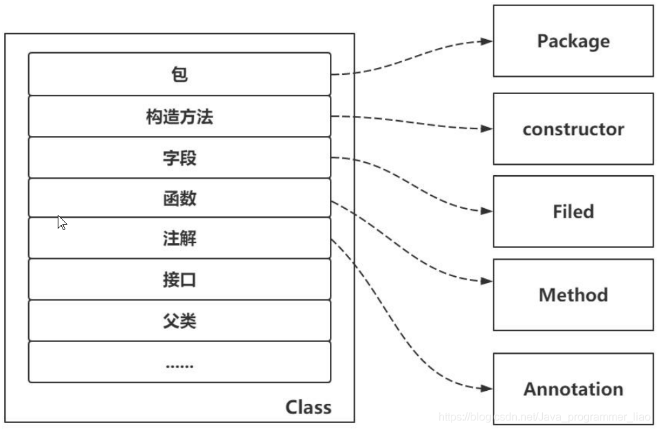

反射：能够分析类的能力的程序(反射就是把java类中的各种成分映射成一个个的Java对象)
  

作用：反射可以赋予JVM动态编译的能力  

静态编译：一次性编译。在编译的时候把你所有的模块都编译进去。
动态编译：按需编译。程序在运行的时候，用到那个模块就编译哪个模块。

适用场景：
* 第三方应用开发过程中，经常会遇到某个类的某个成员变量、方法或是属性是私有的或是只对系统应用开放，这时候就可以利用Java的反射机制通过反射来获取所需的私有成员或是方法。  
* 当我们在使用IDE(如Eclipse，IDEA)时，当我们输入一个对象或类并想调用它的属性或方法时，一按点号，编译器就会自动列出它的属性或方法，这里就会用到反射。  
* 反射最重要的用途就是开发各种通用框架。

优缺点：  
增加程序的灵活性，避免将固有的逻辑程序写死到代码里  
代码简洁，可读性强，可提高代码的复用率  

相较直接调用在量大的情景下反射性能下降  
存在一些内部暴露和安全隐患  

Class类
在程序运行期间，Java运行时系统始终为所有的对象维护一个被称为运行时的类型标识，追踪所有对象所属的类，这些信息可以通过一个专门的类去访问，这个类就是Class类（虚拟机为每个类型管理一个Class对象，不管有多少个同一类型的对象，对应的Class始终是同一个）。  
从java的万物皆对象的角度出发，类其实也是一个具体的对象，它是一个描述类（Class）的实例。  
  

使用：
查阅jdk api文档可以知道详细的使用方法
主要可以分为几部分吧：针对一个类的基本信息、字段、方法、构造器的一些操作
```java
Class c = new Son().getClass();//使用getClass获取一个Class类型的实例
Class c = Class.forName(className); //通过forName根据类名获取Class实例，可能抛出ClassNotFoundException  
Class c = Son.class;//每个类型都有class属性
c.getName();//获取类的名称
c.getSuperclass().getName();////输出Son类父类的类名
Son s = (Son) c.newInstance();//调用类的无参构造方法构造一个对象，该方法不能调用有参数构造方法，可能抛出IllegalAccessException与InstantiationException异常。
```


参考：
1.https://blog.csdn.net/Java_programmer_liao/article/details/106013181