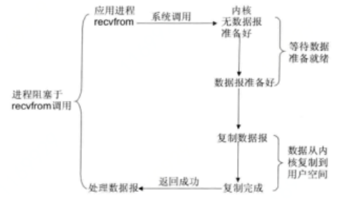
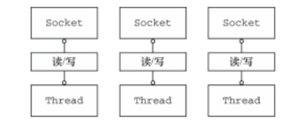
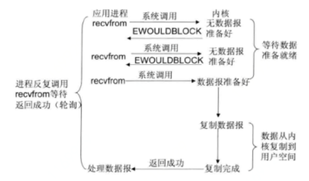
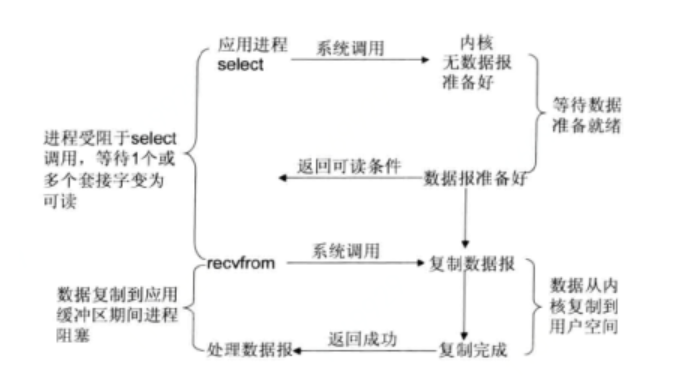
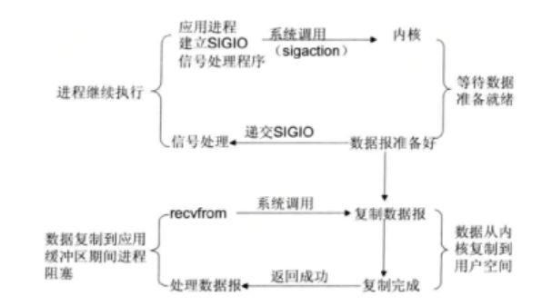
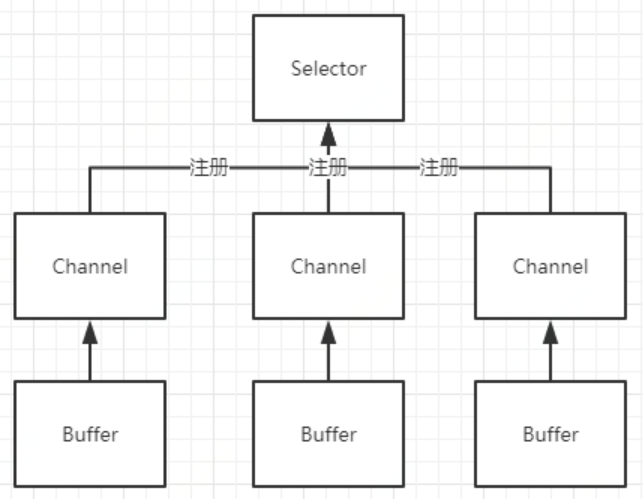
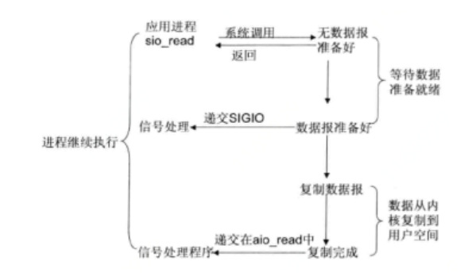
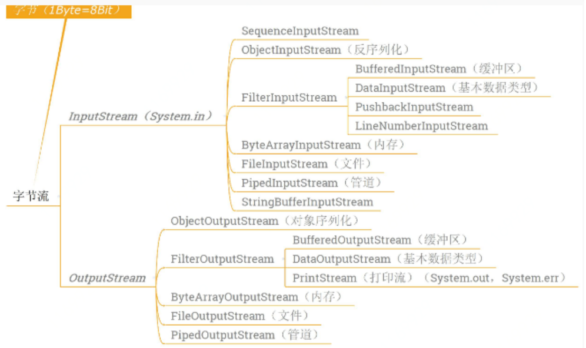
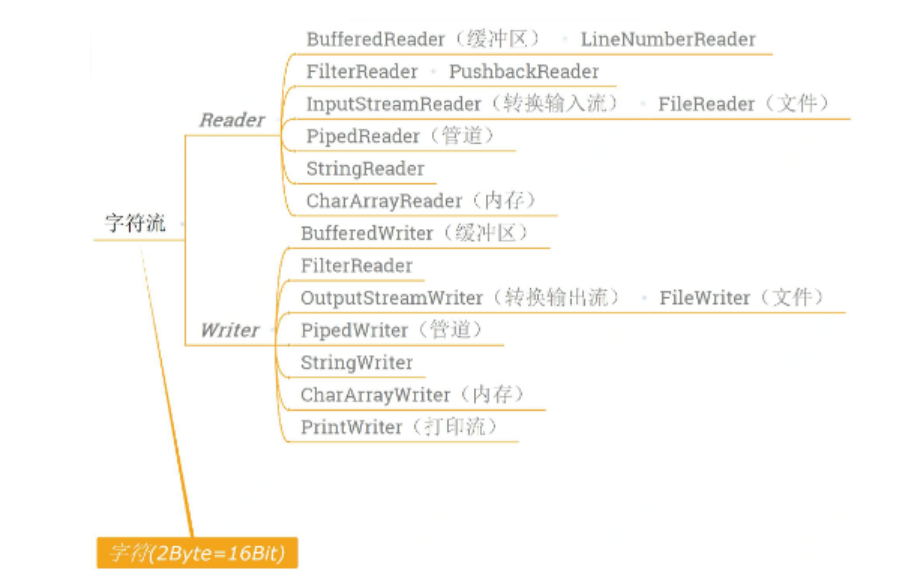

Java的io相关类设计过程是设计模式-[装饰模式](../../设计模式/设计模式headfirst.md)的一个最佳实践。


一、io模型  
=  
1.BIO  
-  
BIO是同步阻塞IO，JDK1.4之前只有这一个IO模型，BIO操作的对象是流，一个线程只能处理一个流的IO请求，如果想要同时处理多个流就需要使用多线程。(如果内核没有把数据准备好不会立刻返回，而是会经历等待数据准备就绪，数据从内核复制到用户空间之后再返回，这期间应用进程一直阻塞直到返回，所以被称为阻塞IO模型)  
  
当使用BIO模型进行Socket编程的时候，服务端通常使用while循环中调用accept方法，在没有客户端请求时，accept方法会一直阻塞，直到接收到请求并返回处理的响应。  
  
客户端并发访问数量和服务器线程数量是1:1的关系，平时由于阻塞会有大量的线程处于等待状态，等待输入或者输出数据就绪，造成资源浪费；面对大量并发的情况下，直接new线程的话，就会大致线程膨胀，系统性能下降，有可能导致堆栈的内存溢出，而且频繁的创建销毁线程，更浪费资源。  
线程池可能是更优一点的方案，但是无法解决阻塞IO的阻塞问题；数量少的话，会导致大量Socket客户端被拒绝，数量设置较大的时候，会导致大量的上下文切换，导致内存浪费。  
>BIO模型适用于链接数目固定而且比较少的架构，但是使用这种模型写的代码更直观简单易于理解。  

2.NIO  
-  
JDK 1.4版本以来，JDK发布了全新的I/O类库，简称NIO，是一种同步非阻塞IO模型(如果内核数据没有准备好，会直接返回一个EWOULDBLOCK错误，应用进程不会阻塞，但是需要应用进程不断的轮询调用recvfrom，直到内核数据准备就绪，之后等待数据从内核复制到用户空间（这段时间会阻塞，但是耗时极小），复制完成后返回)  
  
  
  
>select, poll, epoll 都是I/O多路复用的具体的实现，之所以有这三个鬼存在，其实是他们出现是有先后顺序的:select是第一个实现 (1983 左右在BSD里面实现的);(1997年）一帮人又实现了poll, poll 修复了select的很多问题;2002, 大神 Davide Libenzi 实现了epoll   

NIO核心概念：  
### 2.1缓冲区Buffer  
缓冲区本质上是一块可以写入数据，读数据的时候要从缓冲区中读，写数据的时候会先写到缓冲区，具体使用步骤分为如下的四步：    
```
写入数据到Buffer  
调用flip()方法将Buffer从写模式切换到读模式  
从Buffer中读取数据  
调用clear()方法或者compact()方法清空缓冲区，让它可以再次被写入  
```  
### 2.2通道Channel  
从通道读取到缓冲区，或者从缓冲区写入到通道中，Channel只负责运输数据  
>与流相比：通道是双向的，可以同时进行读，写操作，而流是单向流动的，只能写入或者读取；流的读写是阻塞的，通道可以异步读写。  

```java
FileInputStream fileInputStream=new FileInputStream(new File(src));
FileOutputStream fileOutputStream=new FileOutputStream(new File(dst));
//获取输入输出channel通道
FileChannel inChannel=fileInputStream.getChannel();
FileChannel outChannel=fileOutputStream.getChannel();
//创建容量为1024个byte的buffer
ByteBuffer buffer=ByteBuffer.allocate(1024);
while(true){
    //从inChannel里读数据，如果读不到字节了就返回-1，文件就读完了
    int eof =inChannel.read(buffer);
    if(eof==-1){
        break;
    }
    //将Buffer从写模式切换到读模式
    buffer.flip();
    //开始往outChannel写数据
    outChannel.write(buffer);
    //清空buffer
    buffer.clear();
}
inChannel.close();
outChannel.close();
fileInputStream.close();
fileOutputStream.close();
```  

### 2.3多路复用选择器Selector  
Selector是NIO编程的基础，主要作用就是将多个Channel注册到Selector上，如果Channel上发生读或写事件，Channel就处于就绪状态，就会被Selector轮询出来，然后通过SelectionKey就可以获取到已经就绪的Channel集合，进行IO操作。  
  

JDK中NIO使用多路复用的IO模型，在JDK1.4和1.5 update10版本之前，JDK的Selector基于select/poll模型实现，在JDK 1.5 update10以上的版本，底层使用epoll代替了select/poll（select，poll，epoll都是IO多路复用的机制。I/O多路复用就是通过一种机制，一个进程可以监视多个描述符，一旦某个描述符就绪（一般是读就绪或者写就绪），能够通知程序进行相应的读写操作。但select，poll，epoll本质上都是同步I/O，因为他们都需要在读写事件就绪后自己负责进行读写，也就是说这个读写过程是阻塞的，而异步I/O则无需自己负责进行读写）。NIO提供了两套不同的套接字通道实现网络编程，服务端：ServerSocketChannel和客户端SocketChannel，两种通道都支持阻塞和非阻塞模式  


3.异步IO  
-  
JDK1.7升级了Nio类库，成为Nio2.0，最主要的是提供了异步文件的IO操作，以及事件驱动IO，AIO的异步套接字通道是真正的异步非阻塞IO(在Linux系统中，应用进程发起read操作，立刻可以去做其他的事，内核会将数据准备好并且复制到用空间后告诉应用进程，数据已经复制完成read操作)  
  

aio通过异步通道实现异步操作，异步通道提供了两种方式  
通过Future类来获取异步操作的结果，不过要注意的是future.get()是阻塞方法，会阻塞线程  
通过回调的方式进行异步，通过传入一个CompletionHandler的实现类进行回调，CompletionHandler定义了两个方法，completed和failed两方法分别对应成功和失败  

AIO提供了对应的异步套接字通道实现网络编程，服务端：AsynchronousServerSocketChannel和客户端AsynchronousSocketChannel。  


[有趣的理解](https://www.zhihu.com/question/32163005/answer/255238636)：  
```
1.阻塞I/O模型老李去火车站买票，排队三天买到一张退票。
耗费：在车站吃喝拉撒睡 3天，其他事一件没干。
2.非阻塞I/O模型老李去火车站买票，隔12小时去火车站问有没有退票，三天后买到一张票。
耗费：往返车站6次，路上6小时，其他时间做了好多事。
3.I/O复用模型
  1.select/poll老李去火车站买票，委托黄牛，然后每隔6小时电话黄牛询问，黄牛三天内买到票，然后老李去火车站交钱领票。 
  耗费：往返车站2次，路上2小时，黄牛手续费100元，打电话17次
  2.epoll老李去火车站买票，委托黄牛，黄牛买到后即通知老李去领，然后老李去火车站交钱领票。 
  耗费：往返车站2次，路上2小时，黄牛手续费100元，无需打电话
4.信号驱动I/O模型老李去火车站买票，给售票员留下电话，有票后，售票员电话通知老李，然后老李去火车站交钱领票。  
耗费：往返车站2次，路上2小时，免黄牛费100元，无需打电话
5.异步I/O模型老李去火车站买票，给售票员留下电话，有票后，售票员电话通知老李并快递送票上门。 
耗费：往返车站1次，路上1小时，免黄牛费100元，无需打电话
```


二、java io  
=  
BIO中操作的流主要有两大类，字节流和字符流，两类根据流的方向都可以分为输入流和输出流  
字节流主要用来处理字节或二进制对象  
输入字节流：InputStream  
输出字节流：OutputStream  
>InputStream/OutputStream都是抽象类，实例化的都是子类（每个子类有不同的作用范围）  
  
```java
public static void main(String[] args) throws Exception{
    File file = new File("D:/a.txt");
    InputStream inputStream = new FileInputStream(file);
    byte[] bytes = new byte[(int) file.length()];
    inputStream.read(bytes);
    System.out.println(new String(bytes));
    inputStream.close();
}

public static void main(String[] args) throws Exception{
    String var = "hai this is a test";
    File file = new File("D:/b.txt");
    OutputStream outputStream = new FileOutputStream(file);
    outputStream.write(var.getBytes());
    outputStream.close();
}
```
缓冲区，提高io速度  
```java
BufferedInputStream bufferedInputStream = new BufferedInputStream(inputStream,1024);

BufferedOutputStream bufferedOutputStream = new BufferedOutputStream(outputStream,1024);
```

字符流用来处理字符文本或字符串  
输入字符流：Reader  
输出字符流：Writer  
>Reader/Writer都是抽象类，实例化的都是子类（每个子类有不同的作用范围）  
  
```java
public static void main(String[] args) throws Exception{
    File file = new File("D:/a.txt");
    Reader reader = new FileReader(file);
    char[] bytes = new char[(int) file.length()];
    reader.read(bytes);
    System.out.println(new String(bytes));
    reader.close();
}

public static void main(String[] args) throws Exception{
    String var = "hai this is a test";
    File file = new File("D:/b.txt");
    Writer writer = new FileWriter(file);
    writer.write(var);
    writer.close();
}
```
缓冲区，提高io速度  
```java
BufferedReader bufferedReader = new BufferedReader(reader,1024);

BufferedWriter bufferedWriter = new BufferedWriter(writer,1024);
```

>桥梁：使用InputStreamReader可以将输入字节流转化为输入字符流;使用OutputStreamWriter可以将输出字节流转化为输出字符流。 
```java
Reader reader  =  new InputStreamReader(inputStream);
Writer writer = new OutputStreamWriter(outputStream);
```


参考：  
1.https://chenmingyu.top/nio/  
2.https://www.zhihu.com/question/32163005/answer/255238636(有趣的理解)  
3.http://ifeve.com/java-nio-all/  
4.https://www.cnblogs.com/wugongzi/p/12092326.html（比较全的实操栗子）