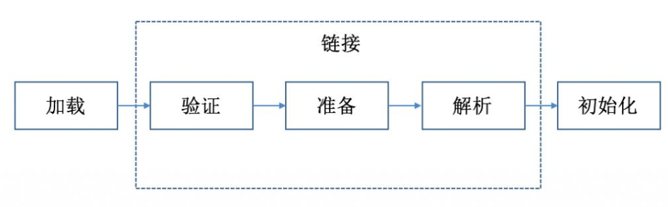

类的加载过程如下所示：  
  
加载  
>将class字节码加载到内存中，并为之创建一个java.lang.Class对象（系统中所有的类都是java.lang.Class的实例）。这里就会涉及到[类加载器](./Java基础学习(98)-类加载器.md)的相关知识。  
>来源包括：从本地文件系统加载class文件；从JAR包中加载class文件，如JAR包的数据库启驱动类；通过网络加载class文件；把一个Java源文件动态编译并执行加载。  

链接  
>连接阶段负责把类的二进制数据合并到JRE中
链接包含：  
验证  
>主要是为了保证加载进来的字节流符合虚拟机规范，不会造成安全错误。  

准备  
>主要是为类变量（注意，不是实例变量）分配内存，并且赋予初值（不是初始化的值，而是ava虚拟机根据不同变量类型的默认初始值，`8种基本类型的初值；引用类型的初值则为null；常量的初值即为代码中设置的值`）

解析  
>将常量池内的符号引用(即一个字符串，但是这个字符串给出了一些能够唯一性识别一个方法，一个变量，一个类的相关信息)替换为直接引用(可以理解为一个内存地址，或者一个偏移量，类方法，类变量的直接引用是指向方法区的指针；而实例方法，实例变量的直接引用则是从实例的头指针开始算起到这个实例变量位置的偏移量)的过程。  

  
现在调用方法hello()，这个方法的地址是1234567，那么hello就是符号引用，1234567就是直接引用。  

初始化  
>这个阶段主要是对类变量初始化，是执行类构造器的过程(换句话说，只对static修饰的变量或语句进行初始化)。如果初始化一个类的时候，其父类尚未初始化，则优先初始化其父类。如果同时包含多个静态变量和静态代码块，则按照自上而下的顺序依次执行。  


基于上述的类加载过程，我们可以得出，类的初始化顺序： 
>初始化顺序依次是：（静态变量、静态初始化块）–>（变量、初始化块）–> 构造器；   
>如果有父类，则顺序是：父类static方法 –> 子类static方法 –> 父类构造方法- -> 子类构造方法   

详细的过程就是  
```
父类静态代码块  
父类静态变量  
子类静态代码块  
子类静态变量  
父类实例代码块   
父类实例变量  
父类构造方法  
子类实例代码块  
子类实例变量  
子类构造方法  
```

参考：  
1.https://blog.csdn.net/ln152315/article/details/79223441?utm_medium=distribute.pc_relevant_t0.none-task-blog-BlogCommendFromMachineLearnPai2-1.add_param_isCf&depth_1-utm_source=distribute.pc_relevant_t0.none-task-blog-BlogCommendFromMachineLearnPai2-1.add_param_isCf  
2.https://blog.csdn.net/cnahyz/article/details/82219210  
3.https://blog.csdn.net/weixin_43260413/article/details/109550169  