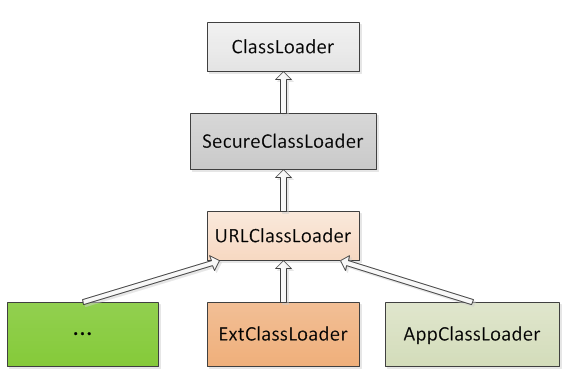
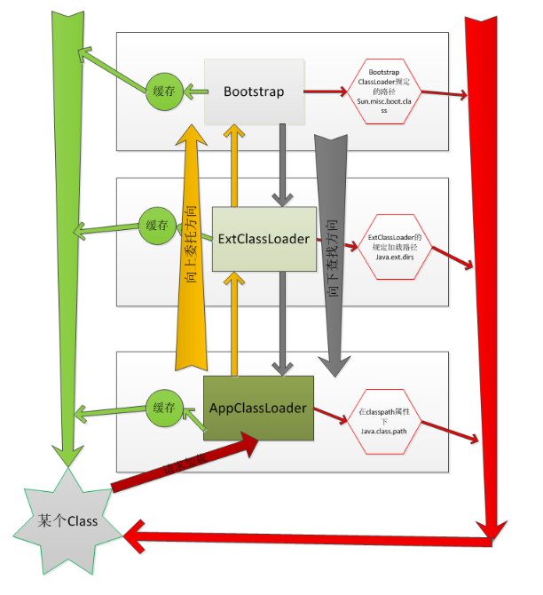

ClassLoader负责负责加载JAVA类（classes）的对象  

[环境变量的配置](./00环境变量配置.md)其中的Classpath就与类加载有关  

1.类加载器分类及工作原理
=  
Bootstrap ClassLoader   
最顶层的加载类，主要加载核心类库，%JRE_HOME%\lib下的rt.jar、resources.jar、charsets.jar和class等（扩展：java -Xbootclasspath/a:path被指定的文件追加到默认的bootstrap路径中）。    

Extention ClassLoader  
扩展的类加载器，加载目录%JRE_HOME%\lib\ext目录下的jar包和class文件（扩展：-D java.ext.dirs选项指定的目录）。  

Appclass Loader（SystemAppClass）  
加载当前应用的classpath的所有类。  

从关键部分源码看加载过程：  
```java
public class Launcher {
    private static Launcher launcher = new Launcher();
    private static String bootClassPath =
        System.getProperty("sun.boot.class.path");
    //-Xbootclasspath,Bootstrap ClassLoader

    public static Launcher getLauncher() {
        return launcher;
    }

    private ClassLoader loader;

    public Launcher() {
        // Create the extension class loader  
        // java.ext.dirs Extention ClassLoader  
        ClassLoader extcl;
        try {
            extcl = ExtClassLoader.getExtClassLoader();
        } catch (IOException e) {
            throw new InternalError(
                "Could not create extension class loader", e);
        }

        // Now create the class loader to use to launch the application
        // java.class.path   Appclass Loader
        try {
            //这里可以说明AppClassLoader的父加载器为ExtClassLoader
            loader = AppClassLoader.getAppClassLoader(extcl);
        } catch (IOException e) {
            throw new InternalError(
                "Could not create application class loader", e);
        }

        //设置AppClassLoader为线程上下文类加载器，这个文章后面部分讲解
        Thread.currentThread().setContextClassLoader(loader);
    }

    /*
     * Returns the class loader used to launch the main application.
     */
    public ClassLoader getClassLoader() {
        return loader;
    }
    /*
     * The class loader used for loading installed extensions.
     */
    static class ExtClassLoader extends URLClassLoader {

        /**
         * create an ExtClassLoader. The ExtClassLoader is created
         * within a context that limits which files it can read
         */
        public static ExtClassLoader getExtClassLoader() throws IOException
        {
            final File[] dirs = getExtDirs();

            try {
                // Prior implementations of this doPrivileged() block supplied
                // aa synthesized ACC via a call to the private method
                // ExtClassLoader.getContext().

                return AccessController.doPrivileged(
                    new PrivilegedExceptionAction<ExtClassLoader>() {
                        public ExtClassLoader run() throws IOException {
                            //ExtClassLoader在这里创建
                            return new ExtClassLoader(dirs);
                        }
                    });
            } catch (java.security.PrivilegedActionException e) {
                throw (IOException) e.getException();
            }
        }


        /*
         * Creates a new ExtClassLoader for the specified directories.
         */
        public ExtClassLoader(File[] dirs) throws IOException {
            //父类也就是URLClassLoder的构造方法并传递了3个参数
            super(getExtURLs(dirs), null, factory);
        }
        //结合URLClassLoder的实际构造方法，可以看出parent是null
        //  public  URLClassLoader(URL[] urls, ClassLoader parent,
        //                           URLStreamHandlerFactory factory) {
        //      super(parent);
        // }
        }
 }

/**
     * The class loader used for loading from java.class.path.
     * runs in a restricted security context.
     */
    static class AppClassLoader extends URLClassLoader {}
```
上面包含的最关键的信息就是：  
>BootstrapClassLoader、ExtClassLoader、AppClassLoader实际是查阅相应的环境属性sun.boot.class.path、java.ext.dirs和java.class.path来加载资源文件的  


```java
public abstract class ClassLoader {
    // The parent class loader for delegation
    // Note: VM hardcoded the offset of this field, thus all new fields
    // must be added *after* it.
    private final ClassLoader parent;
    // The class loader for the system
        // @GuardedBy("ClassLoader.class")
    private static ClassLoader scl;

    private ClassLoader(Void unused, ClassLoader parent) {
        this.parent = parent;
        ...
    }
    //构造函数1，指定parent的ClassLoader
    protected ClassLoader(ClassLoader parent) {
        this(checkCreateClassLoader(), parent);
    }
    //构造函数1，不指定,getSystemClassLoader获取父加载器
    protected ClassLoader() {
        this(checkCreateClassLoader(), getSystemClassLoader());
    }
    public final ClassLoader getParent() {
        if (parent == null)
            return null;
        return parent;
    }
    public static ClassLoader getSystemClassLoader() {
        //获取父加载器
        initSystemClassLoader();
        if (scl == null) {
            return null;
        }
        return scl;
    }

    private static synchronized void initSystemClassLoader() {
        if (!sclSet) {
            if (scl != null)
                throw new IllegalStateException("recursive invocation");
            sun.misc.Launcher l = sun.misc.Launcher.getLauncher();
            if (l != null) {
                Throwable oops = null;
                //通过Launcher获取ClassLoader，实际就是AppClassLoader了
                scl = l.getClassLoader();
                try {
                    scl = AccessController.doPrivileged(
                        new SystemClassLoaderAction(scl));
                } catch (PrivilegedActionException pae) {
                    oops = pae.getCause();
                    if (oops instanceof InvocationTargetException) {
                        oops = oops.getCause();
                    }
                }
                if (oops != null) {
                    if (oops instanceof Error) {
                        throw (Error) oops;
                    } else {
                        // wrap the exception
                        throw new Error(oops);
                    }
                }
            }
            sclSet = true;
        }
    }
}

```   
  
每个类加载器都有一个父加载器，父加载器不是父类（一个ClassLoader创建时如果没有指定parent，那么它的parent默认就是AppClassLoader，AppClassLoader的parent是ExtClassLoader，ExtClassLoader的parent是null）

那么Bootstrap ClassLoader是如何成为ExtClassLoader的父加载器的？？？  
>Bootstrap ClassLoader是由C/C++编写的，它本身是虚拟机的一部分，并不是一个JAVA类。  

这里就涉及到***双亲委托***了  
  
>双亲委托工作流程的的大致描述：当我们需要加载一个类class的时候，首先让AppClassLoader去缓存中找，找不到，委托他的父加载器ExtClassLoader；ExtClassLoader在缓存中找，还是找不到就去委托Bootstrap ClassLoader；一样的，Bootstrap ClassLoader先在缓存中寻找，找不到，就该在指定的路径下（环境变量指定）sun.mic.boot.class找，还是找不到，就告诉ExtClassLoader，让他去他的指定路径java.ext.dirs下找找看；ExtClassLoader还是找不到，就告诉AppClassLoader，去java.class.path找找吧（该找的地方都找了，还找不到就没得办法了，报异常吧）。

对应到具体一点的代码上的步骤就是：  
>执行findLoadedClass(String)去检测这个class是不是已经加载过了；执行父加载器的loadClass方法，如果父加载器为null，则jvm内置的加载器去替代，也就是Bootstrap ClassLoader（解释了ExtClassLoader的parent为null,但仍然说Bootstrap ClassLoader是它的父加载器）如果向上委托父加载器没有加载成功，则通过findClass(String)查找；如果class在上面的步骤中找到了，参数resolve又是true的话，那么loadClass()又会调用resolveClass(Class)这个方法来生成最终的Class对象。  
```java

protected Class<?> loadClass(String name, boolean resolve)
        throws ClassNotFoundException
    {
        synchronized (getClassLoadingLock(name)) {
            // 首先，检测是否已经加载
            Class<?> c = findLoadedClass(name);
            if (c == null) {
                long t0 = System.nanoTime();
                try {
                    if (parent != null) {
                    	//父加载器不为空则调用父加载器的loadClass
                        c = parent.loadClass(name, false);
                    } else {
                    	//父加载器为空则调用Bootstrap Classloader
                        c = findBootstrapClassOrNull(name);
                    }
                } catch (ClassNotFoundException e) {
                    // ClassNotFoundException thrown if class not found
                    // from the non-null parent class loader
                }

                if (c == null) {
                    // If still not found, then invoke findClass in order
                    // to find the class.
                    long t1 = System.nanoTime();
                    //父加载器没有找到，则调用findclass
                    c = findClass(name);

                    // this is the defining class loader; record the stats
                    sun.misc.PerfCounter.getParentDelegationTime().addTime(t1 - t0);
                    sun.misc.PerfCounter.getFindClassTime().addElapsedTimeFrom(t1);
                    sun.misc.PerfCounter.getFindClasses().increment();
                }
            }
            if (resolve) {
            	//调用resolveClass()
                resolveClass(c);
            }
            return c;
        }
    }

```


2.骚操作--自定义类加载器  
-   
  
说在前面：自定义一个classloader，覆盖findClass()方法比较合适，而不要直接改写loadClass()方法。  

自定义类加载：原来那几个加载器的搜索路径都是确定的，当我们想要动态改变的时候，就需要自定义加载器了。实现思路：  
1. 编写一个类继承自ClassLoader抽象类。
2. 复写它的findClass()方法。
3. 在findClass()方法中调用defineClass()。

太抽象了，举个栗子吧  
    

首先，搞一个我们要测试用的类，编译成class文件，放到指定的目录下    
```java
package com.frank.test;
public class Test {
	
	public void say(){
		System.out.println("Say Hello");
	}

}
```
然后，自定义一个类   
```java

import java.io.ByteArrayOutputStream;
import java.io.File;
import java.io.FileInputStream;
import java.io.FileNotFoundException;
import java.io.IOException;


public class DiskClassLoader extends ClassLoader {
	
	private String mLibPath;
	
	public DiskClassLoader(String path) {
		// TODO Auto-generated constructor stub
		mLibPath = path;
	}

	@Override
	protected Class<?> findClass(String name) throws ClassNotFoundException {
		// TODO Auto-generated method stub
		
		String fileName = getFileName(name);
		
		File file = new File(mLibPath,fileName);
		
		try {
			FileInputStream is = new FileInputStream(file);
			
			ByteArrayOutputStream bos = new ByteArrayOutputStream();
			int len = 0;
	        try {
	            while ((len = is.read()) != -1) {
	            	bos.write(len);
	            }
	        } catch (IOException e) {
	            e.printStackTrace();
	        }
	        
	        byte[] data = bos.toByteArray();
	        is.close();
	        bos.close();
	        
	        return defineClass(name,data,0,data.length);
			
		} catch (IOException e) {
			// TODO Auto-generated catch block
			e.printStackTrace();
		}
		
		return super.findClass(name);
	}

	//获取要加载 的class文件名
	private String getFileName(String name) {
		// TODO Auto-generated method stub
		int index = name.lastIndexOf('.');
		if(index == -1){ 
			return name+".class";
		}else{
			return name.substring(index+1)+".class";
		}
	}
	
}


```
最后，来一个测试类   
```java

import java.lang.reflect.InvocationTargetException;
import java.lang.reflect.Method;

public class ClassLoaderTest {

	public static void main(String[] args) {
		// TODO Auto-generated method stub
	
		//创建自定义classloader对象。(路径就是放测试用的class的路径)
		DiskClassLoader diskLoader = new DiskClassLoader("D:\\lib");
		try {
			//加载class文件
			Class c = diskLoader.loadClass("com.frank.test.Test");
			
			if(c != null){
				try {
					Object obj = c.newInstance();
					Method method = c.getDeclaredMethod("say",null);
					//通过反射调用Test类的say方法
					method.invoke(obj, null);
				} catch (InstantiationException | IllegalAccessException 
						| NoSuchMethodException
						| SecurityException | 
						IllegalArgumentException | 
						InvocationTargetException e) {
					// TODO Auto-generated catch block
					e.printStackTrace();
				}
			}
		} catch (ClassNotFoundException e) {
			// TODO Auto-generated catch block
			e.printStackTrace();
		}
		
	}

}


```


参考：  
1.https://blog.csdn.net/briblue/article/details/54973413  
2.https://blog.csdn.net/cnahyz/article/details/82219210