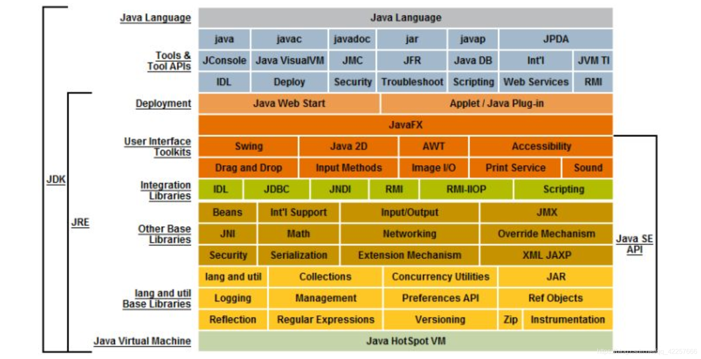

发展史   
Java之父: 詹姆斯·高斯林
1.0----1.4   
5.0----   
（5.0发生重大变化.8.0和11.0比较重要，常用，9和10过渡性质的）  

JDK JRE

JDK(Java Development Kit)是整个JAVA的核心，包括了Java运行环境JRE（Java Runtime Envirnment）、一堆Java开发工具（javac/java/jdb等）和Java基础的类库（即Java API 包）    
在JDK下面的的jre目录里面有两个文件夹bin和lib,在这里可以认为bin里的就是jvm，lib中则是jvm工作所需要的类库，而jvm和 lib和起来就称为jre。  
利用JDK（调用JAVA API）开发了属于我们自己的JAVA程序后，通过JDK中的编译程序（javac）将我们的文本java文件编译成JAVA字节码，在JRE上运行这些JAVA字节码，JVM解析这些字节码，映射到CPU指令集或OS的系统调用。  

安装JDK与环境变量配置(百度得到详细操作步骤)  
安装以后为了方便的使用JDK中带的工具，不需要每次定位到安装目录下才可以使用，所以需要配置环境变量。  
PATH:JAVA_HOME相对路径`%JAVA_HOME%\bin`  
JAVA_HOME:安装JDK的绝对路径`自己的安装路径`    

java程序开发三步走  
编写.java  
编译javac  
运行java  

java程序的常见内容：
注释：  
单行注释`//`  
多行注释`/* */`  
文档注释`/** */`  
