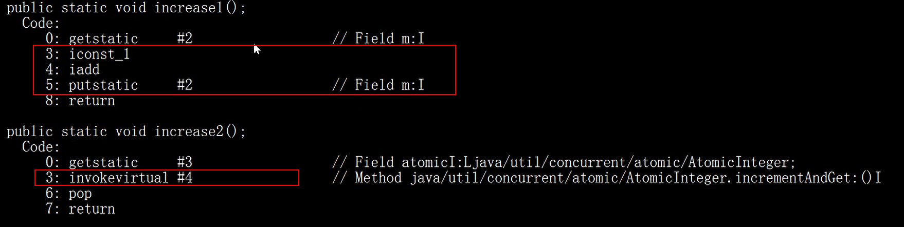

为什么要学这个知识  
多线程中，为了保证数据一致性，我们学习到了synchronized、volatile、单例模式，这里面都涉及到了锁这个东西，CAS和AQS就是基础知识。  
锁：
悲观锁：写（增删改）操作多，读（查）操作少---Lock  
乐观锁：读（查）操作多，写（增删改）操作少---版本  


1.CAS
=  
compare and set/compare and swap  一种**无锁**的**原子**算法，乐观锁  
一个期望值，与现有的值比较，若相等，则进行修改；否则，什么事情都不做。
CAS（V(现在取到的数值)，E（期望值），N（修改后的值））  
V和E用来判断这个目标值是否被别人操作过，修改了  

作用：实现操作叫为复杂，但是无锁，不会阻塞，效率高，提高CPU的吞吐量，性能好  

```java
public class CasDemo{
    private static volatile int m = 0;
    private static AtomicInteger atomic = new AtomicInteger(0);
    public static void increase(){
        m++;
    }

    public static void increase2(){
        atomic.incrementAndGet();//++i
    }
    //结果还是异常，因为主程序先结束了
    // public static void main(String[] args){
    //     for(int i=0;i<20;i++){
    //         new Thread(()->{
    //             CasDemo.increase();
    //             CasDemo.increase2();
    //         }).satrt();
    //     }
    //     atomic.get();
    // }

    //结果都是20，但是实现原理是不也一样的
    public static void main(String[] args) throws InterruptedException{
        Thread[] t = new Thread[20];
        for(int i=0;i<20;i++){
            t[i] = new Thread(()->{
                CasDemo.increase();
            }); 
            t[i].start();
            t[i].join();//线程有交互性，
        }
        
        Thread[] tf = new Thread[20];
        for(int i=0;i<20;i++){
            tf[i] = new Thread(()->{
                CasDemo.increase2();
            }); 
            tf[i].start();
            tf[i].join();
        }

    }
    

}

```  
CAS实现的底层原理：  

 根据incrementandget()，找到虚拟机的源码（是c++编写的）unsafe，其中中可以找到对应的实现代码，继续找到实现的对应的汇编指令（硬件支持）。  
 从而，incrementandget()保证了自增操作的原子性  

JDK的原子整型等原子类AtomicInteger  

CAS存在的问题：ABA（A先被一个线程改为B，然后被另一个线程改回A，第三个线程看不出这个A已经和原来的A不一样了）  

AtomicStampedReference
为了解决这个问题，在后面加了一个版本，用来区分A与A不一样了（时间戳）。

适用场景：  
简单的数据计算  
冲突比较少的场景  


2.AQS
=  
AbstractQueuedSychronizer  同步发生器   构建Lock（JUC包java.util.concurrent）  

基本思想  
内置的FIFO同步队列来完成线程争夺资源的管理工作  

CLH同步队列  

来一个线程就去获取state的值，如果是0，没有线程占用，就可以获取到锁  
如果不为0，说明被其他线程占用了，加入等待队列CLH队列（CLH队列中的线程都是在等待的线程，处于自旋状态（为了减轻切换内核线程的代价），直到线程获取到锁）  
原理图(../../流程图/同步队列.drawio)  

自定义锁  
  

AQS写一个锁  
AQS子类定义为非公共内部帮助器类（私有的内部类继承AQS），写锁的时候的一个帮助器，提供获取锁和释放锁的功能模板  
acquire：以独占模式获取对象，忽略中断  
acquireShared：以共享模式获取对象，忽略中断  
tryAcquire:试图在独占模式下获取对象的状态  
tryAcquireShared：试图在共享模式下获取对象状态  

release：以独占模式释放锁
releaseShared：以共享模式释放锁


3.自定义锁  
=  


