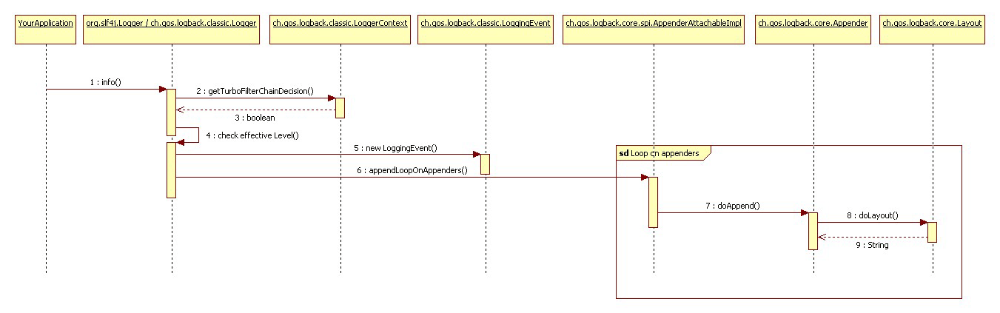

需要知道的是
logback继承自log4j  
分成logback-core（基础） logback-calssic（log4j优化版本） logback-access（与servlet容器整合，如tomcat）三个模块  
配合SLF4J使用


1利用hello world初探logback  
-
```
package chapters.introduction;
import org.slf4j.Logger;
import org.slf4j.LoggerFactory;//定义在 SLF4J API 中，在 org.slf4j 包中。
public class HelloWorld1 {
    public static void main(String[] args) {
        Logger logger = LoggerFactory.getLogger("chapters.introduction.HelloWorld1");
        logger.debug("hello world");//DEBUG 级别的日志语句
    }
}
```
运行后，控制台会有输出，这是因为logback 默认的配置策略：当没有默认的配置时，logback 将会在 root logger 中新增一个 ConsoleAppender。  
为验证上述说法，可以通过StatusManager来获取发生在 logback 生命周期中的事件，查看logback的内部状态，可以帮助查找，解决logback相关的问题。
```
// 打印内部的状态
LoggerContext lc = (LoggerContext)LoggerFactory.getILoggerFactory();
StatusPrinter.print(lc);
```
从控制台输出的结果中，可以看出，由于没有找到logback-test.xml 和 logback.xml 配置文件，采取了默认设置添加了一个ConsoleAppender（Appender 类被看作为输出的目的地，包括 console，files，Syslog，TCP Sockets，JMS 等等其它的日志输出目的地）  

三步开启记录日志：
* 配置logback环境
* 将当前累的全称或者当前类作为参数，传给org.slf4j.LoggerFactory.getLogger()
* 使用logger 来调用不同的方法来打印日志


2.看看logback的构成
-
logback主要是通过Logger（logback-classic 模块的一部分），【Appender 和 Layouts】（logback-core 的一部分）三个类进行构建的。

【logger】  
Logger上下文：分类是logger的一部分（依据开发人员设定的标准，对包含所有可能日志语句的日志空间进行分类），每一个logger都依附于LoggerContext。LoggerContext负责产生、管理logger。
root logger是一个特殊的logger，是每一层次结构的一部分，每一个logger都可以通过他的名字获取。  
`Logger rootLogger = LoggerFactory.getLogger(org.slf4j.Logger.ROOT_LOGGER_NAME)`
所有其他的logger通过org.slf4j.LoggerFactory 类的静态方法 getLogger 获取（需要传入一个logger的名字，hellword中传入类，实际里面通过类获取类名作为参数了）   

Logger的有效等级：logger可以被分成TRACE, DEBUG, INFO, WARN, ERROR 五个等级（定义在 ch.qos.logback.classic.Level 类中，Level 类被final修饰，不能继承）。每一个logger都会有对应的等级，如果没有指定等级，会按照规定的方法为他确定一个等级（一直向上查找，找到第一个有指定等级的层级，并将其对应等级作为自己的等级，root logger默认debug级别）。  
各级别的排序为：TRACE < DEBUG < INFO < WARN < ERROR  
对应各个等级，logger接口中有以下几个方法：
```
package org.slf4j; 
public interface Logger { 
  public void trace(String message);
  public void debug(String message);
  public void info(String message); 
  public void warn(String message); 
  public void error(String message); 
}
```  
如果日志的打印级别大于等于logger设置的有效级别，就可以被打印出来。
手册上的一个例子：
```
// ch.qos.logback.classic.Logger 可以设置日志的级别
// 获取一个名为 "com.foo" 的 logger 实例
ch.qos.logback.classic.Logger logger = 
        (ch.qos.logback.classic.Logger)LoggerFactory.getLogger("com.foo");
// 设置 logger 的级别为 INFO
logger.setLevel(Level.INFO);
// 这条日志可以打印，因为 WARN >= INFO
logger.warn("警告信息");
// 这条日志不会打印，因为 DEBUG < INFO
logger.debug("调试信息");
// "com.foo.bar" 会继承 "com.foo" 的有效级别
Logger barLogger = LoggerFactory.getLogger("com.foo.bar");
// 这条日志会打印，因为 INFO >= INFO
barLogger.info("子级信息");
// 这条日志不会打印，因为 DEBUG < INFO
barLogger.debug("子级调试信息");
```  

获取logger
通过LoggerFactory.getLogger() 可以获取到具体的 logger 实例，名字相同则返回的 logger 实例也相同。
```
//x，y 是同一个 logger 对象
Logger x = LoggerFactory.getLogger("wombat");
Logger y = LoggerFactory.getLogger("wombat");
```   
logback 环境的配置会在应用初始化的时候完成(最优的方式是通过读取配置文件)。  
根据类的全限定名来对 logger 进行命名，是目前最好的方式，没有之一。（因为日志能够输出logger的名字，看出日志的来源）

【Appender 与 Layout】  
输出目的地叫做 appender。包括console、file、remote socket server、MySQL、PostgreSQL、Oracle 或者其它的数据库、JMS、remote UNIX Syslog daemons 中。（可以输出到多个目的地\[前提是允许的日志输出\]，通过 addAppender 方法来新增一个 appender）  
默认情况下，appender具有继承叠加性，子级会根据父级的appender进行叠加，可以设置 additivity = false 来改写默认设置。  

 layout 可以自定义日志的输出格式。  
 参数化日志：
```
//两种常见方法比较 
//1.直接输出，产生构建消息参数的成本
logger.debug("Entry number: " + i + " is " + String.valueOf(entry[i])); 

//2.直接输出的改进版，避免构建消息参数的成本
if(logger.isDebugEnabled()) { 
  logger.debug("Entry number: " + i + " is " + String.valueOf(entry[i]));
}

//3.更好的选择，只有在需要打印debug信息的时候才会进行格式化
Object entry = new SomeObject();
logger.debug("The entry is {}", entry);
```  

结合上面的组件介绍，日志方法被调用以后的执行流程为：


* 获取过滤器链  
    如果存在，TurboFilter过滤器会被调用， Turbo根据设置的阈值或者日志请求信息（Marker, Level， Logger， 消息，Throwable ）过滤事件。  
    如果是 FilterReply.NEUTRAL，则会继续执行下一步，例如：第二步。如果响应是 FilterRerply.ACCEPT，则会直接跳到第三步。
* 应用的基本选择规则  
    logback 会比较有效级别与日志请求的级别，如果日志请求被禁止，那么 logback 将会丢弃调这条日志请求，并不会再做进一步的处理，否则的话，则进行下一步的处理。
* 创建LoggingEvent对象  
    如果日志请求通过了之前的过滤器，logback 将会创建一个 ch.qos.logback.classic.LoggingEvent 对象，这个对象包含了日志请求所有相关的参数，请求的 logger，日志请求的级别，日志信息，与日志一同传递的异常信息，当前时间，当前线程，以及当前类的各种信息和 MDC。
* 调用 appender  
    logback 会调用所有可用 appender 的 doAppend() 方法，这些 appender 继承自 logger 上下文。
* 格式化输出
    被调用的 appender 负责格式化日志时间。layout 格式化 LoggingEvent 实例并返回一个字符串。
* 发送 LoggingEvent
    当日志事件被完全格式化之后将会通过每个 appender 发送到具体的目的地。  

logback的性能：  
* 关闭日志记录
    通过设置 root logger 的日志级别为 Level.OFF 来完全关闭日志的打印。  为了避免不必要的性能损耗，可以使用 SLF4J's 的参数化构建：
    `x.debug("Entry number: {} is {}", i, entry[i]);`  
* 打开日志记录
    logger 在创建的时候就知道自己的有效级别,如果父级 logger 的级别被更改，则会通知所有子级 logger 注意这个更改。  
    格式化日志输出以及发送指定的目的地所需要的成本。