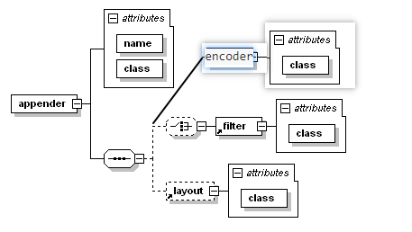

日志在程序中的占有比例是十分大的，需要对其进行有效的管理。  

logback可以使用XML或者Groovy格式进行配置。  
logback的初始化过程大致可以描述为：
* 类路径下寻找logback-test.xml文件
* 没有找到，继续找ogback.groovy文件
* 没有找到，继续找logback.xml文件
* 没有找到，通过 JDK 提供的 ServiceLoader 工具在类路径下寻找文件 META-INFO/services/ch.qos.logback.classic.spi.Configurator，该文件的内容为实现了 Configurator 接口的实现类的全限定类名。
* 以上都没有成功，logback 会通过 BasicConfigurator 为自己进行配置，并且日志将会全部在控制台打印出来。  

1. 自动配置  
什么都不用干，加载默认配置即可。  
在需要添加日志的类中，定义静态成员变量，使用。
```
public static final Logger LOGGER = LoggerFactory.getLogger(MyApp1.class);

public static void main(String[] args) {
    LOGGER.info("Entering application.");

    Foo foo = new Foo();
    foo.doIt();
    LOGGER.info("Exiting application.");
}  
```
由于没有找到配置文件，logback使用BasicConfigurator配置，默认输出到控制台，默认格式化形式。  

好处：
没有依赖logback，便于迁移。

2. xml文件配置方式  
* 项目中添加配置文件
BasicConfigurator等于默认配置的xml文件为：
```
<configuration>
    <!--配置appender-->
    <appender name="STDOUT" class="ch.qos.logback.core.ConsoleAppender"> 
        <encoder>
            <!--配置格式化layout-->
            <pattern>%d{HH:mm:ss.SSS} [%thread] %-5level %logger{36} - %msg%n</pattern>
        </encoder>
    </appender>
    <!--配置root logger-->
    <root level="debug">
        <appender-ref ref="STDOUT" />
    </root>
</configuration>
```  
logback 的默认配置机制为：通过 JoranConfigurator 在类路径上寻找默认的配置文件,可以通过直接调用 JoranConfigurator 的方式来重写 logback 的默认配置机制。
```
private static final Logger LOGGER = LoggerFactory.getLogger(MyApp3.class);
public static void main(String[] args) {
    //修改默认加载配置
    LoggerContext context = (LoggerContext)LoggerFactory.getILoggerFactory();
    JoranConfigurator joranConfigurator = new JoranConfigurator();
    joranConfigurator.setContext(context);
    context.reset();
    try {
        joranConfigurator.doConfigure(args[0]);
    } catch (JoranException e) {
        e.printStackTrace();
    }
    StatusPrinter.printInCaseOfErrorsOrWarnings(context);
    //正常使用
    LOGGER.info("Entering application");
    Foo foo = new Foo();
    foo.doIt();
    LOGGER.info("Exiting application");
}
```  


* 手动指定配置文件
此外，也可以通过系统属性指定默认的配置文件（文件类型只能是 ".xml" 或者 ".groovy"，其它的拓展文件将会被忽略）
```
命令：
java -Dlogback.configurationFile=/path/to/config.xml chapters.configuration.MyApp1
```  
或者，代码中（ogger 实例创建前）
```
static {
    System.setProperty(ContextInitializer.CONFIG_FILE_PROPERTY, "configurationFile.xml");
}
private static final Logger LOGGER = LoggerFactory.getLogger(ServerMain.class);
```  

3. 查看logback内部状态信息  
在配置文件有误的情况下，logback会在控制台打印内部状态信息，也可以手动指定状态监听器，查看logback内部的状态信息。  
```
LoggerContext lc = (LoggerContext)LoggerFactory.getILoggerFactory();
StatusPrinter.print(lc);
```  
对应到配置文件上，就是在configuration元素上添加 debug 属性。
```
<configuration debug="true">
</configuration>
```  
等价于
```
<statusListener class="ch.qos.logback.core.status.OnConsoleStatusListener" />
```  

【注意】：  
如果配置文件有问题，logback会检测并打印错误信息，前提是要可以找到这个配置文件，否则不会打印内部状态信息；
但是如果使用`StatusPrinter.print();`任何情况下都会打印内如状态信息；
用系统属性 "logback.statusListenerClass" 来设置 StatusListener 强制输出状态信息，也可以用来在遇到错误的情况下进行输出。  

logback 通过 StatusManager 的对象来收集内部的状态信息，可以通过 LoggerContext 来获取。
为了保持内存的使用在一个合理的水平，StatusManager 的默认实现包含两个部分：头部与尾部。头部存储第一个 H 状态的消息，尾部存储最后一个 T 状态的消息。logback-classic 包含一个名叫 ViewStatusMessagesServlet 的 servlet。这个 servlet 打印当前 LoggerContext 的 StatusManager 的内容，通过 html 进行输出。WEB-INF/web.xml 中添加如下代码后,可以通过 http://host/yourWebapp/lbClassicStatus 进行访问。
```
<servlet>
    <servlet-name>ViewStatusMessages</servlet-name>
    <servlet-class>ch.qos.logback.classic.ViewStatusMessagesServlet</servlet-class>
</servlet>

<servlet-mapping>
    <servlet-name>ViewStatusMessages</servlet-name>
    <url-pattern>/lbClassicStatus</url-pattern>
</servlet-mapping>
```
代码中监听StatusManager，也可以获取状态信息
```
LoggerContext lc = (LoggerContext)LoggerFactory.getILoggerFactory();
StatusManager statusManager = lc.getStatusManager();
OnConsoleStatusListener onConsoleStatusListener = new OnConsoleStatusListener();
statusManager.add(onConsoleStatusListener);
```  
设置系统属性实现监听的方式
```
java -Dlogback.statusListenerClass=ch.qos.logback.core.status.OnConsoleStatusListener
```  
OnConsoleStatusListener 用于在控制台打印状态消息。  
OnErrorConsoleStatusListener 用于在控制台打印显示错误的状态信息。  

NopStatusListener 会丢弃掉状态信息。  
任何的状态监听器被注册，或者通过 java 系统变量指定 logback.statusListenerClass 的值，在警告或错误的情况下自动打印状态信息 将会被禁用。可以通过设置 java 系统变量 logback.statusListenerClass 的值来禁用一切状态信息的打印。  
```
java -Dlogback.statusListenerClass=ch.qos.logback.core.status.NopStatusListener
``` 


4. 配置文件修改，自动加载  
logback 能够在配置文件改变的时候自动去扫描，需要在 <configuration> 标签上添加 scan=true 属性(默认一分钟一次)，会新建一个 ReconfigureOnChangeTask 任务用于监视配置文件是否变化。ReconfigureOnChangeTask 也会自动监视外部文件的变化。但是，如果更改后的配置文件有语法错误，则会回退到之前的配置文件。
scanPeriod 属性可以指定扫描周期（扫描周期的时间单位可以是毫秒、秒、分钟或者小时，如果没有指定时间单位，则默认为毫秒）。  
```
<configuration scan="true" scanPeriod="30 seconds"> 
    ...
</configuration>
```  

5. 启动展示包数据  
开启后，logback 会在堆栈的每一行显示 jar 包的名字以及 jar 的版本号，可以方便的排除jar版本冲突问题，但是代价高昂。  
```
<configuration packagingData="true">
    ...
</configuration>
```  

6. 停止logback-classic  
释放 logback-classic 所使用的资源  
* 停止使用 logger context
```
LoggerContext loggerContext = (LoggerContext) LoggerFactory.getILoggerFactory();
loggerContext.stop();
```  
* shutddown hook 
```
<configuration debug="true">
    <!-- 如果缺失 class 属性，则会默认加载 ch.qos.logback.core.hook.DefaultShutdownHook -->
    <shutdownHook/>
</configuration>
```

7. 语法  
logback 的配置文件非常的灵活，不需要指定 DTD 或者 xml 文件需要的语法。  
  

标签名大小写敏感,默认规则遵循驼峰命名法。

* logger  
    一个logger标签必须包含一个 name 属性，一个可选的 level 属性，一个可选 additivity 属性。additivity 的值为 true 或 false。  
    level 的值为 TRACE，DEBUG，INFO，WARN，ERROR，ALL，OFF，INHERITED，NULL。当 level 的值为 INHERITED 或 NULL 时，将会强制 logger 继承上一层的级别。
* appender  
    
    需要两个强制的属性 name 与 class。  
    name 属性用来指定 appender 的名字;  
    class 属性需要指定类的全限定名用于实例化。
* root  
    root元素可以包含 0 或多个appender-ref元素。


重复使用appender（导致重复日志）  
重写默认的累加行为（设置 additivity = false，避免重复日志）
```
<logger name="chapters.configuration.Foo" additivity="false">
    <appender-ref ref="FILE" />
</logger>
```
设置context的名字，当多个应用输出日志到同一个目的地，设置 logger context 的名字可以更好的区分。  
`<contextName>myAppName</contextName>`  

* 变量替换  
定义  
    配置文件定义  
    `<property name="USER_NAME" value="/data/logs" />`  
    系统属性定义  
    `java -DUSER_HOME="/data/logs" MyApp3`  
    当存在多个变量的时候，可以放在一个文件中    
    `<property file="F:\project\logback-examples\src\main\resources\variables1.properties"/>`  
    `<property resource="resource1.properties" />`

使用  
```
<appender name="FILE" class="ch.qos.logback.core.FileAppender">
    <file>${USER_NAME}/myApp.log</file>
    <encoder>
        <pattern>%msg%n</pattern>
    </encoder>
</appender>
```  

作用域  
    属性的作用域分别为  
    本地【默认】（local scope）：配置文件每加载一次，变量就会被重新定义一次。  
    上下文（context scope）：上下文范围内的属性会一直存在上下文被清除。  
    系统（system scope）：会插入到 JVM 的系统属性中，跟随 JVM 一同消亡。  

默认值  
    如果某个变量没有被声明，或者为空，默认值则非常有用。在 bash shell 中，默认值可以通过 ":-" 来指定。  
    `"${aNme:-golden}" 会被解释成 "golden" `

嵌套使用：一个变量的值可以包含对其它变量的引用。  
名字嵌套：`"${${userid}.password}" 就是对变量名为 "alice.passowrd" 的引用`  

默认值嵌套：`表达式 "${id:-${userid}}" 的值为 "alice"`  

HOSTNAME 在配置期间会被自动定义为上下文范围内  
CONTEXT_NAME 属性对应当前上下文的名字  
动态定义属性 两个强制的属性：name、class。name 属性用来定义变量的名字，classs 属性用来引用实现了 PropertyDefiner 接口的类。
```
<define name="rootLevel" class="chapters.configuration.PropertyDefiner1">
<shape>round</shape>
<color>brown</color>
<size>24</size>
</define>
```  
shape，color，size 都是 "chapters.configuration.PropertyDefiner1" 的属性,有对应的 set 方法，就可以注入对应的值。  

配置文件中的条件处理  

从 JNDI 中获取变量  

引入文件  
```
<include file="src/main/resources/includedConfig.xml" />
```
```
目标文件必须是由 <included> 元素包裹
<included>
    <appender name="includedConsole" class="ch.qos.logback.core.ConsoleAppender">
        <encoder>
            <pattern>%d - %m%n</pattern>
        </encoder>
    </appender>
</included>
```

可以通过 file 相对路径或者绝对路径来引入,相对路径是指相对应用程序的路径。  
可以通过 resource 属性来引入位于 classpath 路径下的资源文件。  
可以通过 url 属性来引入外部文件。  

上下文监听器