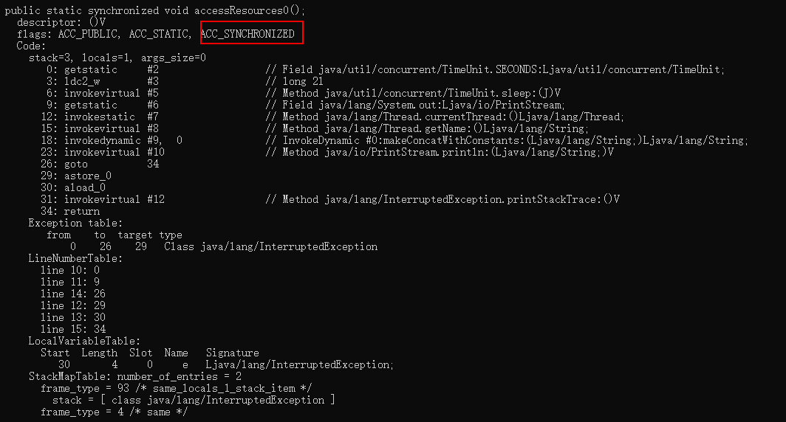
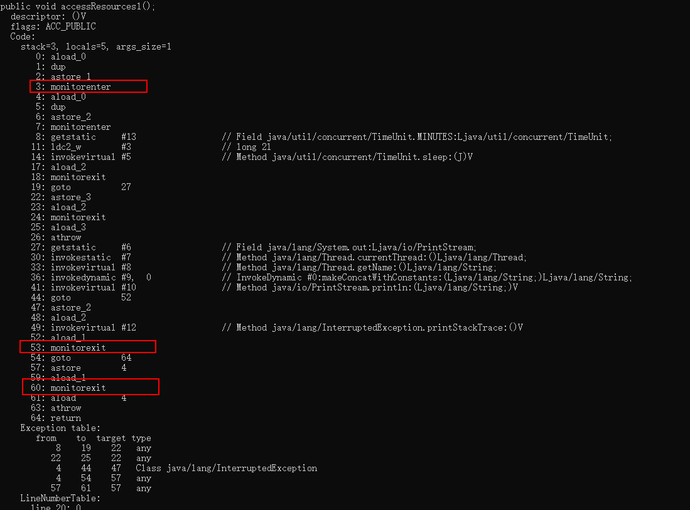
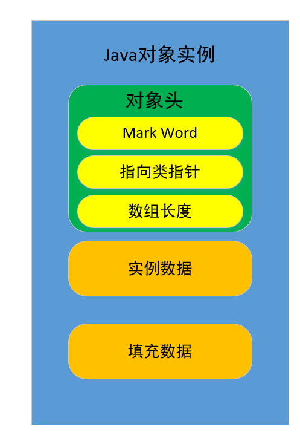
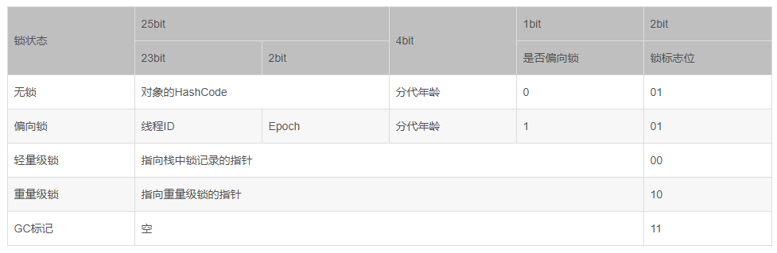

1.原理
=  
Synchronized是利用锁的机制来实现同步的  
锁的两种特性：  
互斥性：同一时间只有一个线程可以只有某个对象锁，从而实现多线程中的协调机制（保证原子性）  
可见性：必须在确保锁被释放之前，堆共享变量所做的修改，对于接下来获得该锁的另一个线程是可见的，否则数据不一致  

2.用法  
=  
2.1同步方法　　
-  
### 2.1.1同步非静态方法  
```java
public Synchronized static void method(){}
```
### 2.1.2同步静态方法
```java
public Synchronized void method(){}
```
2.2同步代码块  
-  
### 2.2.1非静态方法的代码块(对象锁)   
this指的是当前对象，java中的每一个对象对会有一个monitor对象（被一个线程占有，计数+1，不为0\[0表示自由\]表示被其他线程占有，释放的时候-1），监视器  
同一个线程堆同一个对象重复加锁，就会+1，+1（重入性）  
```java
public className{
    public void method(){
        Synchronized(this){

        }
    }
}
```
### 2.2.1非静态方法的代码块(类锁)  
```java
public className{
    public void method(){
        Synchronized(className.class){

        }
    }
}
```  


3.原理解析  
=  
这里会用到两个分析工具（查看线程的状态）：  
* JDK自带的JCONSOLE  
* jsatck pid命令  

原理需要进行反编译文件：  
javap -v filename  

对于方法，标志为ACC_SYNCHRONIZED，对于代码块，标志分别为monitorenter与monitorexit（两个，分别为正常退出与异常退出）

  
java1.6之前，synchronized是重量级锁（霸道总裁，一旦占用，别人就没希望了，只能等我主动放弃），但是1.6之后java虚拟机对其进行了优化，引入了偏向锁，轻量级锁。  
这里涉及到一个monitor对象（每一个对象会和monitor进行关联）：  
  
具体的，一个对象实例包含：
### 对象头：加锁的基础  
* MarkWord2个字（4个字节）：  
    
    这里面就区分出了锁的状态：  
        无锁状态：没有加锁（hashcode用来区分是否是同一个对象）  
        偏向锁（适用于竞争不激烈的时候使用，会涉及到**CAS**算法）：在对象第一次被一个线程占有的时候，是否偏向锁置为1，，锁的标志位为01，前面写入线程ID，当其他线程访问对象的时候，就会发生竞争（结果无非两种：成功/失败）  
            成功：多次被第一次占有这个对象的线程获取（比较记录的线程ID）（这个线程在第一次占有这个对象后，以后多次访问这个对象，由于是老熟人了，就更容易占有这个对象，获取锁）  
            失败：升级为轻量级锁  
        轻量级锁（适用于线程交替使用互斥性不是很强）：  
        重量级锁（强互斥，等待时间长）：  
>轻量级锁向重量级锁转换的过程，涉及到用户线程与核心线程之间的转换，而这种转换需要的时间代价是非常大的，要尽量避免这种转换的经常发生，这时引入了**自旋锁**（轻量级锁竞争失败后，执行几次空循环，比如：5次、10次），让轻量级锁在转换为重量级锁之前等待一段时间，好让其在这段时间里有可能获取到锁，从而避免转换为重量级锁的过程  

>锁消除：JIT在编译的时候，把不必要的锁去掉了

* 指向类指针  
该指针在32位JVM中的长度是32bit，在64位JVM中长度是64bit。  
Java对象的类数据保存在方法区。  
* 数组长度  
只有数组对象保存了这部分数据；该数据在32位和64位JVM中长度都是32bit。  
### 实例数据：  
对象的实例数据就是在java代码中能看到的属性和他们的值。  
### 填充数据：  
JVM要求java的对象占的内存大小应该是8bit的倍数，所以后面有几个字节用于把对象的大小补齐至8bit的倍数，没有特别的功能。    


参考：  
1.https://blog.csdn.net/lkforce/article/details/81128115  
2.https://blog.csdn.net/yinbucheng/article/details/72524482  
3.https://blog.csdn.net/AReallyMan/article/details/106022994  
4.https://blog.csdn.net/u012465296/article/details/53022317  
