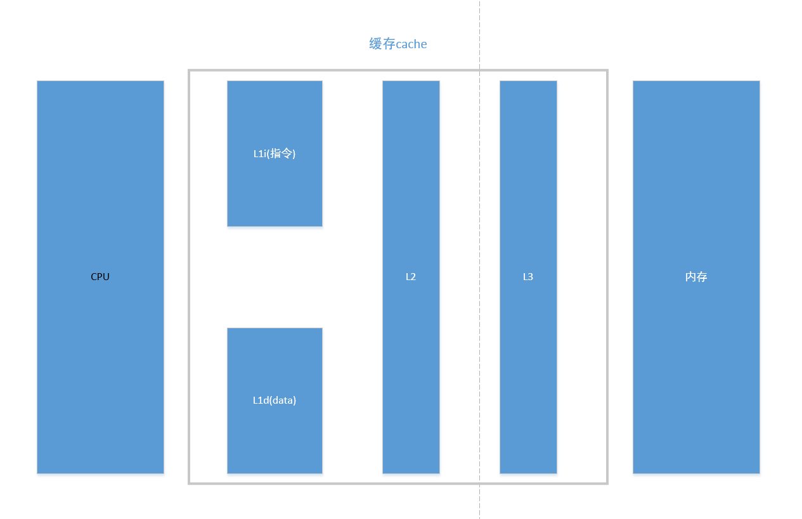
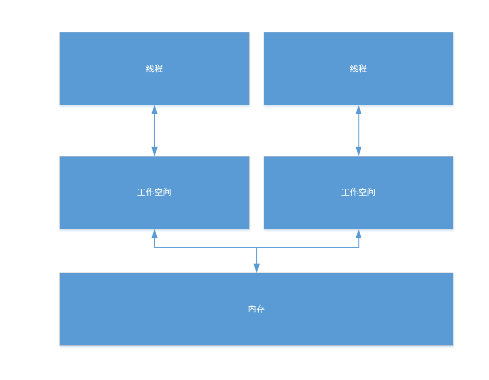

1.硬件层面理解  
=  
  
  

>每一个CPU修改内存数据的步骤：  
>1.从内存中读取数据到缓存cache  
>2.在缓存种中更新数据  
>3.把更新结果刷新到内存中  

>当有多个cpu操作同一个数据的时候，如果不加以处理，这个数据就会出现数据不一致的问题，比如：一个cpu读，一个cpu写，cpu读到的数可能是改之前的也可能是改之后的  

解决方案：  
总线加锁（粒度太大）  
MESI(硬件层面上的实现)  
>读操作：不做任何事情，把cache中的数据读取到寄存器中  
>写操作：发出信号，告知其他cpu将该变量cache line置为无效（会导致增加很多的cache line），其他cpu要访问这个变量的时候，只能从内存中获取  

对应内存模型：  
  
>主存中的数据所有线程都可以访问  
>每个线程都有自己的工作空间（本地内存）  
>工作空间数据：局部变量、内存副本  
>线程不能直接修改内存中的数据，只能读到工作空间中，再到寄存器中间进行修改，修改完成后刷新回内存中  

  

2.volatile  
=  
让其他线程感知到有一个线程对变量进行了修改  
可见性：  
对共享变量的修改，其他线程马上可以感知到  

