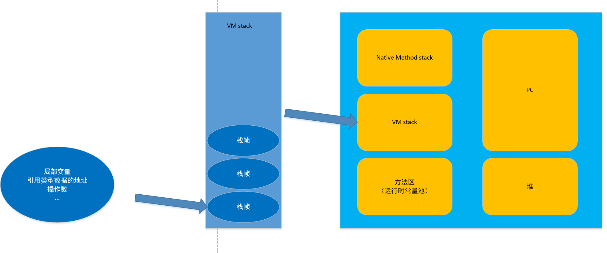
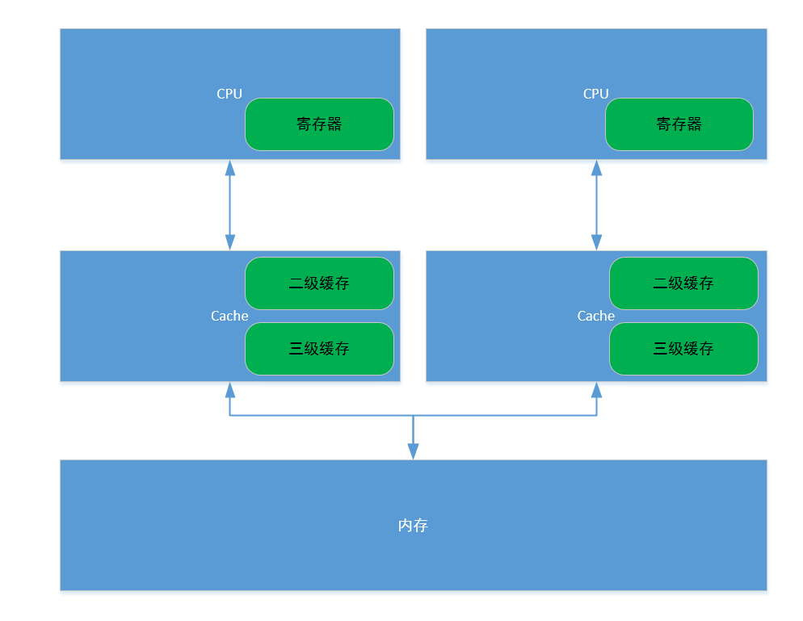
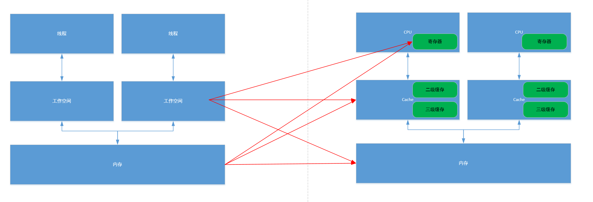

程序：完成某一任务的代码序列（静态的概念）  
进程：程序在某些数据上的一次运行（动态的概念）
线程：一个进程可能包含一个或者多个线程（占有资源的独立单元）

JVM与线程
JVM线程运行后，启动其他线程（main）

JVM内存区域(逻辑上的，物理内存并不存在这样的划分)：  
方法区：存放类信息，常量，static，JIT（即时编译）等   
堆：实例对象 GC   
>方法区域堆中的信息是共享的  

VM stack：Java方法在运行时的内存模型  
>虚拟机栈中，每个方法对应一个栈帧，栈帧里面包含局部变量，引用类型数据的地址，操作数栈等  

native method stack:本地方法栈，java的native方法  

>方法区/堆/虚拟机栈/本地方法栈都可能会出现OOM(内存溢出)：堆内存不足是最常见的 OOM 原因之一（可能是内存泄漏，也有可能是堆的大小设置不合理）；虚拟机栈和本地方法栈，导致 OOM 一般为对方法自身不断的递归调用，且没有结束点，导致不断的压栈操作；随着元数据区的引入，方法区内存已经不再那么窘迫，所以相应的 OOM 有所改观。  

PC:程序计数器，java线程的私有数据，存放程序的下一条指令的地址    

Java内存模型（Java memory model）JMM规范（抽象模型）  
规范：内存数据和工作空间的数据的交互
主内存：共享的信息  
工作内存：私有信息（基本数据类型，直接分配到工作内存，引用的地址放在工作内存中，引用的对象放在堆中）  
工作方式：  
线程修改私有数据，直接在工作空间修改；    
线程修改共享数据，把数据复制到工作空间中，在工作空间中修改，修改完以后，刷新内存中的数据。

对应的硬件内存结构（CPU模型）如下：

从上面的结构中可以看出，共享信息的使用会存在一系列的问题：数据一致性问题（硬件层面解决）  
解决办法：  
* 总线加锁（降低CPU的吞吐量）  
* 缓存一致性协议（MESI）
    当CPU在Cache中操作数据时，如果该数据是共享变量，数据从Cache读到寄存器，修改并更新到内存中，Cache LINE置为无效，其他CPU直接去内存中读数据。  

线程与硬件的关系则是如下：

Java内存模型与JVM内存区域是对应的  
  
由于JMM中的工作空间与内存中的数据可能存在于硬件模型的寄存器、缓存与内存中，也会导致数据一致性的问题：  

这里就引出并发编程的三个重要特性：  
* 原子性：  
不可分割  
* 可见性：  
线程只能操作自己的工作空间中的数据  
* 有序性：  
程序中的数据不一定就是执行的顺序  
    指令重排，提高执行效率

