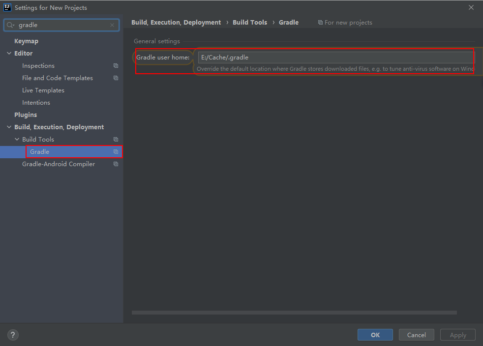
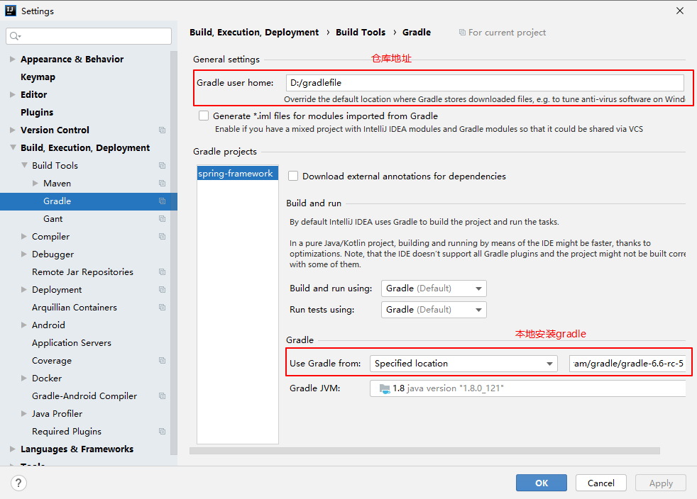
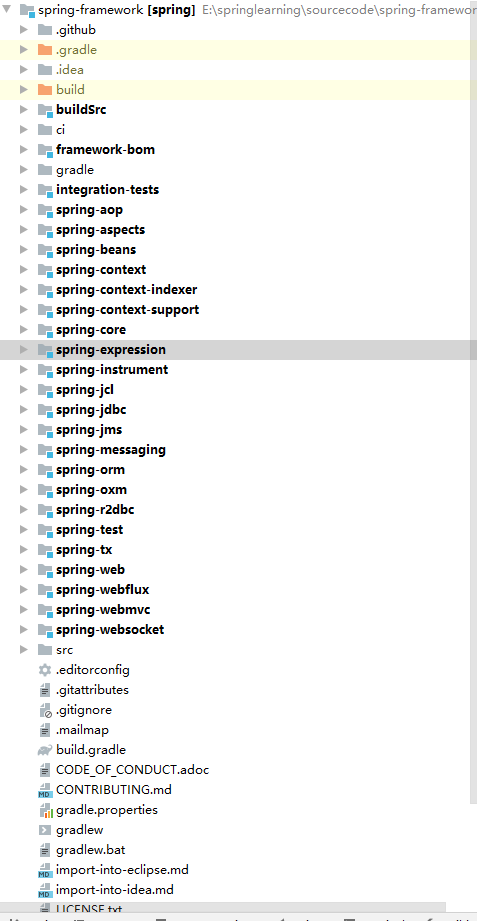
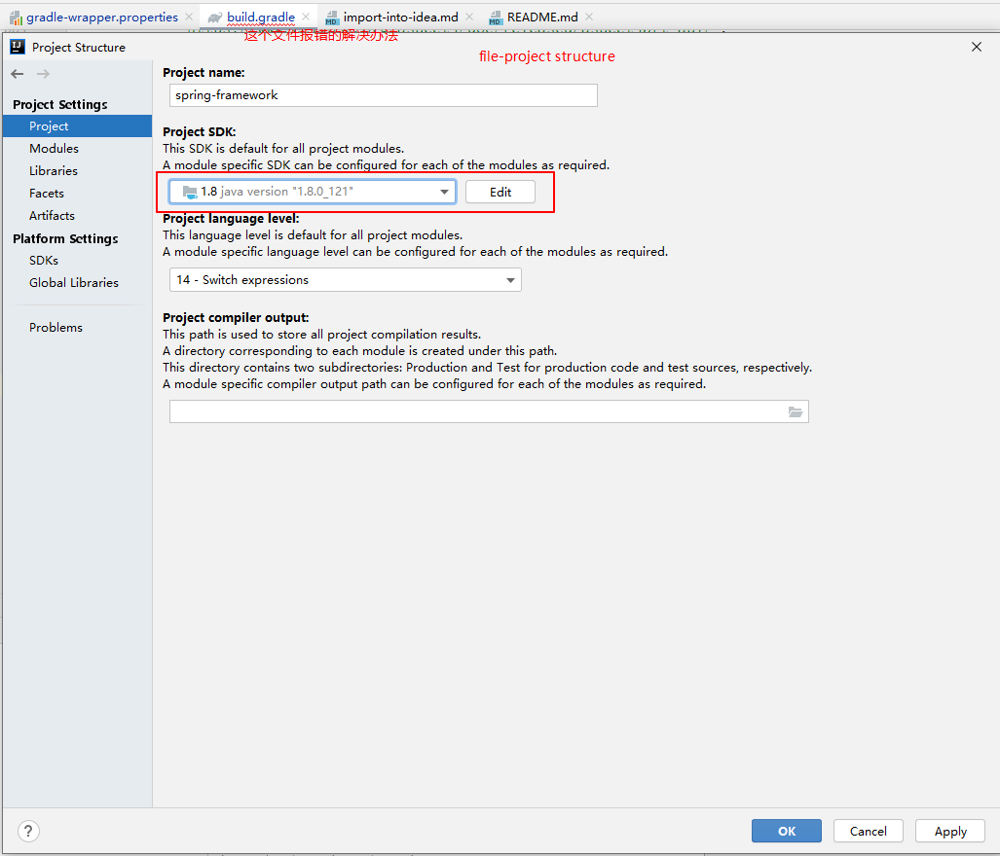
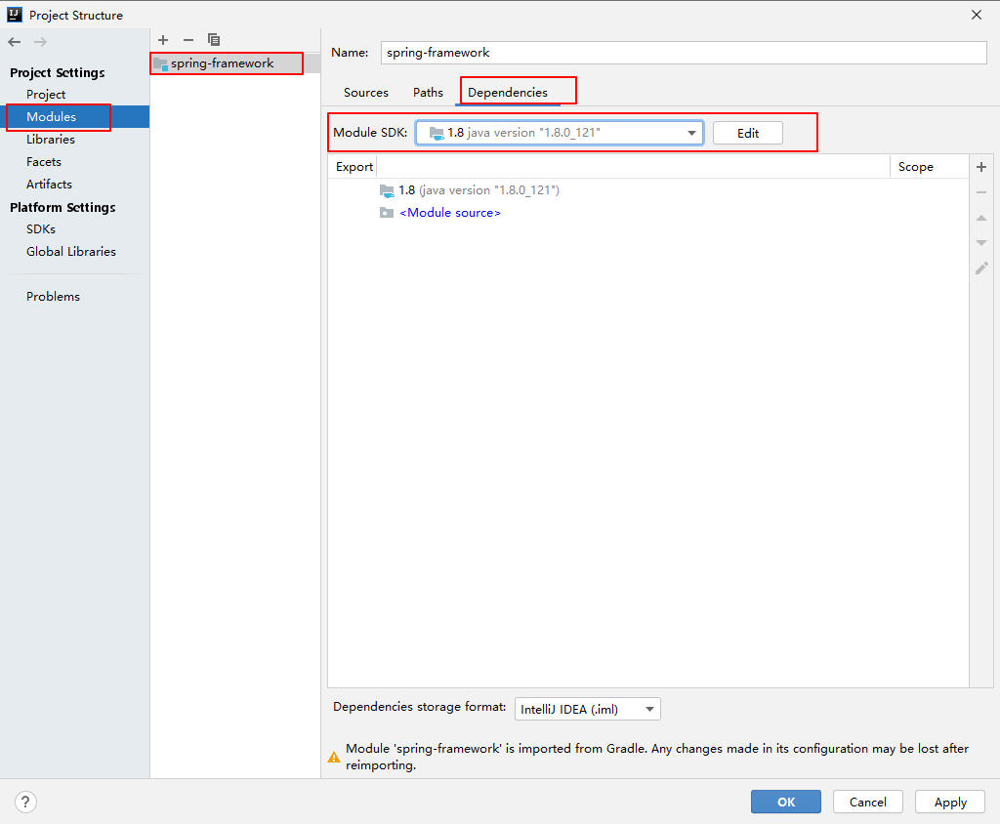

为方便后续阅读Spring源码，利用idea完成源码阅读环境的搭建。特此记录搭建过程，方便后续回忆搭建过程。

说在前面：
gradle安装版本不限，新的也可以，反正源码还会自己去下对应版本  
编译spring源码版本5.0.X（最新=版可能会遇到和我一样的问题，目前没有解决）
jdk 8-121
idea 2020.1ultimate
按照前面的步骤进行相关设置是没问题的

1. Gradel安装（这步版本无所谓）  
=  
由于spring是利用Gradle搭建的，因此需要先安装Gradle（最好安装与编译需要的版本一直，编译需要的版本在idea打开源码，或者源文件根目录下cmd 执行`gradlew.bat`的时候自动下载）。

修改仓库地址：  
cmd `gradle -g D:/Cache/.gradle build build`(测试通过)
https://blog.csdn.net/yanzi1225627/article/details/52024632

2. 获取Spring源码（首先尝试最新版源码master）
=  
github找到项目源码地址（网上说github地址比较慢，其实也还行，不是那么慢，好吧，我错了，有的时候直接从github上拉源码真的绝望，还是用gitee上的镜像地址吧）  
`git@github.com:spring-projects/spring-framework.git`  

git clone项目源码

在拿到代码后，修改文件build.gradle  
文件开始位置添加
```
buildscript {
	repositories {
		maven { url "https://repo.spring.io/plugins-release" }
        maven { url' https://maven.aliyun.com/nexus/content/groups/public/' }
        maven { url' https://maven.aliyun.com/nexus/content/repositories/jcenter'}
	}
}
```  
找到repositories添加镜像地址，加速下载
```
//新增以下2个阿里云镜像
maven { url 'https://maven.aliyun.com/nexus/content/groups/public/' }
maven { url 'https://maven.aliyun.com/nexus/content/repositories/jcenter' }
maven { url "https://maven.aliyun.com/nexus/content/groups/public" }
maven { url "https://其他的镜像地址" }
 //这是原来就在的
 mavenCentral()
maven { url "https://repo.spring.io/libs-spring-framework-build" }
maven { url "https://repo.spring.io/snapshot" } // Reactor and RSocket
//新增spring插件库
maven { url "https://repo.spring.io/plugins-release" }
```  

3. idea打开项目，自动构建项目  
=

按照参考网站[1]上的做法，在打开idea进行自动构建之前，在cmd窗口进行gradle命令操作（2020版idea不执行也可以，一样的效果）  
`gradlew.bat`  

可能会超时导致下载失败，多试几次就好了  

这时也会由于网速出现各种错误，记录一个坑：由于下载的gradle文件有缺失（网络原因导致），执行命令会得到无法解压的报错信息unzip。。。。。。  
（解决办法：按照提示，找到对应文件夹，删除重新下载）  


提前设置了idea的编码格式为utf-8

配置本地安装的gradle
操作：file-setting-搜索gradle
在如下的界面进行设置，设置效果如图所示：  

（实际没有怎么干，选用了默认的选项，即依据配置文件gradle-wrapper中指定的gradle操作进行）


由于idea在gradle的作用下去下载各种jar包，但是由于网速等原因往往会失败，报各种各样的错。  idea打开项目开始构建项目，然后就是漫长的等待过程。。。。。。真的非常漫长（时间长，错误多）等待构建过程中，由于网络的原因会报各种各样的错误，重新构建就完事了，错误实在是千奇百怪，记不过来。（不断地尝试重新构建，要坚信源码是没有问题的，有问题的是你的网络）   


项目源码出现了如图所示的蓝点，说明项目构建完成。  


spring源码构建过程就已经劝退了。。。。。。

在家里的网络顺畅的情况下，终于顺利走完这一步了（源代码用的是fork的代码）

4.编译源码  
=
上述过程只是完成了项目的构建，还需要进一步编译，才算是真正完成spring源码的编译。  


依据import-into-idea.md说的，

打开项目可能出现的问题（原因jdk没有指定，或者版本不对，我遇到的问题是由于版本过低（spring源码为master最新版，jdk为jdk1.8.0_121），导致缺乏对应的包，编译失败）：
gradle代码报错  
解决办法：  




需要先完成编译spring-oxm下的compileTestjava  

（第一次到这里的时候，各种报错，千奇百怪，第二次，可能因为需要下载的东西都有了，一次编译通过，但是输出控制台中有乱码warning）（目前没找到解决办法，似乎不影响，就继续往下走了）  


由于官方为了避免冲突，排除了两个jar：  
spring-cglib-repack.jar  
spring-objenesis-repack.jar  

解决办法：  
idea直接利用gradle插件，双击对应jar    
  

排除aspects模块，设置编译jdk版，进行项目编译  
  

   

   

剩下的就是听天由命，等待了。。。。。。  

又fxxk失败了，我哭了，你呢？？？

这会问题出在message模块的编译过程中。。。  
io.rsocket.RSocketFactory.ClientRSocketFactory 错误，似乎是下载的io.rsocket包有问题，maven中央仓库没有找到对应版本的，换了一个低版本的，原来出错的地方不出错了（io.rsocket.RSocketFactory.ClientRSocketFactory找不到），但是有其他地方出错了（RSocketClient找不到了）

这个问题，留着以后经验丰富的时候，回头再尝试解决一次

5.尝试较低版本的spring源码版本
=
尝试编译spring5.0.x版本源码    
这个版本对应的gradle对jdk版本有要求，jdk不能太高，开始构建前注意切换回jdk8版本  

这回就使用原版本的文件，什么文件我都不改了，不用镜像了也，慢就慢了吧，晚上开着去睡觉了（哈哈哈），一早起来还是有网络问题导致的报错，不过多试几次就完事了，挺幸运，早上起来以后，几分钟就构建完了。

尝试编译oxm和core也都通过了，然后排出aspects模块，开始正式编译，由于正式编译所需时间比较长，就开着电脑去工作了

工作之余，远程连接电脑，看见编译报错，不慌，直接重新编译，一次不行两次，两次不行就三次，干就完事了。。。。。。  

经过不断重新编译，最后终于编译成功，终于成功了！！！于成功了！！！于成功了！！！

6.测试模块搭建
=  
测试主要是为了看看容器加载bean的时候是否正常。前面没报错，基本不会有问题。这个随意发挥吧，好多人的博客都有说明，建议就参考参考\[1\]中的内容。中间可能在添加注释的时候需要用到idea的自动添加依赖以及import相关类的功能，问题不大。（要是控制台输出中文乱码，参考我的`IDEA使用.md`中的做法即可）


7.经验教训
=
1. 要会看输出的日志，找问题
2. 遇到问题不要慌，尤其是人家确认没问题的项目，干就完事了
3. 在尝试新事物的时候，尽量找稳定的，不要最新的
4. 博客记录的东西不一定适合自己的问题，要有自己的记录

祝我自己和大家以后编译一切顺利！  
祝我自己和大家以后编译一切顺利！  
祝我自己和大家以后编译一切顺利！  

参考：  
[1] https://blog.csdn.net/smart_an/article/details/107199151  
[2] https://blog.csdn.net/duli3554197/article/details/105799853/