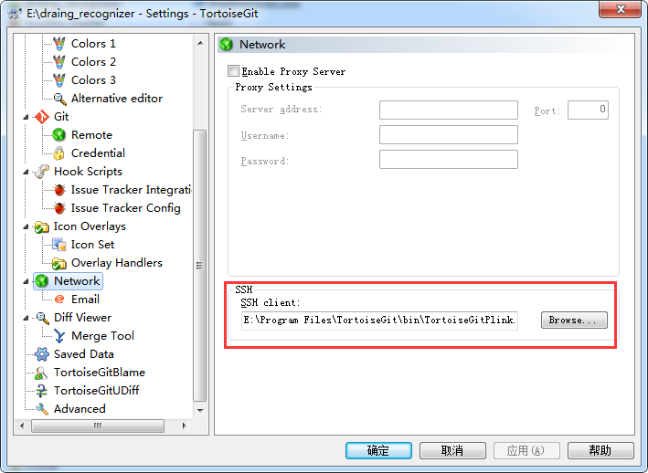

一、git与tortoisegit安装教程
=
随便百度一下即可，安装过程没有什么难度

参考：  
https://blog.csdn.net/xc_zhou/article/details/93137856  
（这个链接关于配置tortoisegit部分在后面进行扩展）  

二、记录安装过程中自己遇到几个问题
=
2.1问题一：tortoisegit配置密钥
-
由于tortoisegit与git的rsa不太一样，无法直接使用git生成的ssh-rsa，需要完成配置，才可以使用。  

参考：
https://www.cnblogs.com/yqzc/p/6762206.html

2.2问题二：tortoisegit访问被拒
-  
针对我个人出现这个问题的原因是，tortoisegit的设置有问题（其实前面的一个链接里有标记，但是没有引起足够重视）  
  

参考：
https://www.cnblogs.com/tangmiao/p/11244863.html

三、实际使用过程中遇到的一些问题
=  
3.1git需要连接多个远程仓库
-  
解决办法有两个：  
* 为每一个远程仓库生成密钥分别进行位置（容易混乱，已经经过实践[命令行模式下进行，不便]）

* 所有远程仓库共用一个密钥（目前未经过实践，只是了解这个思路）