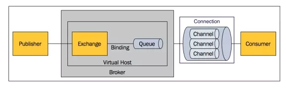
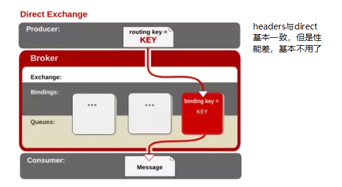
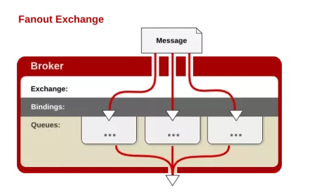
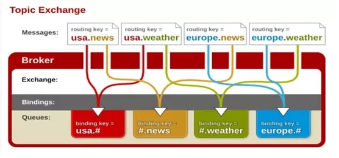

RabbitMQ  
  
1.基本概念  
=  
Broker 表示消息队列服务器实体。  
Message 由消息头和消息体组成，消息体是不透明的，而消息头则由一系列的可选属性组成，这些属性包括routing-key（路由键）、priority（相对于其他消息的优先权）、delivery-mode（指出该消息可能需要持久性存储）等。  
Virtual Host 虚拟主机，表示一批交换器、消息队列和相关对象，每个 vhost 本质上就是一个 mini 版的 RabbitMQ 服务器，拥有自己的队列、交换器、绑定和权限机制。  
Publisher 消息的生产者，也是一个向交换器发布消息的客户端应用程序。  
Exchange 交换器，用来接收生产者发送的消息并将这些消息路由给服务器中的队列。  
    Exchange分发消息时根据类型的不同分发策略有区别，目前共四种类型：direct、fanout、topic、headers 。  
    direct：消息中的路由键（routing key）如果和 Binding 中的 binding key 一致， 交换器就将消息发到对应的队列中。  
      
    fanout：每个发到 fanout 类型交换器的消息都会分到所有绑定的队列上去。  
      
    topic：topic 交换器通过模式匹配分配消息的路由键属性，将路由键和某个模式进行匹配，此时队列需要绑定到一个模式上。    
      
Binding 绑定，用于消息队列和交换器之间的关联。  
Queue 消息队列，用来保存消息直到发送给消费者。  
Connection 网络连接，比如一个TCP连接。  
Channel 信道，多路复用连接中的一条独立的双向数据流通道。信道是建立在真实的TCP连接内地虚拟连接，AMQP 命令都是通过信道发出去的，不管是发布消息、订阅队列还是接收消息，这些动作都是通过信道完成。  
Consumer 消息的消费者，表示一个从消息队列中取得消息的客户端应用程序。  

参考：  
1.https://zhuanlan.zhihu.com/p/63700605  
2.