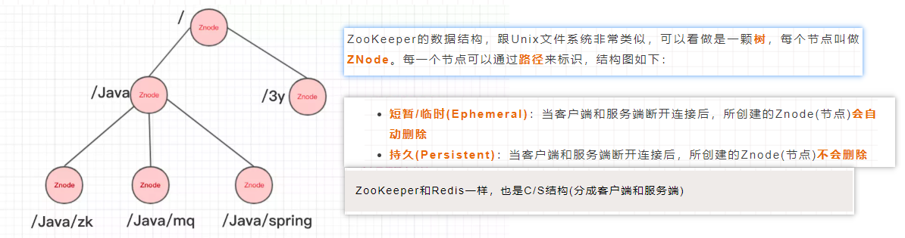
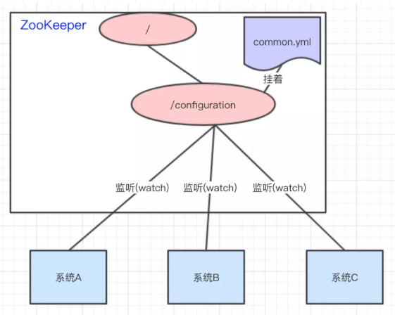
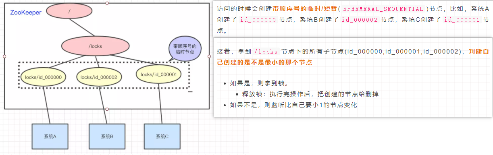
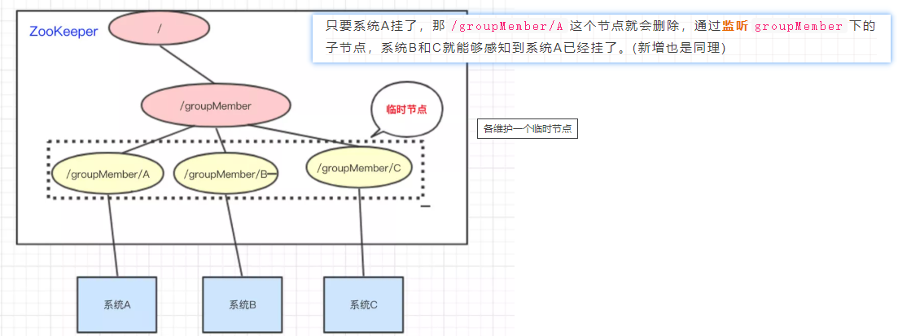

ZooKeeper主要服务于分布式系统，可以用ZooKeeper来做：统一配置管理、统一命名服务、分布式锁、集群管理。(使用分布式系统就要进行节点管理--需要实时感知节点的状态、对节点进行统一管理等等，ZooKeeper作为一个能够通用解决这些问题的中间件而存在)    
分布式协调服务  
ZooKeeper 的设计目标是将那些复杂且容易出错的分布式一致性服务封装起来，构成一个高效可靠的原语集，并以一系列简单易用的接口提供给用户使用。  

1.zookeeper为什么可以用在那么多地方
-  
* 数据结构  

* 监听器  
与上面的数据结构配合，才能真正发挥出zookeeper的强大作用，监听器主要的监听分成：
    监听znode节点的数据变化  
    监听子节点的增减变化  

2.怎么实现这么多功能的  
-  
* 统一配置管理：微服务框架中的各个服务都有自己的配置文件，需要进行集中的管理，详细可以看[springcloudconfig](../../框架/01springfamily/springcloud/springcloudconfig.md)，对于配置文件存在的公共部分，可以提取为common.yml，并且放在ZooKeeper的Znode节点中，然后各个需要用到的服务监听这个节点的数据变化就可以了，一旦数据变化，各个系统就可以及时响应。  
    
* 统一命名服务：为某一部分的资源取一个名字，别人通过这个名字就可以拿到对应的资源。将这部分资源放在zookeeper的znode节点，访问这个节点就可以获得对应的资源。  
* 分布式锁：  

* 集群状态：  
