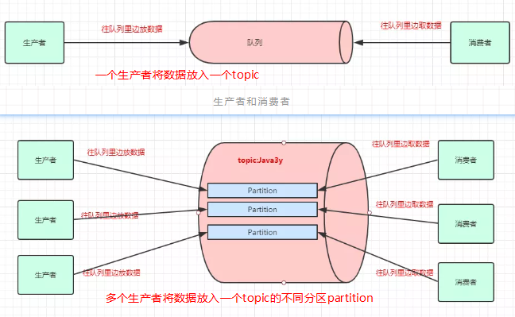
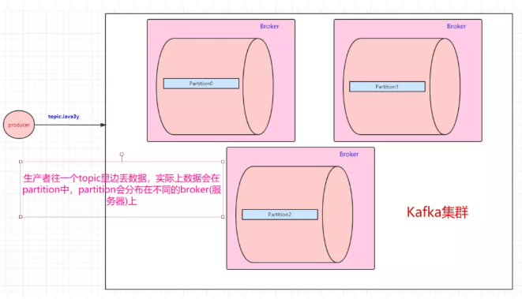
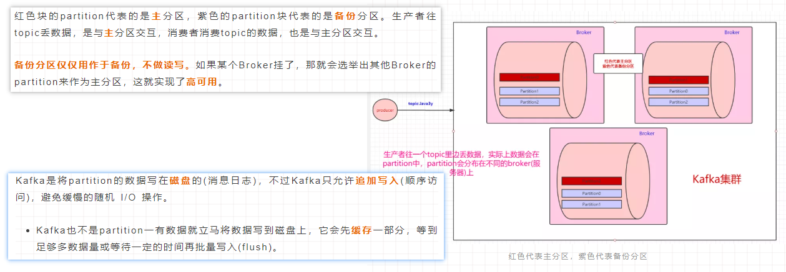
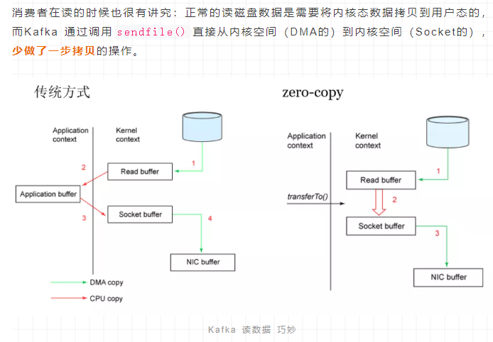
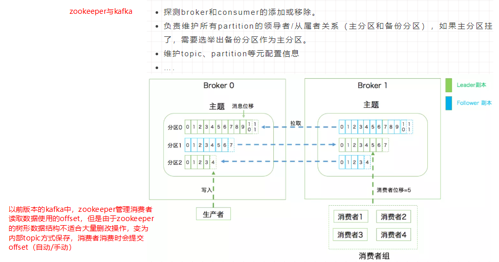
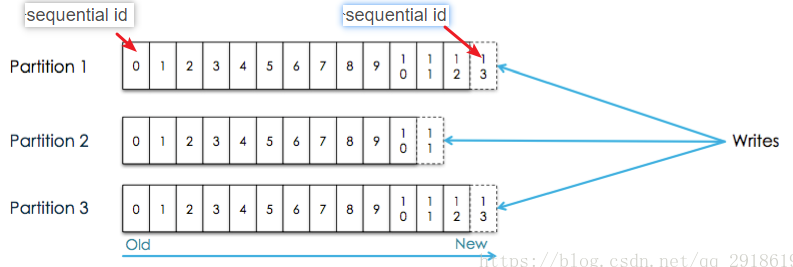
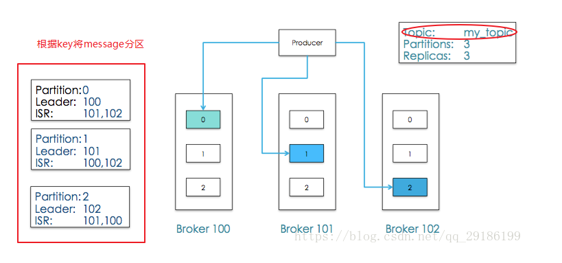
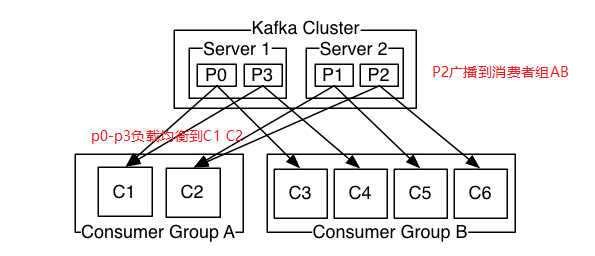

Kafka是最初由Linkedin公司开发，是一个分布式、分区的、多副本的、多订阅者，基于[zookeeper](../ZooKeeper.md)协调的分布式日志系统（也可以当做MQ系统），常见可以用于web/nginx日志、访问日志，消息服务等等，Linkedin于2010年贡献给了Apache基金会并成为顶级开源项目。  

1.zookeeper基本概念速览
=  
由MQ的基本知识知道，肯定有三个角色：生产者、消息队列、消费者

由常见MQ知道，kafka是分布式的，那分布式结构是怎么实现的

kafka是怎么解决数据丢失的问题的

kafka是怎么消费MQ中的数据的
  
kafka底层获取数据的原理

kafka与zookeeper之间的羁绊

涉及的术语：
broker：Kafka 集群包含一个或多个服务器，服务器节点称为broker；  

Topic：每条发布到Kafka集群的消息都有一个类别，这个类别被称为Topic；  
partition：topic中的数据分割为一个或多个partition，partition中的数据是有序的，不同partition间的数据丢失了数据的顺序；  
>日志的分区partition （分布）在Kafka集群的服务器上。每个服务器在处理数据和请求时，共享这些分区。每一个分区都会在已配置的服务器上进行备份，确保容错性。  
>每个分区都有一台 server 作为 “leader”，零台或者多台server作为 follwers 。leader server 处理一切对 partition （分区）的读写请求，而follwers只需被动的同步leader上的数据。  

offset：每个Topics划分为一个或者多个Partition,并且Partition中的每条消息都被标记了一个sequential id ,也就是offset；consumer选择一个topic，通过id指定从哪个位置开始消费消息，消费完成之后保留id，下次可以从这个位置开始继续消费，也可以从其他任意位置开始消费；  
>好处：  
>消费者可以根据需求，灵活指定offset消费  
>保证了消息不变性，为并发消费提供了线程安全的保证,每个consumer都保留自己的offset，互相之间不干扰，不存在线程安全问题。  
>消息访问的并行高效性,每个topic中的消息被组织成多个partition，partition均匀分配到集群server中,生产、消费消息的时候，会被路由到指定partition，减少竞争，增加了程序的并行能力。  
>增加消息系统的可伸缩性,每个topic中保留的消息可能非常庞大，通过partition将消息切分成多个子消息，并通过负责均衡策略将partition分配到不同server,这样当机器负载满的时候，通过扩容可以将消息重新均匀分配。  
>保证消息可靠性,消息消费完成之后不会删除，可以通过重置offset重新消费，保证了消息不会丢失。  
>灵活的持久化策略,可以通过指定时间段（如最近一天）来保存消息，节省broker存储空间。  
>备份高可用性,消息以partition为单位分配到多个server，并以partition为单位进行备份。  

  

Producer：生产者即数据的发布者，该角色将消息发布到Kafka的topic中；  
>生产者可以将数据发布到所选择的topic（主题）中。生产者负责将记录分配到topic的哪一个 partition（分区）中。  

 

Consumer：消费者可以从broker中读取数据；  
>消费者使用一个 消费组 名称来进行标识，发布到topic中的每条记录被分配给订阅消费组中的一个消费者实例  
>如果所有的消费者实例在同一消费组中，消息记录会负载平衡到每一个消费者实例;如果所有的消费者实例在不同的消费组中，每条消息记录会广播到所有的消费者进程.   

  

Consumer Group：每个Consumer属于一个特定的Consumer Group；partition中的每个message只能被组（Consumer group ） 中的一个consumer（consumer 线程 ）消费  
Leader：每个partition有多个副本，其中有且仅有一个作为Leader，Leader是当前负责数据的读写的partition；  
Follower：Follower跟随Leader，所有写请求都通过Leader路由，数据变更会广播给所有Follower，Follower与Leader保持数据同步。如果Leader失效，则从Follower中选举出一个新的Leader；当Follower与Leader挂掉、卡住或者同步太慢，leader会把这个follower从“in sync replicas”（ISR）列表中删除，重新创建一个Follower。

2.kafka的优点
=  
解耦  
冗余：持久化  
扩展  
灵活&峰值处理能力：不需要为了峰值，投入大量成本，平时浪费资源  
可恢复性  
顺序保证：Kafka保证一个Partition内的消息的有序性  
缓冲
异步通信

3.应用场景
=
3.1作为消息系统
-  
传统的消息系统有队列和发布-订阅两个模块，队列可以有序的将消息发送给多个消费者（但多个消费者不保证接收是有序的，消息系统通常使用“唯一消费者”的概念，即只让一个进程从队列中消费， 但这就意味着不能够并行地处理数据），扩展处理过程，但是消费者消费数据后，数据丢失；发布-订阅会把所有信息广播到所有订阅者，但是这样就没办法扩展处理过程，效率低；  
kafka则融合了这两个模块：每个topic都有以下特性—可以扩展处理并且允许多订阅者模式。
>topic中的partition是一个并行的概念,Kafka能够为一个消费者池提供顺序保证和负载平衡，是通过将topic中的partition分配给消费者组中的消费者来实现的， 以便每个分区由消费组中的一个消费者消耗。(分区本身就是隔离，每一个分区被分给一个消费者可以同时进行，同时保证每个分区只被分给一个消费者)  

3.2作为存储系统  
-  
数据写入Kafka后被写到磁盘，并且进行备份以便容错。直到完全备份，Kafka才让生产者认为完成写入，即使写入失败Kafka也会确保继续写入；可以存储大量数据，并且可通过客户端控制它读取数据的位置，您可认为Kafka是一种高性能、低延迟、具备日志存储、备份和传播功能的分布式文件系统。  

3.3流处理  
-  
不仅仅用来读写和存储流式数据，它最终的目的是为了能够进行实时的流处理；在Kafka中，流处理器不断地从输入的topic获取流数据，处理数据后，再不断生产流数据到输出的topic中去。  

3.4批处理  
-  

参考：  
1.https://www.cnblogs.com/qingyunzong/p/9004509.html
2.https://kafka.apachecn.org/documentation.html  
3.https://blog.csdn.net/qq_29186199/article/details/80827085