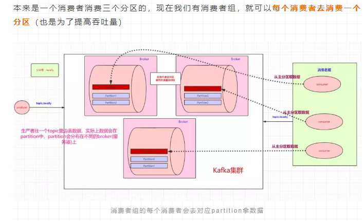

Kafka是最初由Linkedin公司开发，是一个分布式、分区的、多副本的、多订阅者，基于[zookeeper](../ZooKeeper.md)协调的分布式日志系统（也可以当做MQ系统），常见可以用于web/nginx日志、访问日志，消息服务等等，Linkedin于2010年贡献给了Apache基金会并成为顶级开源项目。  

1.zookeeper基本概念速览
-  
由MQ的基本知识知道，肯定有三个角色：生产者、消息队列、消费者

由常见MQ知道，kafka是分布式的，那是分布式结构是怎么实现的

kafka是怎么解决数据丢失的问题的

kafka是怎么消费MQ中的数据的
  
kafka底层获取数据的原理

kafka与zookeeper之间的羁绊

涉及的术语：
broker：Kafka 集群包含一个或多个服务器，服务器节点称为broker；  
Topic：每条发布到Kafka集群的消息都有一个类别，这个类别被称为Topic；  
partition：topic中的数据分割为一个或多个partition，partition中的数据是有序的，不同partition间的数据丢失了数据的顺序；  
Producer：生产者即数据的发布者，该角色将消息发布到Kafka的topic中；  
Consumer：消费者可以从broker中读取数据；  
Consumer Group：每个Consumer属于一个特定的Consumer Group；  
Leader：每个partition有多个副本，其中有且仅有一个作为Leader，Leader是当前负责数据的读写的partition；  
Follower：Follower跟随Leader，所有写请求都通过Leader路由，数据变更会广播给所有Follower，Follower与Leader保持数据同步。如果Leader失效，则从Follower中选举出一个新的Leader；当Follower与Leader挂掉、卡住或者同步太慢，leader会把这个follower从“in sync replicas”（ISR）列表中删除，重新创建一个Follower。

2.kafka的优点
-  
解耦  
冗余：持久化  
扩展  
灵活&峰值处理能力：不需要为了峰值，投入大量成本，平时浪费资源  
可恢复性  
顺序保证：Kafka保证一个Partition内的消息的有序性  
缓冲
异步通信

参考：  
1.https://www.cnblogs.com/qingyunzong/p/9004509.html
2.https://kafka.apachecn.org/documentation.html