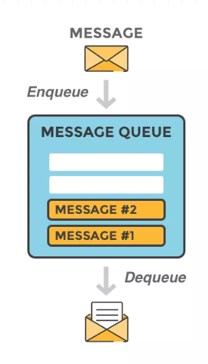
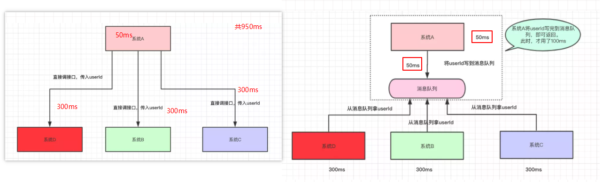

1.消息队列（MQ(Message Queue)）
- 
目的：将要传递的数据放在队列里面    
把数据放进去的一方叫做生产者  
把数据总队列中取出的叫做消费者  
  

优势：  
* 解耦：生产者把产生的数据放在消息队列里面，需要数据的消费者自己去取，有需求的变动（某个系统需要数据，某个系统不需要再提供数据）和生产者无关，直接找消息队列就可以，生产者无需修改代码。  
* 异步：如果直接调用系统接口传递数据，操作的时间成本是计算时间成本加调用时间成本，但是在一些系统之间，对于非主要业务可以异步调用（订单系统与短信通知系统可以看作主要业务与非主要业务的关系）以提高用户体验和吞吐量（原来比如说完成一次操作需要50ms计算，300ms的接口调用，这还只是涉及一个接口，要是有多个就消耗的时间更加多了，但是有了消息队列的话，计算50ms，写入消息队列100ms，任务结束，其他的接口获取消息队列中的数据异步进行就可以，时间不用计算在主业务系统的消耗上，可以有效的提高主业务系统的吞吐量）
  
* 限流：如果是请求直接访问系统服务，当请求量大于服务能够处理的数据量时，就会导致系统崩溃，需要限制请求的数量，消息队列的处理办法就是把请求放在队列中，再由各个系统去消息队列中获取请求的数据进行处理，返回结果，这样就不会产生由于请求集中增加导致的系统忙碌于崩溃

为什么是MQ，不是JDK的队列  
高可用：从上面看，MQ要有解耦、异步和限流的优势，肯定不能是单机的，要是这台机器宕机了，整个系统就崩溃了，需要时集群/分布式的，这样如果要自己写代码实现肯定不合适啊，可以，但是没有必要。  
数据丢失：万一数据写完以后，程序挂了，数据丢失造成的影响就大了，和[redis](./Redis/redis.md)类似，肯定需要有对应的机制来保存数据，再次启动以后可以还原数据。  
消费者数据获取方式：一种是生产者将数据放入MQ，主动告诉消费者去取数据（push），还有一种就是消费者自己去轮询MQ，有数据就取回来用（pull）。
其他：重复消息的处理、消息的绝对顺序......

2.常见MQ  
* [RabbitMQ](./RabbitMQ/RabbitMQ.md)：Erlang编写的重量级MQ（大腕啊），支持的协议多（AMQP，XMPP, SMTP, STOMP），实现了Broker构架，发送消息的时候会先在中心队列排队，对路由、负载均衡或者数据持久化都有很好的支持。  
* Redis：基于Key-Value对的NoSQL数据库，支持MQ功能，所以完全可以当做一个轻量级的队列服务来使用。（小数据的入队速度非常快，表现优越，但是数据较大的时候表现不行；出队的时候性能都非常好）  
* ZeroMQ：号称最快的消息队列系统，尤其针对大吞吐量的需求场景，能够实现RabbitMQ不擅长的高级/复杂的队列，但是开发人员需要自己组合多种技术框架。不需要安装和运行一个消息服务器或中间件，因为你的应用程序将扮演这个服务器角色，意味着机器宕机，数据就消失了（拜拜了，您内）。
* ActiveMQ：Apache下的一个子项目， 类似于ZeroMQ，它能够以代理人和点对点的技术实现队列；同时类似于RabbitMQ，它少量代码就可以高效地实现高级应用场景。  
* [Kafka](./kafka/kafka.md)/Jafka：Apache下的一个子项目，是一个高性能跨语言分布式发布/订阅消息队列系统，而Jafka是在Kafka之上孵化而来的，即Kafka的一个升级版。（快速持久化，高吞吐量，完全分布式，支持Hadoop数据并行加载）（牛啊，不多说，学它先）

3.传递模式
* 点对点：消息持久到一个队列中以后，有一个或者多个消费者可以消费这条数据，但是只能被消费一次，然后删除（阅后即焚的感觉），这种模式可以保证数据处理的顺序。
* 发布-订阅：消息被持久化到一个topic中，一个消费者可以订阅多个topic，可以消费其中的所有数据，一条数据可以被多个消费者消费，不会立马删除数据。

参考：  
1.https://mp.weixin.qq.com/s?__biz=MzI4Njg5MDA5NA==&mid=2247485080&idx=1&sn=f223feb9256727bde4387d918519766b&chksm=ebd74799dca0ce8fa46223a33042a79fc16ae6ac246cb8f07e63a4a2bdce33d8c6dc74e8bd20&token=1439272449&lang=zh_CN&scene=21#wechat_redirect  
2.https://www.cnblogs.com/qingyunzong/p/9004509.html