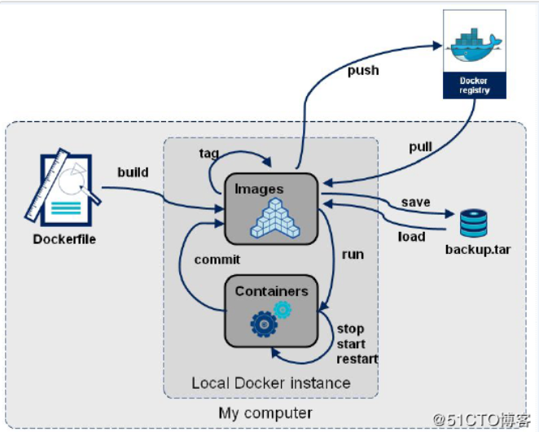

1.概念理解  
=  
Dockerfile是一个包含用于组合映像的命令的文本文档。  
可以使用在命令行中调用任何命令。Dockerfile其内部包含了一条条的指令，每一条指令构建一层，因此每一条指令的内容，就是描述该层应当如何构建。   
Docker通过读取Dockerfile中的指令自动生成映像。  
  

>简单一点的说法就是Dockerfile就是用来指导生成image的。   

一个Dockefile通常包含四个部分：  
* 基础镜像信息  
* 维护者信息  
* 镜像操作信息  
* 容器启动时执行指令  

2.常见的指令及含义  
=  
2.1FROM：指定基础镜像，必须为第一个命令
-  
`FROM <image>:<tag>`  

2.2MAINTAINER: 维护者信息  
-  
`MAINTAINER <name>`

2.3RUN：构建镜像时执行的命令  
-  
shell执行:`RUN <command>`  
exec执行:`RUN ["executable", "param1", "param2"]`

2.4ADD：将本地文件添加到容器中  
-  
tar类型文件会自动解压(网络压缩资源不会被解压)，可以访问网络资源，类似wget  
`ADD <src>... <dest>`  
`ADD ["<src>",... "<dest>"] 用于支持包含空格的路径`  

2.5COPY：功能类似ADD  
-  
但是是不会自动解压文件，也不能访问网络资源  

2.6CMD：构建容器后调用，也就是在容器启动时才进行调用  
-  
CMD用于指定在**容器启动时**所要执行的命令 VS RUN用于指定**镜像构建**时所要执行的命令。
`CMD ["executable","param1","param2"]`  (执行可执行文件，优先)  
`CMD ["param1","param2"] `(设置了ENTRYPOINT，则直接调用ENTRYPOINT添加参数)  
`CMD command param1 param2 `(执行shell内部命令)  

2.7ENTRYPOINT：配置容器，使其可执行化  
-  
配合CMD可省去"application"，只使用参数。  
ENTRYPOINT与CMD非常类似，不同的是通过docker run执行的命令不会覆盖ENTRYPOINT，而docker run命令中指定的任何参数，都会被当做参数再次传递给ENTRYPOINT。Dockerfile中只允许有一个ENTRYPOINT命令，多指定时会覆盖前面的设置，而只执行最后的ENTRYPOINT指令。  
`ENTRYPOINT ["executable", "param1", "param2"] `(可执行文件, 优先)  
`ENTRYPOINT command param1 param2 `(shell内部命令)  

2.8LABEL：用于为镜像添加元数据  
-  
`LABEL <key>=<value> <key>=<value> <key>=<value> ...`  

2.9ENV：设置环境变量  
-  
`ENV <key> <value>`  `<key>`之后的所有内容均会被视为其`<value>`的组成部分，因此，一次只能设置一个变量  
`ENV <key>=<value> ...  `可以设置多个变量，每个变量为一个`<key>=<value>`的键值对，如果`<key>`中包含空格，可以使用\来进行转义，也可以通过""来进行标示；另外，反斜线也可以用于续行

2.10EXPOSE：指定于外界交互的端口  
-  
`EXPOSE <port> [<port>...]`  

2.11VOLUME：用于指定持久化目录  
-  
一个卷可以存在于一个或多个容器的指定目录，该目录可以绕过联合文件系统，并具有以下功能：  
卷可以容器间共享和重用  
容器并不一定要和其它容器共享卷  
修改卷后会立即生效  
对卷的修改不会对镜像产生影响  
卷会一直存在，直到没有任何容器在使用它  
`VOLUME ["/path/to/dir"]`

2.12WORKDIR：工作目录，类似于cd命令  
-  
`WORKDIR /path/to/workdir`  

参考：  
1.https://www.cnblogs.com/edisonchou/p/dockerfile_inside_introduction.html  
2.