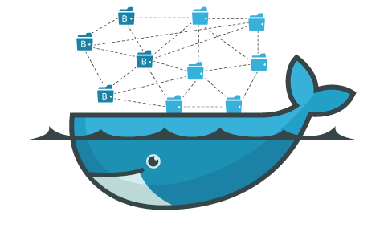

对docker的理解：
   
  
 
Docker 的角度，软件就是容器的组合：业务逻辑容器、数据库容器、储存容器、队列容器......Docker 使得软件可以拆分成若干个标准化容器，然后像搭积木一样组合起来。  
这个微服务的思想不谋而合：软件把任务外包出去，让各种外部服务完成这些任务，软件本身只是底层服务的调度中心和组装层。  
微服务很适合用 Docker 容器实现，每个容器承载一个服务。一台计算机同时运行多个容器，从而就能很轻松地模拟出复杂的微服务架构。  


1.Docker用来解决什么问题的
=  
为了让开发好的软件可以在用户的机器上正确的运行起来，需要对机器进行一系列的配置，但是由于每台机器的情况都不一样，配置环境的过程各不相同，而且以我们日常中安装软件的一些经验来看，可能由于一些奇奇怪怪的问题，会导致出错，为了正确配置环境费时费力。（我们自然会想到，把我们开发时候用的软件可以正常运行的环境复制一份给用户，这样问题不就解决了吗）

2.解决办法  
=  
2.1虚拟机    
- 
在一种操作系统里面运行另一种操作系统（比如在 Windows 系统里面运行 Linux 系统），由于虚拟机看上去跟真实系统一模一样，应用程序不知道是在虚拟机上跑；而对于底层系统来说，虚拟机就是一个普通文件。  
但是：虚拟机需要单独的内存与硬盘空间，为了应用程序可以运行，我们还必须接受由于运行虚拟机需要付出的代价；虚拟机本身就是一个完整的操作系统，两套操作系统必然会有一些操作是冗余的（最简单的就是用户登录）；启动慢，为了运行应用程序，先要等虚拟机上的操作系统运行起来。  
为了让程序可以正常运行，直接复制了一个操作系统，用户的设备只要可以运行这个复制的操作系统就可以。  

2.2Linux 容器  
-  
不是模拟一个完整的操作系统，而是对进程进行隔离，对于容器里面的进程来说，它接触到的各种资源都是虚拟的，从而实现与底层系统的隔离。  
启动容器相当于启动本机的一个进程，启动比较快；容器只占用需要的资源，不占用那些没有用到的资源，而且多个容器可以共享资源；容器只要包含用到的组件即可，容器文件比虚拟机文件要小很多。  
不是复制整个操作系统，而是把运行应用程序与用户的设备隔离，用户设备为这个隔离的空间提供虚拟化的支持，应用程序在这个"世外桃源"里面干自己的事。  

2.3
-  
Docker 属于 Linux 容器的一种封装，提供简单易用的容器使用接口。  
Docker 将应用程序与该程序的依赖，打包在一个文件里面，运行这个文件，就会生成一个虚拟容器，程序在这个虚拟容器里运行。  
应用程序带上自己需要用的东西，打包带走，走到一处就打开这个包就住下了开始正常的生活。


3.可以用在哪里，用来干什么
=  
一次性的环境：为了测试应用程序是不是可以在其他人那里正常运行，以后就不需要装虚拟机这样的复杂操作了；  
提供弹性的云服务：开关这么方便，很适合动态扩容和缩容；  
组建微服务架构：微服务通常需要多台服务器来运行，开发者又不是每个人都有那么多钱可以豪横，就可以用来在一台电脑上模拟出微服务架构。  

4.一些重要概念
=  
4.1image文件  
-  
上面也说了，docker会把程序和需要的依赖“打包”，编程一个文件，这个文件就是image文件。  
要用的时候，docker运行这个文件就可以根据这个image文件生成容器，同一个image文件，可以生成多个同时运行的容器实例。（类似于安装文件，但是是那种可以在一台电脑上安装多次的软件对应安装文件，不是只可以安装一次的软件）  
image文件是一个二进制文件，一个image文件往往通过继承另一个image文件，加上一些个性化设置而生成，一般不会自己去从头定制一个image，制作好的image文件可以贡献出来和大家共享，共享image的地方就是仓库（repository），官方仓库是[DockerHub](https://hub.docker.com/)。

4.2容器文件  
-  
image文件运行后，产生的容器实例本身也是一个文件，image运行后就会有两个文件，一个image文件一个容器文件，并且容器停止运行并不会删除容器文件。  
终止运行的的容器文件，依然占据磁盘空间，只有手动删除才可以从磁盘上移文件。  

4.3Dockerfile
一个文本文件，用来配置image文件，Docker会根据这个文件生成二进制的image文件，这样我们才可以方便的将我们的软件推广开来。
编写示例：
4.3.1[ 可选 ]排除一些不需要的文件  
项目根目录下新建.dockerignore文本文件，写入需要排除的文件  
4.3.2编写Dockerfile
项目的根目录下，新建一个文本文件 Dockerfile  
```
FROM node:8.4
COPY . /app
WORKDIR /app
RUN npm install --registry=https://registry.npm.taobao.org
EXPOSE 3000
CMD node demos/01.js
```
对应内容的分别解释为  
```
FROM node:8.4：该 image 文件继承官方的 node image，冒号表示标签，这里标签是8.4，即8.4版本的 node。
COPY . /app：将当前目录下的所有文件（除了.dockerignore排除的路径），都拷贝进入 image 文件的/app目录。
WORKDIR /app：指定接下来的工作路径为/app。
RUN npm install：在/app目录下，运行npm install命令安装依赖。注意，安装后所有的依赖，都将打包进入 image 文件。
EXPOSE 3000：将容器 3000 端口暴露出来， 允许外部连接这个端口。
CMD node demos/01.js：表示容器启动后自动执行cmd命令node demos/01.js
```
需要注意的是：  
RUN命令在 image 文件的构建阶段执行，执行结果都会打包进入 image 文件；CMD命令则是在容器启动后执行。  
另外，一个 Dockerfile 可以包含多个RUN命令，但是只能有一个CMD命令。

需要***特别注意***的是，指定了CMD命令以后，docker container run命令就不能附加命令了


4.3.3创建image文件  
docker image build -t koa-demo  
docker image build -t koa-demo:0.0.1 .   
解释：-t参数用来指定 image 文件的名字，后面还可以用冒号指定标签（如果不指定，默认的标签就是latest），最后的那个点表示 Dockerfile 文件所在的路径（例是当前路径，所以是一个点）  

4.3.4运行image文件  
docker container run --rm -p 8000:3000 -it koa-demo:0.0.1 /bin/bash  

4.3.5停止容器  
docker container kill [ containerID ]  
或者：ctrl + c  

4.3.6发布image文件  
确认了 image 文件的有效性，本着开源精神，可以发布到网上和大家进行分享  

5.常用的操作命令
=  
5.1从仓库获取image文件：  
格式：docker pull groupname/imagefilename  
示例：docker pull [ library/ ]hello-world  
官方默认是在library分组下面，可以不用加分组名称  

5.2查看本地image文件  
格式：docker image ls  

5.3运行image文件  
格式：docker container run imagefilename
示例：docker container run hello-world
docker container run命令具有自动抓取image文件的功能，如果发现本地没有指定的 image 文件，就会从仓库自动抓取。  
后面还可以加一些参数：
格式：docker container run -p 本机端口:容器端口 -it imagefilename:标签 容器启动后的第一个命令  
示例：docker container run --rm -p 8000:3000 -it koa-demo:0.0.1 /bin/bash  
解释：  
```
--rm:在容器终止运行后自动删除容器文件。
-p参数：容器的 3000 端口映射到本机的 8000 端口。
-it参数：容器的 Shell 映射到当前的 Shell，然后你在本机窗口输入的命令，就会传入容器。
koa-demo:0.0.1：image 文件的名字（如果有标签，还需要提供标签，默认是 latest 标签）。
/bin/bash：容器启动以后，内部第一个执行的命令。这里是启动 Bash，保证用户可以使用 Shell。
```
运行image文件  ***VS***  启动容器  
格式:docker container start \[containerID\]  
RUN是新建一个容器实例，每次都是新建一个，容器文件会不断增加；  
START是启动，始终只有一个容器文件。  

5.4停止一个容器  
格式：docker container kill containerID  
示例：docker container kill hello-world  

kill***VS***stop  
格式：bash container stop \[containerID\]  
kill命令终止容器运行，相当于向容器里面的主进程发出 SIGKILL 信号，直接终止所有操作，正在进行的操作全部丢失；  
stop命令也是用来终止容器运行，先向容器里面的主进程发出 SIGTERM 信号，然后过一段时间再发出 SIGKILL 信号，程序收到 SIGTERM 信号可以自行进行收尾清理工作，但也可以不理会这个信号，然后在收到 SIGKILL 信号后终止所有操作  


5.5查看容器文件列表（输出信息中包含容器id）   
格式：  
docker container ls（列出本机正在运行的容器）  
docker container ls --all（列出本机所有的容器，包括已经停止运行的容器）  

5.6移除容器文件
格式：docker container rm \[containerID\]  

5.7发布image文件  
前提：注册，登录 docker login  
标记本地image  
格式：docker image tag \[imageName\] \[username\]/\[repository\]:\[tag\]  
示例：docker image tag koa-demos:0.0.1 ruanyf/koa-demos:0.0.1  
或者  
格式：docker image build -t \[username\]/\[repository\]:\[tag\]  
示例：
发布  
格式：docker image push \[username\]/\[repository\]:\[tag\]  

5.8查看输出  
格式：docker container logs \[containerID\]  

5.9进入一个容器
格式：docker container exec -it \[containerID\] /bin/bash

5.9拷贝文件  
格式：docker container cp \[containerID\]:\[/path/to/file\] .
解释：拷贝指定文件到当前路径

参考：
1.http://www.ruanyifeng.com/blog/2018/02/docker-tutorial.html  （基础概念理解）
2.http://www.ruanyifeng.com/blog/2018/02/docker-wordpress-tutorial.html (搭建一个网站)

k8s
3.https://zhuanlan.zhihu.com/p/53260098    


Windows10 下docker的安装实践：  
遇到的问题主要有：
* 由于选取的安装版本问题导致的不可用（docker toolbox与docker desktop）    
* 安装软件下载速度非常慢，阿里云容器镜像下载  
* docker toolbox安装过程中由于未安装git（电脑上已有，所以未勾选避免重复安装），导致Docker Quickstart Terminal不可用，修改快捷方式属性，指向安装的git即可  
* 其余的问题参见：  
4.https://www.jianshu.com/p/2aa5b05717c6  