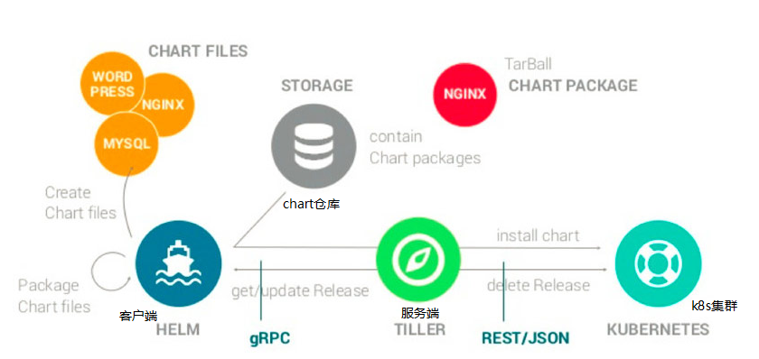

helm就是一个k8s的包管理器  
类似于Ubuntu的apt-get 

1.相关术语  
=  
1.1Helm(客户端，理解为操作界面) 
-  
Helm 是一个命令行下的客户端工具。主要用于 Kubernetes 应用程序 Chart 的创建、打包、发布以及创建和管理本地和远程的 Chart 仓库。

1.2Tiller（服务端，理解为后台，在k8s上的实际的操作功能由它完成）  
-  
Tiller 是 Helm 的服务端，部署在 Kubernetes 集群中。Tiller 用于接收 Helm 的请求，并根据 Chart 生成 Kubernetes 的部署文件（ Helm 称为 Release ），然后提交给 Kubernetes 创建应用。Tiller 还提供了 Release 的升级、删除、回滚等一系列功能。

1.3Chart（软件包，理解为.exe）  
-  
Helm 的软件包，采用 TAR 格式，其包含了一组定义 Kubernetes 资源相关的 YAML 文件。

1.4Release（应用实例，理解为.exe安装完以后的一个软件实例）  
-  
使用 helm install 命令在 Kubernetes 集群中部署的 Chart 称为 Release。

1.5Repoistory（仓库，集中管理Chart的地方）

结合上述的几个概念，可以大概了解一下Chart的Install、Update和Rollback过程  
Install与Update：  
Helm从指定的目录或者tgz文件中解析出Chart结构信息，然后将指定的Chart结构和Values信息(或要更新的信息)通过gRPC传递给Tiller  
Tiller根据Chart和Values生成一个Release/生成Release并更新指定名称的Release的History，将Release发送给Kubernetes，完成安装/更新  

Rollback：  
Helm将要回滚的Release的名称传递给Tiller，Tiller根据Release的名称查找History，获取上一个Release，将上一个Release发送给Kubernetes用于替换当前Release  

参考：  
1.https://blog.csdn.net/bbwangj/article/details/81087911  
2.

