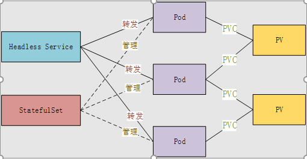

1.api对象  
=
API对象是Kubernetes集群中的管理操作单元。  
Kubernetes 集群系统每支持一项新功能，引入一项新技术，一定会新引入对应的 API 对象，支持对该功能的管理操作。  

API 对象都有 3 大类属性：  
* 元数据 metadata
    元数据是用来标识 API 对象的，每个对象都至少有 3 个元数据：namespace，name 和 uid；除此以外还有各种各样的标签 labels 用来标识和匹配不同的对象。
* 规范 spec   
    规范描述了用户期望 Kubernetes 集群中的分布式系统达到的理想状态（Desired State）；
* 状态 status  
    status 描述了系统实际当前达到的状态（Status）  

Kubernetes 中所有的配置都是通过 API 对象的 spec 去设置的，也就是用户通过配置系统的理想状态来改变系统，这是 Kubernetes 重要设计理念之一，即所有的操作都是声明式（Declarative）的而不是命令式（Imperative）的。  
比如：用户可以通过复制控制器 Replication Controller 设置期望的 Pod 副本数为 3；系统当前实际的 Pod 副本数为 2；那么复制控制器当前的程序逻辑就是自动启动新的 Pod，争取达到副本数为 3。（我告诉你我想要3个，无论告诉你多少次还是3，命令式直接告诉你就是让你再开一个服务，运行多次结果就错了，会导致多开好多个）  

1.1Pod  
-  
pod是运行在docker之上，由一组运行在同一主机的一个或者多个容器组成；最基本的管理单位是 pod，而不是container。  
      
      
       
可以看作运行在 Kubernetes 集群中的小机器人，不同类型的业务就需要不同类型的小机器人去执行。  
目前 Kubernetes 中的业务主要可以分为长期伺服型（long-running）、批处理型（batch）、节点后台支撑型（node-daemon）和有状态应用型（stateful application）；分别对应的小机器人控制器为 Deployment、Job、DaemonSet 和 StatefulSet。  

副本控制器（Replication Controller，RC）  
保证 Pod 高可用的 API 对象：监控运行中的 Pod 来保证集群中运行指定数目的 Pod 副本（少了就新建，多了就杀死）。

副本集（Replica Set，RS）
RS 是新一代 RC，提供同样的高可用能力，区别主要在于 RS 后来居上，能支持更多种类的匹配模式。副本集对象一般不单独使用，而是作为 Deployment 的理想状态参数使用。  

### 1.1.1Deployment（部署）
部署是一个比 RS 应用模式更广的 API 对象，可以是创建一个新的服务，更新一个新的服务，也可以是滚动升级一个服务。  
### 1.1.2Job（任务）    
批处理业务的运行有头有尾，Job 管理的 Pod 根据用户的设置把任务成功完成就自动退出了。成功完成的标志根据不同的 spec.completions 策略而不同：单 Pod 型任务有一个 Pod 成功就标志完成；定数成功型任务保证有 N 个任务全部成功；工作队列型任务根据应用确认的全局成功而标志成功。
### 1.1.3DaemonSet（后台支撑服务集）  
后台支撑型服务的核心关注点在 Kubernetes 集群中的节点（物理机或虚拟机），要保证每个节点上都有一个此类 Pod 运行（存储、日志等等）
### 1.1.4StatefulSet（有状态服务集）  
两组近义词  
第一组是无状态（stateless）、牲畜（cattle）、无名（nameless）、可丢弃（disposable）；  
第二组是有状态（stateful）、宠物（pet）、有名（having name）、不可丢弃（non-disposable）；  
RC 和 RS 主要是控制提供无状态服务的，其所控制的 Pod 的名字是随机设置的，一个 Pod 出故障了就被丢弃掉，在另一个地方重启一个新的 Pod，名字变了（名字无所谓，数量达到预期数量就ok）；RC 和 RS 中的 Pod，一般不挂载存储或者挂载共享存储，保存的是所有 Pod 共享的状态，Pod 像牲畜一样没有分别。  
StatefulSet 是用来控制有状态服务，StatefulSet 中的每个 Pod 的名字都是事先确定的，不能更改；StatefulSet 中的 Pod，每个 Pod 挂载自己独立的存储，如果一个 Pod 出现故障，从其他节点启动一个同样名字的 Pod，要挂载上原来 Pod 的存储继续以它的状态提供服务。  

1.2节点（node）
-  
Kubernetes 集群中的计算能力由 Node 提供，是所有 Pod 运行所在的工作主机，可以是物理机也可以是虚拟机，统一特征是上面要运行 kubelet 管理节点上运行的容器。

1.3service  
-  
由于pod生命周期短，状态不稳定，pod异常后新生成的pod ip会发生变化，导致访问不到pod；通过service对pod做代理，service有固定的ip和port（Virtual IP：并不是一个真实存在的IP，无法被ping，没有实体网络对象来响应，是由k8s虚拟出来的），ip:port组合自动关联后端pod，即使pod发生改变，kubernetes内部更新这组关联关系，使得service能够匹配到新的pod；如果pod使用rc创建了多个副本，那么service就能代理多个相同的pod，所以service可以认为是一组pod的代理或者是更高层的抽象，其他的service通过本service提供的虚拟IP进行访问，也可以在service中对代理的一组pod提供负载服务。  
   

1.4存储卷（Volume）
-    
Kubernetes 的存储卷的生命周期和作用范围是一个 Pod，每个 Pod 中声明的存储卷由 Pod 中的所有容器共享。  
支持多种公有云平台的存储，包括 AWS，Google 和 Azure 云；  
支持多种分布式存储包括 GlusterFS 和 Ceph；  支持较容易使用的主机本地目录 emptyDir, hostPath 和 NFS；  
Kubernetes 还支持使用 Persistent Volume Claim 即 PVC 这种逻辑存储。  
1.4.1持久存储卷（Persistent Volume，PV）  
PV是K8s集群中某个网络存储对应的存储块
1.4.2持久存储卷声明（Persistent Volume Claim，PVC）
使得存储的使用者可以忽略后台的实际存储技术（例如 AWS，Google 或 GlusterFS 和 Ceph），而将有关存储实际技术的配置交给存储管理员通过 Persistent Volume 来配置。
  

存储的 PV 和 PVC 的这种关系，跟计算的 Node 和 Pod 的关系是非常类似的；
PV 和 Node 是资源的提供者，根据集群的基础设施变化而变化，由 Kubernetes 集群管理员配置；
PVC 和 Pod 是资源的使用者，根据业务服务的需求变化而变化，有 Kubernetes 集群的使用者即服务的管理员来配置。

1.5密钥对象（Secret）
-  
Secret 是用来保存和传递密码、密钥、认证凭证这些敏感信息的对象。  

1.6ConfigMap  
-  
将配置文件与image文件解耦，（总不能配置修改一次，就制作一次image文件吧）  
ConfigMap API给我们提供了向容器中注入配置信息的机制，ConfigMap可以被用来保存单个属性，也可以用来保存整个配置文件或者JSON二进制大对象。

1.6用户帐户（User Account）和服务帐户（Service Account）  
-  
用户帐户为人提供账户标识，而服务账户为计算机进程和 Kubernetes 集群中运行的 Pod 提供账户标识；人的身份与服务的 namespace 无关，所以用户账户是跨 namespace 的；而服务帐户对应的是一个运行中程序的身份，与特定 namespace 是相关的。  

1.7命名空间（Namespace）  
命名空间为 Kubernetes 集群提供虚拟的隔离作用，Kubernetes 集群初始有两个命名空间，分别是默认命名空间 default 和系统命名空间 kube-system，除此以外，管理员可以可以创建新的命名空间满足需要。

1.8RBAC 访问授权  
-  
基于角色的访问控制（Role-based Access Control，RBAC）的授权模式，相对于基于属性的访问控制（Attribute-based Access Control，ABAC），RBAC 主要是引入了角色（Role）和角色绑定（RoleBinding）的抽象概念。  
在 ABAC 中，Kubernetes 集群中的访问策略只能跟用户直接关联；  
而在 RBAC 中，访问策略可以跟某个角色关联，具体的用户在跟一个或多个角色相关联。  

1.9Etcd
-  
Etcd是Kubernetes集群中的一个十分重要的组件，用于保存集群所有的网络配置和对象的状态信息。  
整个kubernetes系统中一共有两个服务需要用到etcd用来协同和存储配置  
网络插件flannel、对于其它网络插件也需要用到etcd存储网络的配置信息  
kubernetes本身，包括各种对象的状态和元信息配置  