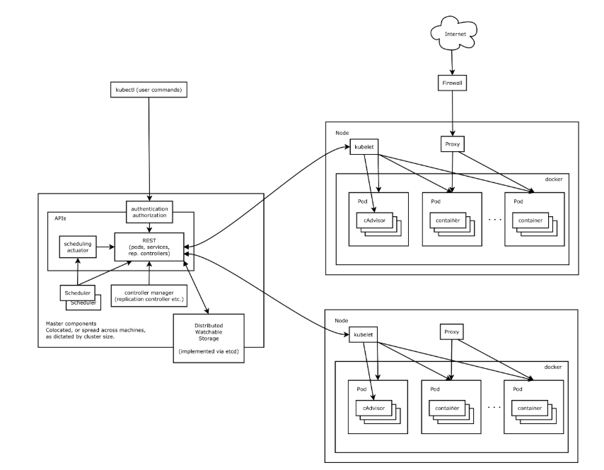

Dockers实现了将应用程序装进容器里面，方便我们的应用的推广使用。  
但是，当我们将其运用到实际业务中的时候，用起来还是不方便，各个容器之间的调度，管理还是需要一个工具来方便的完成，k8s就是这样的一个工具。  

K8S，就是基于容器的集群管理平台，它的全称，是kubernetes（用“8”字替代了“ubernete”这8个字符）。
官方的架构一览图：  
 
太难懂了，抽象简化一下  
   
继续简化  
 

1.k8s集群  
=  
一个K8S系统，通常称为一个K8S集群（Cluster），主要包括：  
  
  
* 主节点（master）一个  
    API Server：门面，营业厅  
    Scheduler：调度室  
    Controller manager：大管家   
    etcd：分布式数据库（key-value），存储集群的所有数据  
  
* 计算节点（node）一群  
  
    [Docker](../Docker/docker.md)  
    kubelet：主要负责监视指派到它所在Node上的Pod，包括创建、修改、监控、删除等    
    kube-proxy：主要负责为Pod对象提供代理  
    Fluentd：主要负责日志收集、存储与查询  
    kube-dns（可选）  
    Pod：pod是运行在docker之上，由一组运行在同一主机的一个或者多个容器组成；最基本的管理单位是 pod，而不是container。  
      
      
       
    Service：由于pod生命周期短，状态不稳定，pod异常后新生成的pod ip会发生变化，导致访问不到pod；通过service对pod做代理，service有固定的ip和port（Virtual IP：并不是一个真实存在的IP，无法被ping，没有实体网络对象来响应，是由k8s虚拟出来的），ip:port组合自动关联后端pod，即使pod发生改变，kubernetes内部更新这组关联关系，使得service能够匹配到新的pod；如果pod使用rc创建了多个副本，那么service就能代理多个相同的pod，所以service可以认为是一组pod的代理或者是更高层的抽象，其他的service通过本service提供的虚拟IP进行访问，也可以在service中对代理的一组pod提供负载服务。  
       
    namespace：用于实现多租户的资源隔离，Namespace通过将集群内部的资源对象分配到不同的Namespace中，形成逻辑上分组的不同项目、小组或用户组，便于不同的分组在共享使用整个集群的资源的同时还能被分别管理。  
    
 

高级货色：  
分层架构  
 
API设计原则  
控制机制设计原则

参考：  
1.https://my.oschina.net/jamesview/blog/2994112（极简的介绍）  
2.https://blog.csdn.net/maoyeqiu/article/details/79270625 （基本概念的较为详细的介绍）  
3.https://jimmysong.io/kubernetes-handbook/concepts/（k8s手册）
