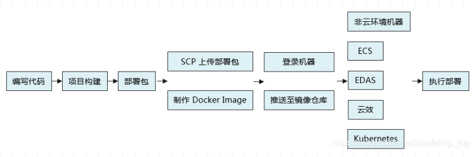
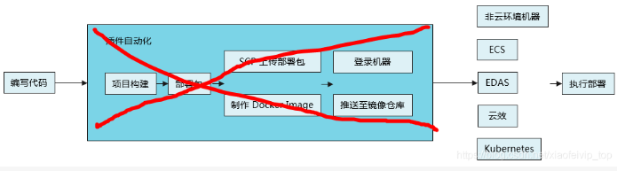
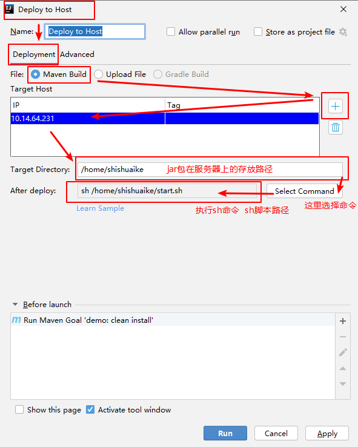
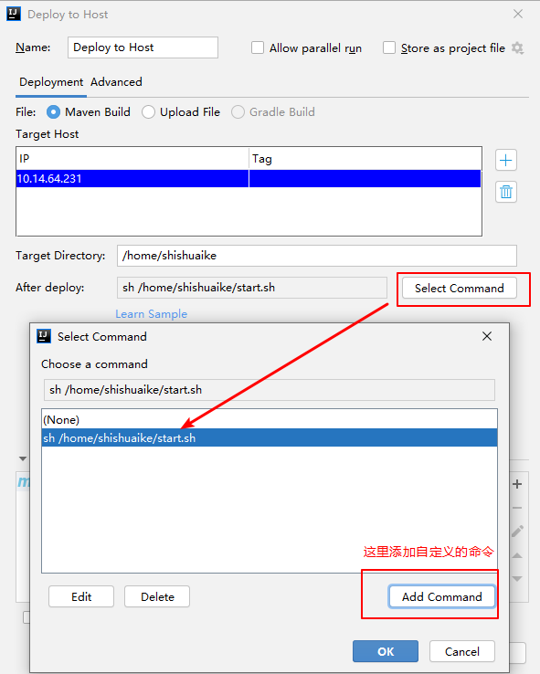
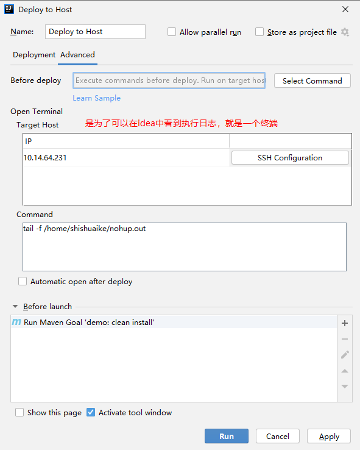
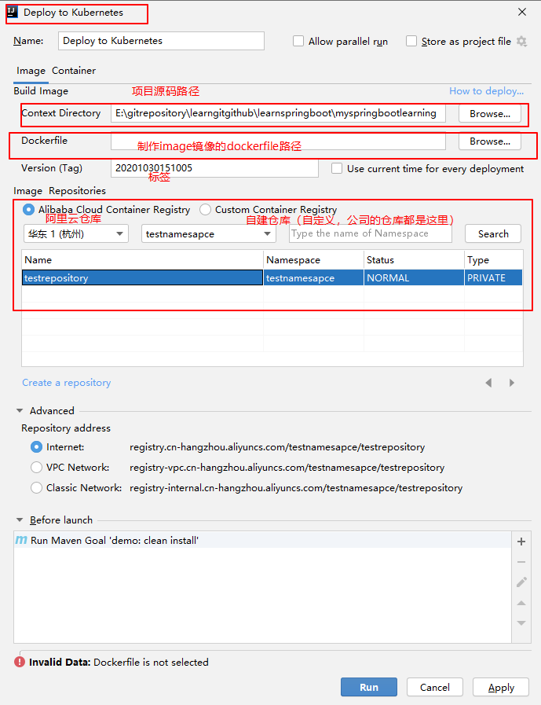
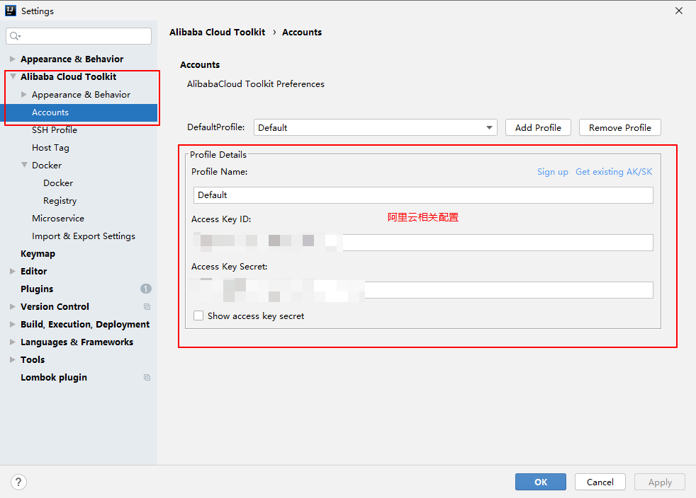

1.Cloud Toolkit  
=  
目标是简化部署过程，传统的部署过程一般步骤如下图所示：  
  
有了插件之后，部署过程就可以简化为：  
  

2.插件安装  
=  
就是一般的插件安装过程，无特殊之处  

3.使用记录  
=
3.1单机服务器部署
-  
参考链接1中的操作为将编写的源代码打包，然后上传到服务器，并执行指定sh脚本，完成项目启动的实际操作过程，其中，他的操作中的配置ecs为将项目部署到阿里云上的操作，为了将项目部署到自己的服务器，改为操作deploy host  
  
  
  

3.2k8s集群服务器部署  
-  
相比于单机部署，k8s部署就比较麻烦了。。。  
主要涉及到的有两块重要设置：  
### 3.2.1私人镜像仓库配置    
这里尝试了使用阿里云的镜像仓库与自建仓库  
  
尝试阿里云的镜像仓库，就需要配置阿里云的相关信息，appsecretkey等，可以成功获取到仓库（虽然会弹一些异常提示窗口，具体是否有影响等配置完以后看效果）  
  
尝试本机docker自建镜像仓库  
遇到问题：配置的时候无法连接到registry，连接失败  

### 3.2.2自建k8s集群配置

阿里云官方文档为部署到阿里云k8s提供了一系列的帮助（docker镜像仓库，k8s容器服务等），但是对要部署到自建k8s集群上的说明指导意义不大  

参考：  
1.https://xffjs.com/f/article/59.html（部署到服务器host）  
2.https://help.aliyun.com/document_detail/168937.html?spm=a2c4g.11186623.6.586.4b3d4878MzSYuv（阿里云关于插件部署应用到自建k8s的文档）  
3.https://www.cnblogs.com/hbxZJ/p/10236107.html（自建镜像仓库）
