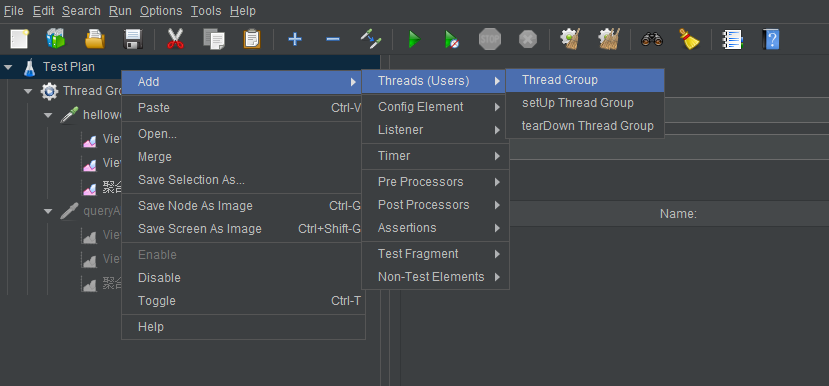
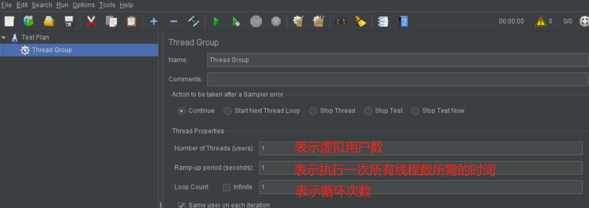
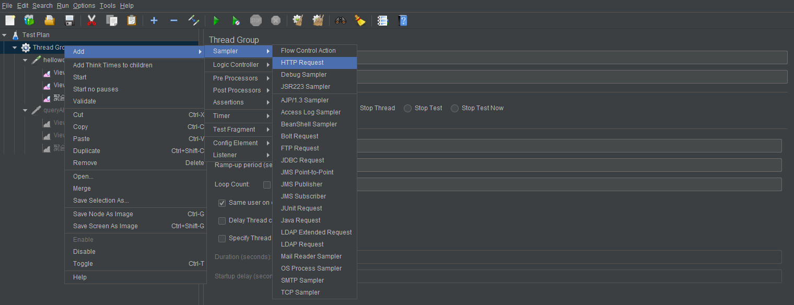
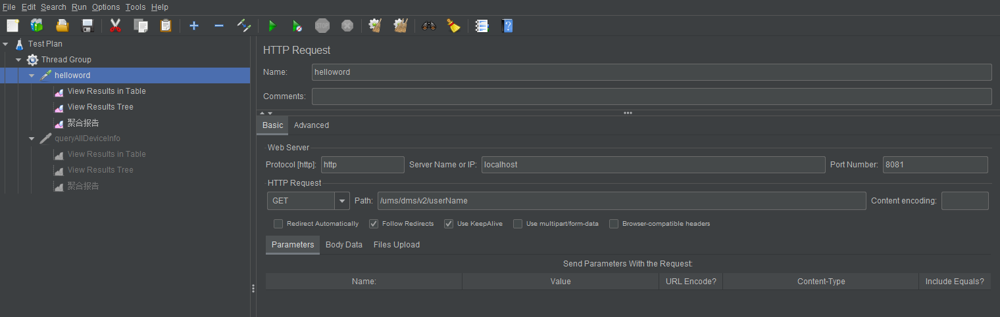
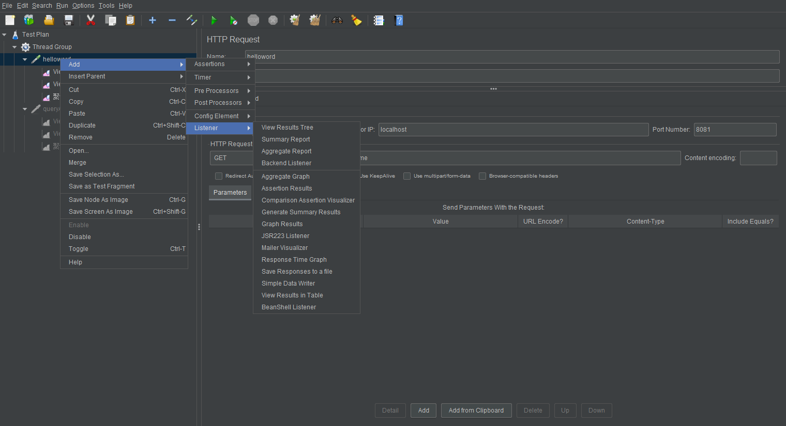
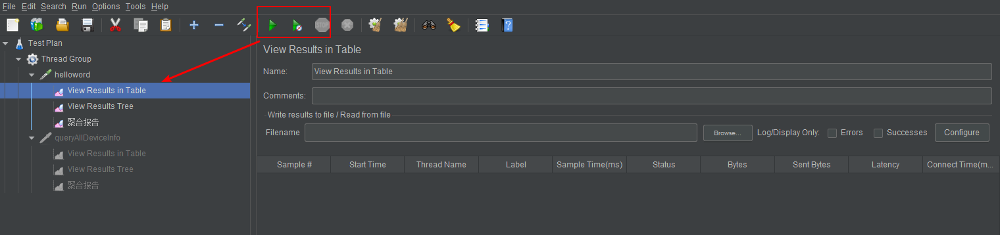

Jmeter是一款软件测试产品  

1.安装教程  
=  
[下载](http://jmeter.apache.org/download_jmeter.cgi)、解压、运行（bin目录下的jmeter.bat文件）  
>运行后会打开两个窗口，运行过程中不要关闭命令行窗口  

2.使用  
=  
主要包含以下几个步骤：  
添加测试计划、设置线程数、设置请求头、添加监听器、测试、查看结果报告  
  
  
  
  
  
  

参考：  
1.https://blog.csdn.net/yaorongke/article/details/82799609（安装与快速使用）  
2.https://www.cnblogs.com/iceb/p/7094047.html（比较详细的使用说明）  
3.https://blog.csdn.net/nyist327/article/details/44653965?utm_medium=distribute.pc_relevant_t0.none-task-blog-BlogCommendFromMachineLearnPai2-1.add_param_isCf&depth_1-utm_source=distribute.pc_relevant_t0.none-task-blog-BlogCommendFromMachineLearnPai2-1.add_param_isCf(带参数的post请求)  
4.https://blog.csdn.net/zouxiongqqq/article/details/107469463（参数编码，解决body中中文乱码）