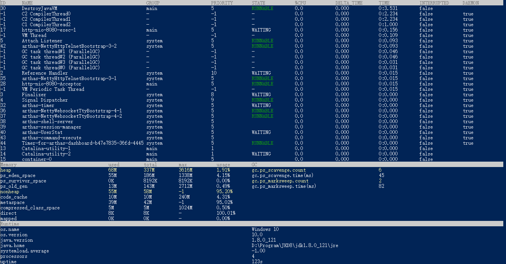
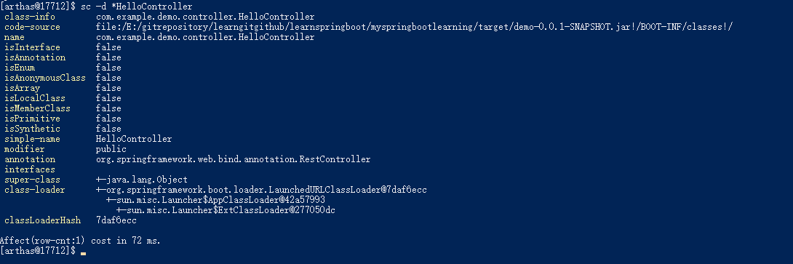
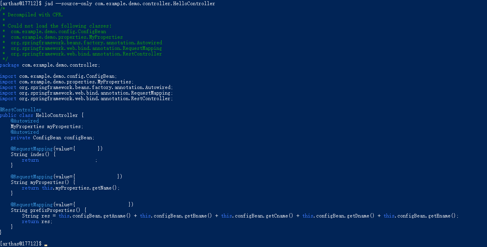
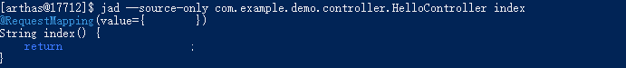
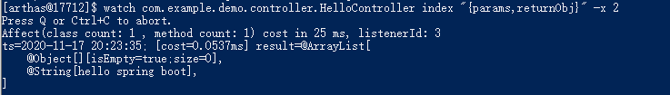
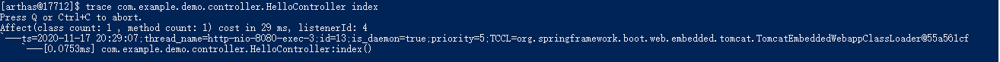
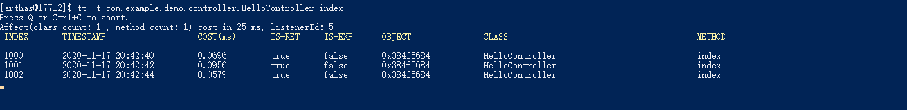

阿里巴巴开源的Arthas，是一款线上debug调试工具  
适用场景：  
线上运行的代码功能出现了问题，无法debug，或者没有相关的日志，为了一行日志更新线上代码、部署等又不方便；  
程序可以正常运行，但是反应时间比较长，不知道问题出在哪里；  
程序初期运行完美，但是一段时间后，程序变慢；  


一、基本指令([官方指令文档](https://arthas.aliyun.com/doc/commands.html))  
=  
1.dashboard  
-  
“上帝视角”指令：Dashboard，整个程序进程有个直观的数据监控  
  

2.sc  
-  
SC：查看JVM已加载的类信息,类的详细信息，包括是从哪个jar包读取的，他是不是接口/枚举类等，甚至包括他是从哪个类加载器加载的。
```
sc -d *MathGame
```
  

3.jad  
-  
jad：反编译某个类，或者反编译某个类的某个方法
```
# 反编译只显示源码
jad --source-only com.Arthas
# 反编译某个类的某个方法
jad --source-only com.Arthas mysql
```
  
  

4.方法运行相关  
-  
### 4.1[watch](https://arthas.aliyun.com/doc/watch.html)  
watch：方法执行的数据观测，你可以通过watch指令，来监控某个类，监控后，运行下你的功能，复现下场景，arthas会提供给你具体的出参和入参，帮助你排查故障  
  

### 4.2trace  
trace：输出方法调用路径，并输出耗时  
这个指令对于优化代码非常的有用，可以看出具体每个方法执行的时间，如果是for循环等重复语句，还能看出n次循环中的最大耗时，最小耗时，和平均耗时  
  

### 4.3[tt](https://arthas.aliyun.com/doc/tt.html)  
tt：官方名为时空隧道  
对某方法开启tt后，会记录下每一次的调用（你需要设置最大监控次数），然后你可以在任何时候会看这里面的调用，包括出参，入参，运行耗时，是否异常等  
  

```
watch com.example.demo.controller.HelloController index "{params,returnObj}" -x 2
trace com.example.demo.controller.HelloController index
tt -t com.example.demo.controller.HelloController index
```

5.线程相关  
-  
thread -n：排列出 CPU 使用率 Top N 的线程。  
thread -b：排查阻塞的线程。（代码有时候设计的不好，会引发死锁的问题，卡住整个线程执行，使用这个指令可以轻松的找到问题线程，以及问题的执行语句）


6.[ognl表达式](../../杂记/OGNL.md)  
-  
[参考示例](https://github.com/alibaba/arthas/issues/11)  

参考：  
1.https://mp.weixin.qq.com/s?__biz=MzU1NTA0NTEwMg==&mid=2247484057&idx=1&sn=84861376e5a231e87c0d1161107e608f&scene=21#wechat_redirect（博客，简化版文档）  
2.https://arthas.aliyun.com/doc/（官方文档）  
3.https://commons.apache.org/proper/commons-ognl/language-guide.html(OGNL)  
