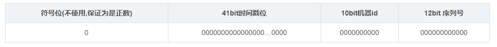
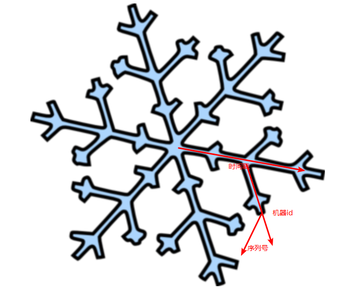
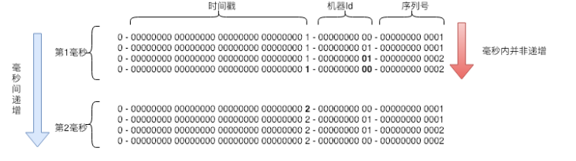

1.数据库自增主键  
=  
>优点：简单  
>缺点：依赖数据库，对于分库，分表等问题无法解决，即使通过配置解决了，也不利于后续扩容操作  

2.时间戳  
=  
用时间作为唯一ID  
>优点：简单  
>缺点：高并发，分布式场景下不适用，统一时间id就会重复    

3.Redis原子操作  
=  
利用Redis原子操作incrBy  
>优点：简单  
>缺点：依赖redis，且为了保证正常工作，redis需要做持久化      

4.UUID/GUID  
=  
>优点：简单，无其他依赖；唯一，随机，适合分布式 / 高并发  
>缺点：太长，128bit，随机性高，也会导致索引操作消耗大，不适合做数据库主键索引

5.雪花算法  
=  
符号位 + 时间戳 + 机器id + 序列号     
  
  
>优点：算法简单，不需要依赖其他的组件；长度合适，趋势是递增的（不是严格递增），磁盘io友好，对建立索引影响较小  
>缺点：时间戳可能重复，主要是由于机器时间不同步导致的，时间同步误差只能减小，无法消灭      
  

