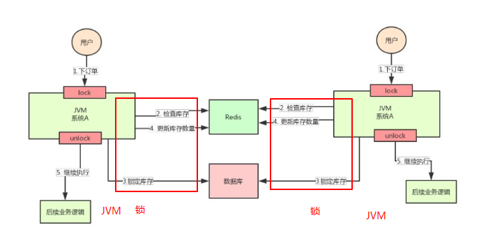
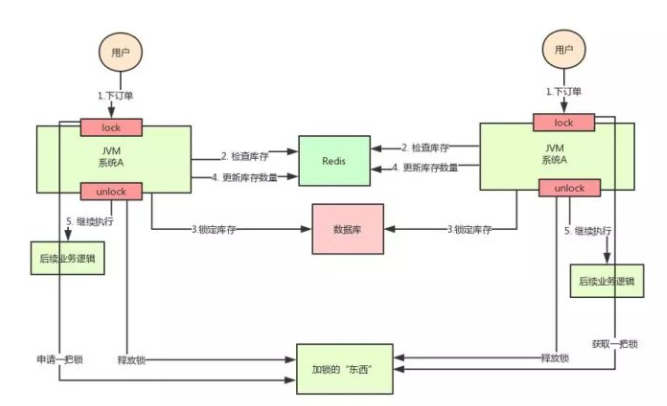

分布式锁  
=  
1.是什么
-  
由线程到进程，再到操作系统层面，可以分为三类锁：线程锁、进程锁与分布式锁  
### 1.1线程锁  
主要用来给方法、代码块加锁：当某个方法或代码使用锁，在同一时刻仅有一个线程执行该方法或该代码段；线程锁只在同一JVM中有效果，因为线程锁的实现在根本上是依靠线程之间共享内存实现的。（java并发编程中synchronized等线程锁）  
### 1.2进程锁  
为了控制同一操作系统中多个进程访问某个共享资源。（因为进程具有独立性，各个进程无法访问其他进程的资源，因此无法通过synchronized等线程锁实现进程锁）  
### 1.3分布式锁  
当多个进程不在同一个系统中，用分布式锁控制多个进程对资源的访问。  
  

2.使用场景  
-  
线程间并发问题和进程间并发问题都是可以通过分布式锁解决的，但是消耗的资源与解决问题得到的收益相比是不合适的。  
分布式锁解决分布式情况下的多进程并发问题是最合适的。
  

3.可靠性要求  
-  
### 3.1互斥性  
在任意时刻，只有一个客户端能持有锁。  
### 3.2不会发生死锁  
即使有一个客户端在持有锁的期间崩溃而没有主动解锁，也能保证后续其他客户端能加锁。  
### 3.3具有容错性  
只要大部分的Redis节点正常运行，客户端就可以加锁和解锁。  
### 3.4解铃还须系铃人  
加锁和解锁必须是同一个客户端，客户端自己不能把别人加的锁给解了。

4、实现方式
-   
### 4.1基于数据库实现分布式锁  
   
### 4.2基于缓存（Redis等）实现分布式锁  
[Resdis分布式锁的实现方式](./Redis分布式锁.md)
### 4.3基于Zookeeper实现分布式锁

参考：
1.https://blog.csdn.net/yb223731/article/details/90349502  
2.https://www.cnblogs.com/barrywxx/p/11644803.html  
3.https://zhuanlan.zhihu.com/p/148606203?utm_source=wechat_timeline

