Redis介绍
=  
出于低延迟的读写速度、支撑海量的数据和流量、大规模集群的管理与庞大运营成本的考量，NOSQL应运而生  
Redis是现在最受欢迎的NoSQL数据库之一  
1.特点   
-  
基于内存运行，性能高效  
* 支持分布式，理论上可以无限扩展  
* key-value存储系统（MAP?为什么不用map：map是本地的缓存，多台机器使用的话不具有一致性，redis是分布式缓存，具有一致性；map不是专业做缓存，内存受到限制，缓存的数据随着JVM销毁而结束，而且JVM内存太大容易挂掉的，redis是专业的，可以将缓存数据保存在硬盘中，Redis重启了后可以将其恢复）  
* 开源的使用ANSI C语言编写、遵守BSD协议、支持网络、可基于内存亦可持久化的日志型、Key-Value数据库，并提供多种语言的API  

C/S通讯模型  
单进程单线程模型  
丰富的数据类型  
操作具有原子性  
持久化  
高并发  
支持lua脚本  

2.应用场景  
-  
Redis 的应用场景包括：缓存系统（“热点”数据：高频读、低频写）、计数器、消息队列系统、排行榜、社交网络和实时系统。  


3.数据结构与数据类型  
-  
Redis提供的数据类型主要分为5种自有类型和一种自定义类型，这5种自有类型包括：String类型、哈希类型、列表类型、集合类型和顺序集合类型（Redis并没有直接使用这些数据结构来实现key-value数据库，而是基于这些数据结构创建了一个对象系统）：  

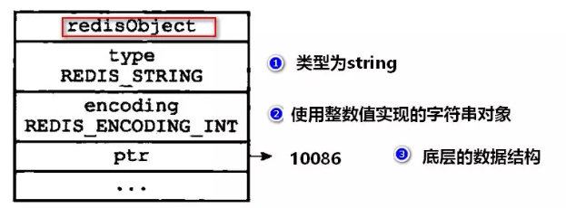
```c
typedef struct redisObject{

    // 对象的类型
    unsigned type 4:;

    // 对象的编码格式
    unsigned encoding:4;

    // 指向底层实现数据结构的指针
    void * ptr;

    //.....
}robj;
```
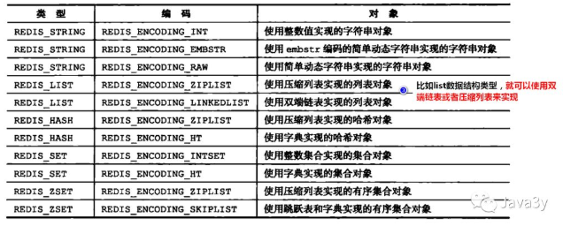  
***注意***从上面可以看出，同一种数据类型的不同编码，对应底层的实现是不一样的。  

### 3.1SDS简单动态字符串  
```c
struct sdshdr{
    // 字节数组，用于保存字符串(好处：内部实现动态扩容，防止溢出)
    // SDS是二进制安全的，所有SDS API都会以处理二进制的方式来处理SDS存放在buf数组里的数据。
    char buf[];
    // 记录buf数组中已使用的字节数量，也是字符串的长度（好处：获取长度时间复杂度o(1)）
    int len;
    // 记录buf数组未使用的字节数量（好处：减少内存分配的次数）
    int free;
}
```


### 3.2链表  
```c
typedef struct listNode {
    //无环双向链表
    struct listNode *prev;//前驱指针
    struct listNode *next;//后继指针 
    
    void *value; //节点的值,保存各种不同类型的值

} listNode;
```
```c
typedef struct list{
    //获取表头指针，表尾指针，链表节点长度的时间复杂度均为O(1)
    //表头结点
    listNode  *head;
    //表尾节点
    listNode  *tail;
    //链表长度
    unsigned long len;

    //节点值复制函数
    void *(*dup) (viod *ptr);

    //节点值释放函数
    void  (*free) (viod *ptr);

    //节点值对比函数
    int (*match) (void *ptr,void *key);

}list
```  
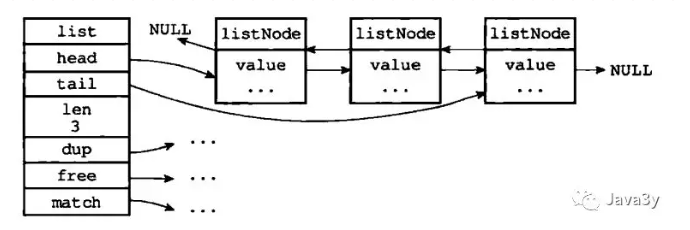
### 3.3hash表  
hash表采用数组加链表实现  
```c
typedef struct dictht{

    //哈希表数组
    dictEntry **table;  

    //哈希表大小
    unsigned long size;    

    //哈希表大小掩码，用于计算索引值
    //总是等于size-1
    unsigned long sizemark;     

    //哈希表已有节点数量
    unsigned long used;

}dictht
```  
```c
typedef struct dictEntry {

    //键
    void *key;

    //值
    union {
        void *value;
        uint64_tu64;
        int64_ts64;
    }v;    

    //指向下个哈希节点，组成链表
    struct dictEntry *next;

}dictEntry;
```
为了方便使用，再封装了一次  
```c
typedef struct dict {

    //类型特定函数
    dictType *type;

    //私有数据
    void *privdata;

    //哈希表，一个用于存储，一个用于渐进式rehash
    //渐进式rehash:rehashidx设置为0，表示rehash开始；
    //rehash期间每次操作时，除了执行指定命令外，还会将ht[0]中rehashindx索引上的值rehash到ht[1]，rehashidx+1
    //所有的键值对完成rehash，这时将rehashidx设置为-1
    //rehash过程中，服务器会优先查找ht[0]，如果不存在，再查找ht[1];执行新增操作时，新的键值对一律保存到ht[1]，不再对ht[0]进行任何操作
    dictht ht[2];

    //rehash索引
    //当rehash不进行时，值为-1
    int rehashidx;  

}dict;
//-----------------------------------
typedef struct dictType{

    //计算哈希值的函数
    unsigned int (*hashFunction)(const void * key);

    //复制键的函数
    void *(*keyDup)(void *private, const void *key);

    //复制值得函数
    void *(*valDup)(void *private, const void *obj);  

    //对比键的函数
    int (*keyCompare)(void *privdata , const void *key1, const void *key2)

    //销毁键的函数
    void (*keyDestructor)(void *private, void *key);

    //销毁值的函数
    void (*valDestructor)(void *private, void *obj);  

}dictType
```
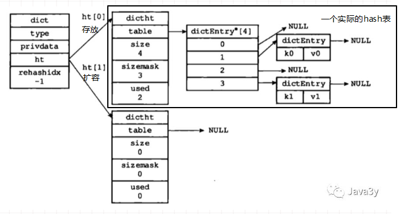
### 3.4跳跃表  
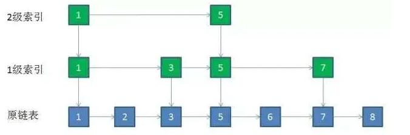
```c
typeof struct zskiplistNode {
        // 后退指针
        struct zskiplistNode *backward;
        // 分值
        double score;
        // 成员对象
        robj *obj;
        // 层
        struct zskiplistLevel {
                // 前进指针
                struct zskiplistNode *forward;
                // 跨度
                unsigned int span;
        } level[];
} zskiplistNode;
```
```c
typeof struct zskiplist {
        // 表头节点，表尾节点
        struct skiplistNode *header,*tail;
        // 表中节点数量
        unsigned long length;
        // 表中最大层数
        int level;
} zskiplist;
```
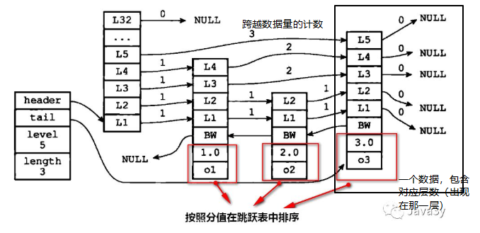

### 3.5整数集合  
当一个set(集合)只包含整数值元素，并且元素的数量不多时，Redis就会采用整数集合(intset)作为set(集合)的底层实现  
```c
typeof struct intset {
        // 编码方式
        unit32_t encoding;
        // 集合包含的元素数量
        unit32_t lenght;
        // 保存元素的数组
        int8_t contents[];
} intset;
```
contents数组的真正类型取决于encoding属性的值,只支持升级操作，并不支持降级操作   
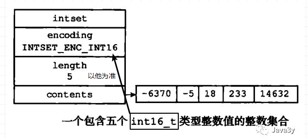

### 3.6压缩列表(ziplist)
如果list的每个都是小整数值，或者是比较短的字符串，压缩列表(ziplist)作为list的底层实现  
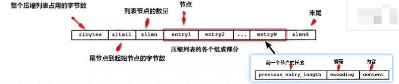  

知道了上面的数据结构，对应的数据类型也就自然而然理解了。回头看一下，  
  


Redis数据库
= 
1.数据库原理  
-  
### 1.1怎么存放数据的  
Redis是C/S结构，Redis服务器用redisServer结构体来表示；Redis客户端通过redisClient结构体来表示。  
```c
struct redisServer{  
    //redisDb数组,表示服务器中所有的数据库
    redisDb *db;  
    //服务器中数据库的数量(默认16个)
    int dbnum;  
}; 

typedef struct redisClient{  
    //客户端当前所选数据库
    redisDb *db;  
}redisClient;  


typedef struct redisDb { 
    int id;         // 数据库ID标识
    dict *dict;     // 键空间，存放着所有的键值对              
    dict *expires;  // 过期哈希表，保存着键的过期时间                          
    dict *watched_keys; // 被watch命令监控的key和相应client    
    long long avg_ttl;  // 数据库内所有键的平均TTL（生存时间）     
} redisDb;
```
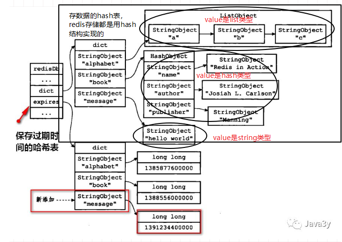 
服务器使用clints链表连接多个客户端状态，新添加的客户端状态会被放到链表的末尾（客户端与服务端的知识还有待完善）

### 1.2存放数据的策略  
我们都知道，redis是基于内存的，内存和硬盘不一样，容量有限，代价比较高，所以不能随便长时间存放一些没有必要的数据，所以数据需要有时间限制。  
设置键的生存时间可以通过EXPIRE或者PEXPIRE命令；设置键的过期时间可以通过EXPIREAT或者PEXPIREAT命令。（归根到底，都是通过PEXPIREAT实现）  
查看剩余生存时间的命令了：  
PERSIST(移除过期时间)；  
TTL(Time To Live)返回剩余生存时间，以秒为单位；  
PTTL以毫秒为单位返回键的剩余生存时间。  

### 1.3删除数据的策略  
怎么把不要的数据删掉，策略是什么？（Redis采用的是惰性删除+定期删除两种策略）  
定时删除(对内存友好，对CPU不友好)：到时间点上就把所有过期的键删除了；  
惰性删除(对CPU极度友好，对内存极度不友好)：每次从键空间取键的时候，判断一下该键是否过期了，如果过期了就删除；  
定期删除(折中)：每隔一段时间去删除过期键，限制删除的执行时长和频率。

如果内存块里的数据放的太多了，怎么有选择的淘汰一些数据：  


2.数据持久化  
-  
### 2.1RDB(基于快照)  
将某一时刻的所有数据保存到一个RDB文件中（一个经过压缩的二进制文件），Redis服务器在启动的时候，如果发现有RDB文件，就会自动载入RDB文件。  
SAVE会阻塞Redis服务器进程，服务器不能接收任何请求，直到RDB文件创建完毕为止；   
BGSAVE创建出一个子进程，由子进程来负责创建RDB文件，服务器进程可以继续接收请求。  

执行SAVE或者BGSAVE命令创建出的RDB文件，程序会对数据库中的过期键检查，已过期的键不会保存在RDB文件中。  
载入RDB文件时，程序同样会对RDB文件中的键进行检查，过期的键会被忽略。  
```
save 900 1              #在900秒(15分钟)之后，至少有1个key发生变化，
save 300 10            #在300秒(5分钟)之后，至少有10个key发生变化
save 60 10000        #在60秒(1分钟)之后，至少有10000个key发生变化
```

### 2.2AOF(append-only-file)  
当Redis服务器执行写命令的时候，将执行的写命令保存到AOF文件中。
实际步骤：  
命令追加：命令写入aof_buf缓冲区  
文件写入：调用flushAppendOnlyFile函数，考虑是否要将aof_buf缓冲区写入AOF文件中（flushAppendOnlyFile函数的行为由服务器配置的appendfsyn选项来决定的）  
```
appendfsync always     # 每次有数据修改发生时都会写入AOF文件。
appendfsync everysec   # 每秒钟同步一次，该策略为AOF的默认策略。
appendfsync no         # 从不同步。高效但是数据不会被持久化。
```
文件同步：考虑是否将内存缓冲区的数据真正写入到硬盘  

以让AOF文件的体积变得更小:AOF重写(合并一些命令)  
AOF重写不需要对现有的AOF文件进行任何的读取、分析。AOF重写是通过读取服务器当前数据库的数据来实现的！  
Redis将AOF重写程序放到子进程里执行(BGREWRITEAOF命令)，fork出一个子进程来完成重写AOF的操作，从而不会影响到主进程，为了解决数据不一致的问题，Redis服务器设置了一个AOF重写缓冲区，这个缓存区会在服务器创建出子进程之后使用。
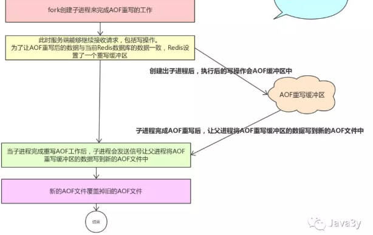 

如果数据库的键已过期，但还没被惰性/定期删除，AOF文件不会因为这个过期键产生任何影响(也就说会保留)，当过期的键被删除了以后，会追加一条DEL命令来显示记录该键被删除了。  
重写AOF文件时，程序会对RDB文件中的键进行检查，过期的键会被忽略。

RDB和AOF并不互斥，它俩可以同时使用，aof不容易丢失数据，rdb恢复数据快（服务器会优先使用AOF文件来还原数据，备份比较完善）

3.数据库事件  
-  
### 3.1文件事件  
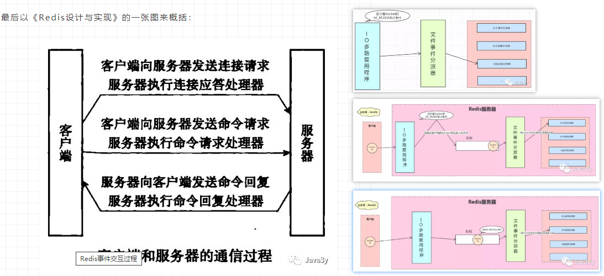   

Redis单线程（快的原因是什么）  
1）纯内存操作  
2）核心是基于非阻塞的IO多路复用机制  
3）单线程避免了多线程的频繁上下文切换问题  

### 3.2时间事件  
更新服务器的统计信息(时间、内存占用、数据库占用)  
清理数据库的过期键值对  
AOF、RDB持久化  
如果是主从服务器，对从服务器进行定期同步  
如果是集群模式，对进群进行定期同步和连接  
…   

文件事件和时间事件之间是合作关系，服务器会轮流处理这两种事件，并且处理事件的过程中不会发生抢占；  
时间事件的实际处理事件通常会比设定的到达时间晚一些


参考：
1.https://mp.weixin.qq.com/s?__biz=MzI4Njg5MDA5NA==&mid=2247484359&idx=1&sn=0994c6246990b7ad42a2d3f294042316&chksm=ebd742c6dca0cbd0a826ace13f4d4eeff282052f4a97b31654ef1b3b32f991374f5c67a45ae9&token=620000779&lang=zh_CN&scene=21###wechat_redirect（redis系列文章）  
2.https://www.jianshu.com/p/dc252b5efca6


