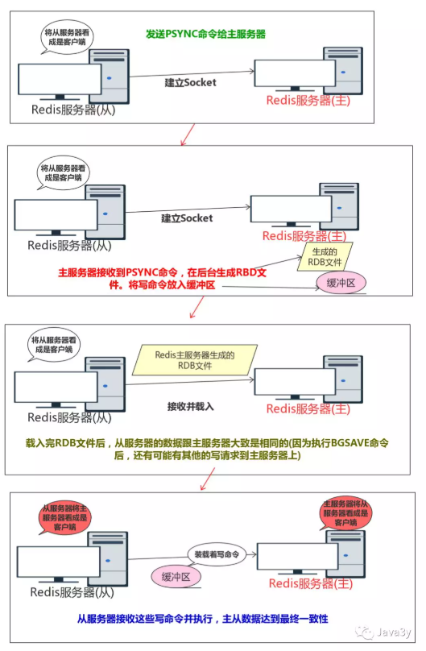

单台redis服务器能力有限：  
内存有限  
支持并发量有限  
redis挂了怎么办  

多台redis服务器，怎么处理

主从架构  
=  
1.1架构  
-  
   

读写分离；高可用；处理更多的并发访问量。

1.2数据一致性  
-  
实现方法：从服务器复制主服务器的数据  
复制包括：同步、命令传播  
首先，从服务器寻找并连接主服务器  
  
### 1.2.1同步(sync)  
将从服务器的数据库状态更新至主服务器的数据库状态  

#### 1.2.1.1完全同步  

#### 1.2.1.2部分同步  
这个比较麻烦，涉及到主从服务器的复制偏移量、主服务器的复制积压缓冲区、服务器运行的ID(run ID)  
主从服务器中，都维护着一个复制偏移量，通过比较偏移量来确定数据是否一致；当偏移量不一致的时候，从服务器请求数据同步，主服务器根据run ID判断是不是自己的从服务，不是自己的从服务器就完全同步；是自己的服务器，根据收到的偏移量去复制积压缓存区（主服务器进行命令传播时，不仅仅会将写命令发送给所有的从服务器，还会将写命令入队到复制积压缓冲区）查找，找到了需要的数据就直接把这部分数据同步给从服务器，否则进行完全同步。  

### 1.2.2命令传播(command propagate)  
主服务器的数据库状态被修改，导致主从服务器的数据库状态不一致，让主从服务器的数据库状态重新回到一致状态。

哨兵机制  
=  
1.1机制解释  
-  
哨兵看着主服务器及其从服务器（一个哨兵可以看多个这样的结构，一个这样的结构可以被多个哨兵看管，这样就可以在主服务器下线之后先选取领头哨兵，然后由他进行选取从服务器作为主服务器等一系列操作）  
  
Sentinel本质上只是一个运行在特殊模式下的Redis服务器，在启动的时候会将普通Redis服务器的代码替换成Sentinel专用代码，初始化Sentinel的状态，并根据给定的配置文件初始化Sentinel监视的主服务器列表，并创建两个连向主服务器的网络连接（命令连接(发送和接收命令)、订阅连接(订阅主服务器的sentinel:hello频道)）；当发现有新的从服务器出现时，除了创建对应的从服务器实例结构，Sentinel还会创建命令连接和订阅连接。

在Sentinel运行的过程中，通过命令连接会以每两秒一次的频率向监视的主从服务器的_sentinel_:hello频道发送命令(主要发送Sentinel本身的信息，监听主从服务器的信息)，并通过订阅连接接收_sentinel_:hello频道的信息。

1.2判断下线  
### 1.2.1主观下线  
发送PING命令  
主服务器在down-after-milliseconds毫秒内连续向Sentinel发送无效回复  
### 1.2.2客观下线  
Sentinel将一个主服务器判断为主观下线以后，向同样监视该主服务器的Sentinel询问，看它们是否也认为该主服务器是否下线。  
足够多的Sentinel认为该主服务器是下线的，那么就判定该主服务为客观下线，并对主服务器执行故障转移操作。  

1.3故障转移  
当一个主服务器认为为客观下线以后，监视这个下线的主服务器的各种Sentinel会进行协商，选举出一个领头的Sentinel，领头的Sentinel会对下线的主服务器执行故障转移操作。（总的来说就是先到先得）  

选举出领头的Sentinel之后，领头的Sentinel会对已下线的主服务器执行故障转移操作：  
在已下线主服务器属下的从服务器中，挑选一个转换为主服务器（跟master断开连接的时长、slave优先级、复制offset、run id）  
让已下线主服务器属下的所有从服务器改为复制新的主服务器  
已下线的主服务器重新连接时，让他成为新的主服务器的从服务器  
  

参考：  
1.https://mp.weixin.qq.com/s?__biz=MzI4Njg5MDA5NA==&mid=2247484430&idx=1&sn=be69ef08e58dc7559d054221732ee8ee&chksm=ebd7450fdca0cc19a4a8cd788161bfdebc0d51abe9989debadd61ba29e3cce6961ebe6093d5b&token=620000779&lang=zh_CN&scene=21###wechat_redirect（redis系列文章）