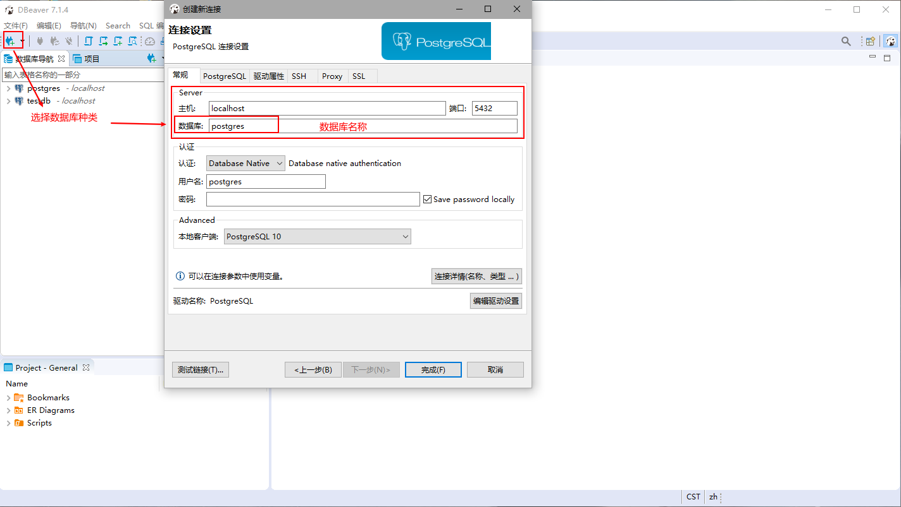

postgresql数据库是开源的的对象-关系数据库服务器  
读法：post-gress-q-l  
https://link.zhihu.com/?target=http%3A//www.postgresql.org/files/postgresql.mp3

1.下载与安装
=  
官方地址（慢）：  
https://www.enterprisedb.com/downloads/postgres-postgresql-downloads  

安装过程：  
不必多说，没什么特殊点。  
记住端口和超级管理员密码  
我的端口：5432
我的密码：%Admin  

2.可视化软件
同时尝试过HeidiSQL和DBeaver（吐槽一下，官网下载太慢了），但是HeidiSQL不知什么原因，始终无法打开指定的数据库，一直只显示默认的数据库。

DBeaver连接数据库的操作说明:  
