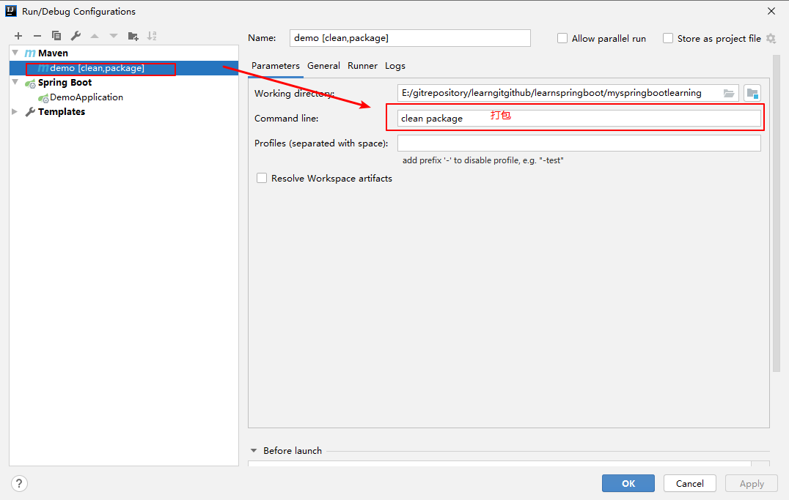

1.helloworld
=
所有的东西都是从helloworld，开始的，springboot也不例外，但是由于idea的强大功能，建立一个demo项目不是什么难事，百度一下，到处都是操作说明，因此不再记录过程了。

这里记一下，idea中利用maven插件打包运行的操作  
  

jar包依赖树分析，操作同上，使用命令：`dependency:tree`  

Tips：
main - resource - 新建banner.txt(自定义启动时候的图案，使用http://www.network-science.de/ascii/生成)