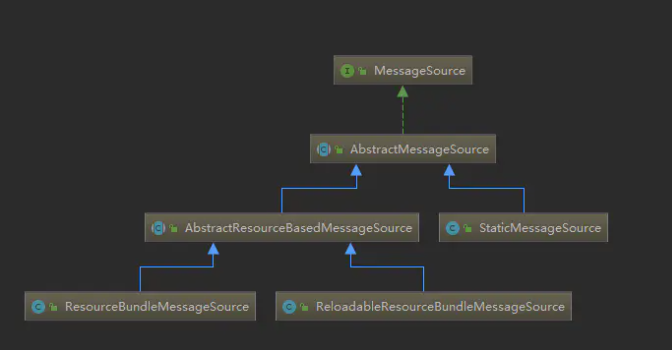

问题来源：  
全世界有很多的国家和地区，每个国家或地区有自己的语言和文字，应用程序需要为不同国家和地区的用户提供对应的文字信息，需要支持信息国际化。  

一、Java SE的国际化支持  
=  
主要涉及两个类：  
* java.util.Locale  
不同的Locale代表不同的国家和地区，比如：  
Local.CHINA代表中国，代码表示为zh_CN  
Local.US代表美国，代码表示为en_US  
美国与英国都的属于英语地区，可以使用Local.ENGLISH表示，只有语言代码en  
```
三种构造方法：  
    1. Locale(String language)  
    2. Locale(String language, String country)  
    3. Locale(String language, String country, , String variant)  
```
常用的Locale有静态变量，不用重新构造。
* java.util.ResourceBundle  
ResourceBundle用来保存特定于某个Locale的信息（可以是String类型的对象，也可以是任何类型的对象）。通常，管理的是一组信息序列，有一个统一的basename，然后通过在basename后面追加的语言或者地区代码来区分。比如：  
basename：message  
对应的配置文件命名为：  
messages.properties  
messages_zh.properties  
messages_zh_CN.properties（按照规定，这个配置文件中各个键对应的内容不应该以中文提供，应该使用native2ascii或者类似的工具进行转码）  
messages_en.properties  
messages_en_US.properties  
...  
每个资源文件中都有相同的键来标志具体的资源条目，相同键对应的内容根据Locale不同进行变化。  
通过结合Locale和ResourceBundle可以实现应用程序的国际化信息支持  


二、Spring的国际化支持
=  
Spring在Java SE的基础上进一步抽象国际化信息的访问接口，也就是org.springframework.context.MessageSource，该接口中包含了：
```
String getMessage(String code, Object[] args, String defaultMessage, Locale locale);//根据传入的资源条目的键（code）、信息参数以及Locale来查找信息，如果没有找到要的信息，就返回defaultMessage。  

String getMessage(String code, Object[] args, Locale locale) throws NoSuchMessageException;//与第一个方法相同，但是没有默认的信息返回，找不到就抛出异常。  

String getMessage(MessageSourceResolvable resolvable, Locale locale) throws NoSuchMessage zException;//使用MessageSourceResolvable对资源条目的键、信息参数等进行封装，将MessageSourceResolvable作为查询参数来调用上述的方法，如果找不到会抛出异常。  
```  

ApplicationContext实现了MessageSource接口，可以当做MessageSource使用。如果要提供容器内的国际化信息支持，可以利用配置文件或者注释的方法实现。  

2.1MessageSource的可用实现
-  
首先看一下各个实现之间的关系：  


* StaticMessageSource  
MessageSource的简单实现，用于通过编程的方式添加信息条目，用于测试，不宜使用于生产环境。  
* ResourceBundleMessageSource  
基于java.util.ResourceBundle实现，对其父类AbstractMessageSource行为进行扩展，提供对多个ResourceBundle的缓存以提高查询速度；对参数化和非参数化信息的处理进行优化，对用于参数化信息格式化的MessageFormat实例进行缓存，最常用与生产环境。  
* ReloadableResourceBundleMessageSource  
基于java.util.ResourceBundle实现，但通过cacheSeconds属性指定时间段，定期刷新并检查properties资源文件是否有变更，可以通过ResourceLoader来加载信息资源文件（避免将信息资源文件放到classpath中）  

2.2注入  
-  
* MessageSourceAware  
ApplicationContext启动的时候，会自动识别容器中类型为MessageSourceAware的bean定义，并将自身作为MessageSource注入相应对象实例中。最简单的办法就是让它实现MessageSourceAware接口，然后注册到ApplicationContext容器。（不建议）  
* MessageSource  
直接通过构造方法注入或者setter方法注入的方式声明依赖就可以了。


参考：
1. 《spring揭秘》5.2国际化信息支持
2. （一个具体一点的使用例子）https://www.jianshu.com/p/b6dad0c1bc20