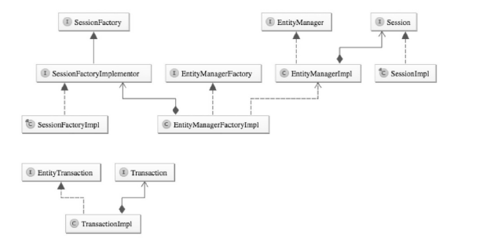

   
   

基础注解：
    @Entity：对象会成为被JPA管理的实体，映射到指定的数据库表  

    @Table：指定数据库的表名  

    @Id：数据库主键  

    @IdClass：利用外部类的联合主键  
    其实就是选取表中的几个字段属性作为联合主键，将这几个字段拿出来单独封装成为主键类，然后在表的实体类上加@IdClass(value = XXX.class)，并将这些字段都用@Id标记为主键（注意：这时候Repository里面对应修改`public interface DeviceCapabilityRepository extends JpaRepository<DeviceCapability, XXX>`）  
    
    @GeneratedValue：主键生成策略  
    TABLE:通过表产生主键，框架由表模拟序列产生主键，便于数据库移植  
    SEQUENCE:通过序列产生主键，@SequenceGenerator指定序列名（常见于orcale）  
    IDETITY:数据库ID自增长（常见于mysql）  
    AUTO:JPA默认自动选择合适的策略

    @Basic：表示属性是到数据库表的字段的映射，如果实体的字段上
    没有任何注解，默认即为@Basic    

    @Transient：表示该属性并非一个到数据库表的字段的映射，表示
    非持久化属性，与@Basic作用相反，JPA映射数据库的时候忽略它  

    @Column：定义该属性对应数据库中的列名

    @Temporal：Data类型的属性映射  
    @Temporal(TemporalType.DATE)映射为日期时只有日期  
    @Temporal(TemporalType.TIME)映射为日期时只有时间  
    @Temporal(TemporalType.TIMESTAMP)映射为日期时有日期+时间  

    @Enumerated：直接映射枚举类型的字段

    @Lob将属性映射成数据库支持的大对象类型(占用内存空间较大，一般配合
@Basic(fetch=FetchType.LAZY)将其设置为延迟加载)  
    Clob长字符串类型 java.sql.Clob、Character[]、char[]和String将被映射为Clob类
型   
    Blob字节类型 java.sql.Blob、Byte\[\]、byte\[\]和实现了Serializable接口的类型
将被映射为Blob类型  

关联关系注解  
@JoinColumn  
配合OneToOne OneToMany ManyToOne使用，单独使用没有意义

@OneToOne  
使用：  
```java
//Department中
@OneToOne
//employee_id指的是Department里面的字段
//referencedColumnName="id"指的是Employee表里面的字段
@JointColumn(name="employee_id",referernceColumnName="id")
private Employee employeeAttribute;

//双向关联的话Employee中
@OneToOne(mapppedBy = employeeAttribute)
private Department department;
//与Department中一样的额做法当然也是可以的
```

@OneToMany  
@ManyToOne  
这两个可以相对存在，也可以单独存在  
```java
@ManyToOne(targetEntity=DeviceType.class)
@JoinColumn(name="deviceType",referencedColumnName="typeId")
private DeviceType deviceType;

//配置一对多关系
@OneToMany(mappedBy="deviceType")
private Set<DeviceInfo> deviceInfo = new HashSet<DeviceInfo>(0);
```  

@OrderBy  
@OneToMany一起使用  

@JoinTable 
@ManyToMany一起使用  
 
