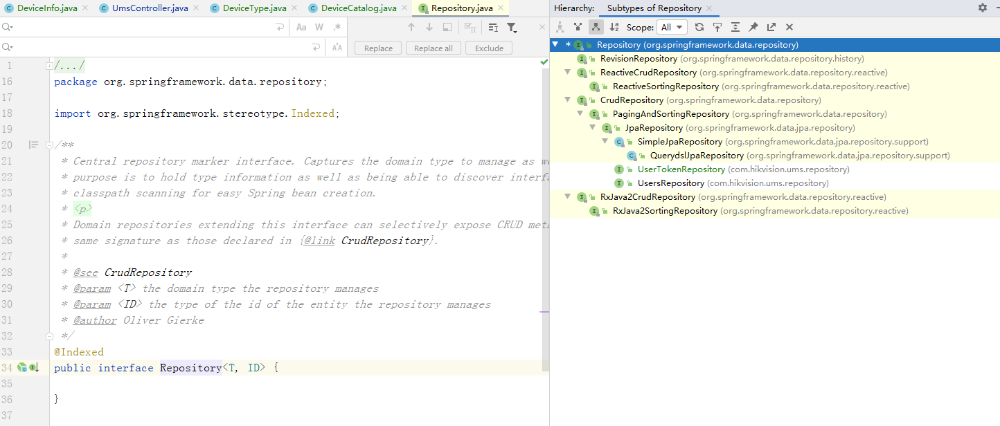
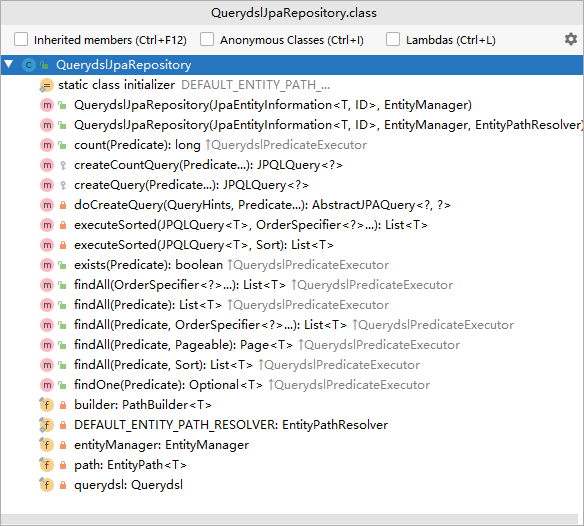

Repository是Spring Data里面最底层的抽象接口，最顶级的父类，源码里面什么方法都没有，只是一个标识。（Spring动态代理的时候发现他的子类或者实现类）

TIPS：  
IDEA快速查看一个类的继承体系  
自上而下：navigate - type hierarchy（alt shift f12）
     

自下而上绘制继承关系图：右键-diagram-show（ctrl-alt-u）
  

查看一个类本身的结构：navigate-file structure（ctrl F12）  
  