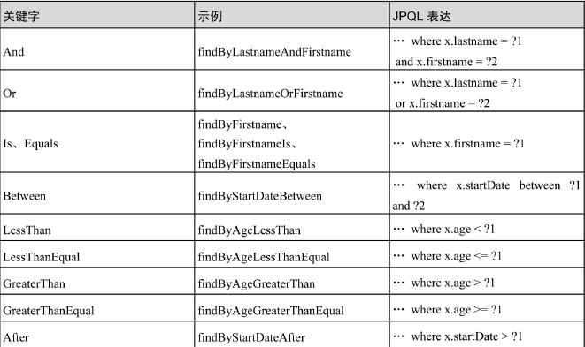
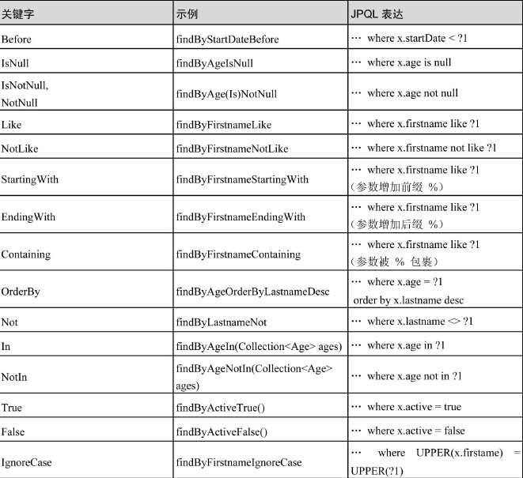
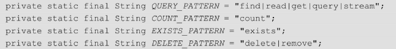
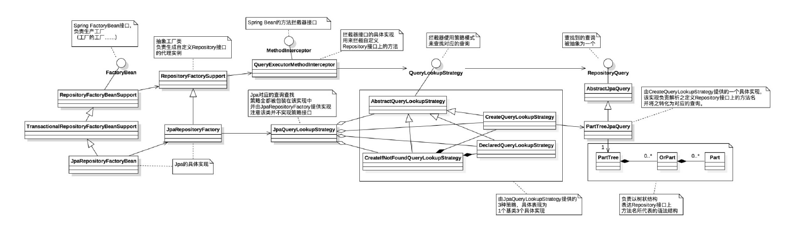
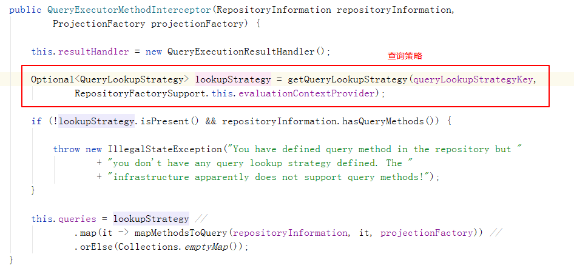
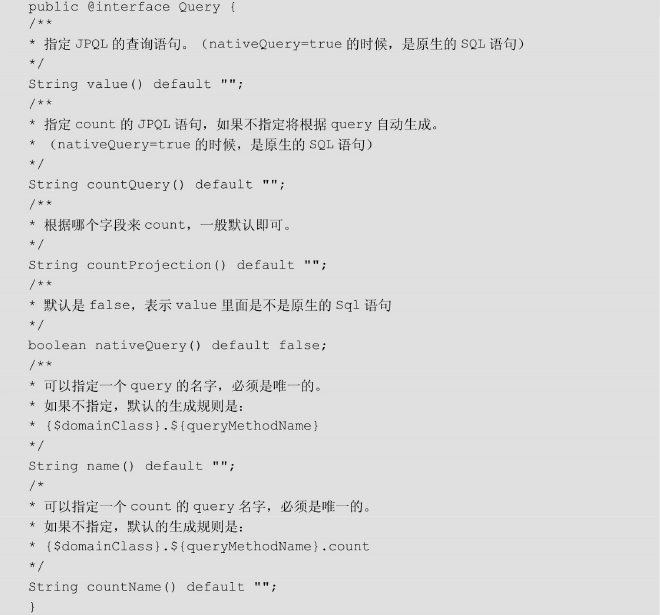

Spring JPA Repository实现原理是动态代理  

定义查询方法的方法可分为：从方法名称中指定特定用于存储的查询和更新、使用@Query手动定义。  

查询方法的查询策略：通过在Spring Boot的启动类上的配置，可以进行方法的查询策略设置（其实就是根据什么来创建查询，要查询的信息是从方法名来的，还是注解里面来的的）  
`@EnableJpaRepositories(queryLookupStrategy=
QueryLookupStrategy.Key.CREATE_IF_NOT_FOUND)`  

* CREATE：直接根据方法名创建，方法名称删除给定的前缀，解析其余部分，创建查询，不符合规则则报异常。  
     表达式是可以连接的运算符的的属性遍历，组合表达式AND和OR，运算关键字Between、LessThan、GreaterThan、Like(具体与数据库支持有关)；  
    IgnoreCase表示忽略大小写；  
    OrderBy表示排序。   
* USE_DECLARED_QUERY：注解的方式创建查询，找不到注解，报异常。  
* CREATE_IF_NOT_FOUND：先用注解方式找，再用方法方式创建查询。（默认）  

1.通过方法名解析  
-  
关键字与使用示例：  

  
除了find，还有以下几种前缀：  
   

属性表达式：  
把关键字去除以后，用于解析实体的属性，从而生成查询方法的部分。  

实现机制：  
QueryExecutorMethodInterceptor实现MethodInterceptor接口，在查询方法真正地实现调用前，先执行invoke（关键在于如何解析，怎么invoke不重要）
 
 

2.通过注解  
-  
@Query  
 

//TODO待补充


查询结果的处理：  
分页、查询：
    指定特定类型的参数，分页和排序查询
```java
    //Page知道可用的元素和页面的总数，代价可能是昂贵的
    Page <User> findByLastName(String lastname, Pageable pagelable);
    //只知道是否有下一个Slice可用，用在不关心一共有多少页的场景
    Slice <User> findByLastName(String lastname, Pageable pagelable);
    //只需排序，一个参数即可
    List <User> findByLastName(String lastname, Sort sort);
    List <User> findByLastName(String lastname, Pageable pagelable);
```  
    限制查询结果（first、top）    
```java  
    //返回排序第一条
    User findFirstByOrderByLastnameAsc();
    User findTopByOrderByAgeDesc();
    //返回前10条数据
    Page <User> findFirst10ByLastName(String lastname, Pageable pagelable);
    //返回前3条数据
    Slice <User> findTop3ByLastName(String lastname, Pageable pagelable);
```  

查询结果的不同形式：  
    流式查询结果
    使用Java 8 Stream\<T\> 作为返回类型来逐步处理查询方法的结果（try catch关闭流）
    ```java
    @Query("selecet u from User u")
    Stream<User> findAllByCustomQueryAndStream();
    Stream<User> findAllByFirstnameNotNull();
    @Query("selecet u from User u")
    Stream<User> streamAllPaged(Pageable pagelable);
    ```
    异步查询结果  
    使用Spring的异步方法执行功能异步的存储库查询。（定时任务，在调用的时候立即返回查询结果，而实际的查询发生在已经提交的Spring TaskExecutor中）
    ```
    Future<User>  findByLastName(String lastname);
    CompletableFuture<User>  findByLastName(String lastname);
    ListenableFuture<User>  findByLastName(String lastname);
    ```  
    Projections对查询结果的扩展  
    针对我们不需要全部字段，只需指定的字段或者返回复合型的字段，对专用返回类进行建模，将部分字段显示为视图对象。
    ```
    //查询一张表的部分字段  
    //1.仅需要返回部分字段时，需要先声明一个借口，包含要返回的属性
    interface NamesOnly{
        String getFirstname();
        String getLastname();
    }
    //2.Repository中用该对象接收结果
    interface PersonRepository extends Repository<Person, UUID>{
        Collection<NamesOnly> findByLastname(String lastname);
    }

    //查询关联的子对象
    interface PersonSummary{
        String getFirstname();
        String getLastname();
        AddressSummary getAddress();
        interface AddressSummary{
            String getAddress();
        }
    }

    //拼接返回
    interface NamesOnly{
        @Value("#{target.firstname + ' ' + target.lastname}")
        String getFullname();
    }

    还有很多很多用法...
    ```  