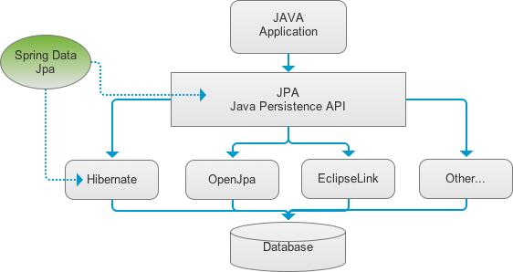
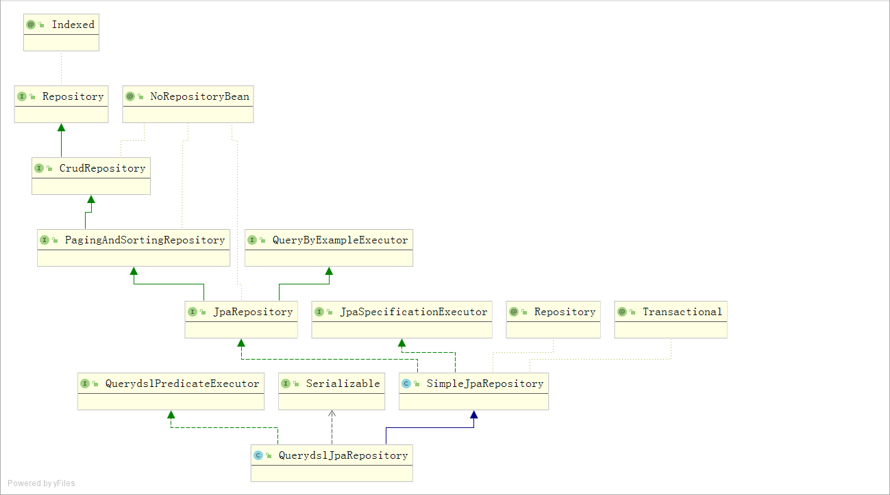

几个概念的区别：
Hibernate是一个开源的对象关系映射框架，对JDBC进行了非常轻量级的对象封装，使得程序员可以随心所欲的使用对象编程思维来操纵数据库。属于全自动的ORM框架，着力点在于POJO和数据库表之间的映射，完成映射即可自动生成和执行sql。  
Mybatis：MyBatis 本是apache的一个开源项目iBatis, 2010年这个项目由apache software foundation 迁移到了google code，并且改名为MyBatis 。属于半自动的ORM框架，着力点在于POJO和SQL之间的映射，自己编写sql语句，然后通过配置文件将所需的参数和返回的字段映射到POJO。  
Spring Data JPA：Spring Data是一个通过命名规范简化数据库访问，并支持云服务的开源框架。其主要目标是使得对数据的访问变得方便快捷，并支持map-reduce框架和云计算数据服务。  

Hibernate的开发难度要大于Mybatis、Spring Data。主要是由于Hibernate封装了完整的对象关系映射机制,以至于内部的实现比较复杂、庞大，学习周期较长。Mybatis 主要依赖于SQL的编写与ResultMap的映射。Spring Data易上手，通过命名规范、注解查询简化查询操作。

1.概念
=
spring data jpa是spring data模块的一个模块，依赖hibernate jpa实现，是一种orm技术（Object Relational Mapping）  


特点：
只需要定义接口，集成jpa提供的接口就可以，不需要自己编写接口实现类。

2.基本使用流程  
=  
* 添加依赖（pom.xml）
* 添加数据源（配置数据库连接，application.properties）
* 定义接口（编写Dao层）
* 编写实体类（Entity）
* 测试代码

3.spring data jpa接口继承体系
=


4.spring data jpa原理
=


根据spring data jpa继承体系，看看各接口分别可以用来干什么：

5.Repository接口
=
* 方法名称命名规则查询  
    findBy(关键字)+属性名称(属性名称的首字母大写)+查询条件(首字母大写)  
    | 关键字 | 方法名称 | 对应sql条件 |
    | :----:| :----: | :----: |
    | And | findByNameAndPwd | where name= ? and pwd =? |
    | Or | findByNameOrSex | where name= ? or sex=? |
    | Is,Equal | findById | findByIdEquals |
    |Between	|findByIdBetween	|where id between ? and ?
    |LessThan	|findByIdLessThan	|where id < ?
    |LessThanEqual	|findByIdLessThanEquals	|where id <= ?
    |GreaterThan	|findByIdGreaterThan	|where id > ?
    |GreaterThanEqual	|findByIdGreaterThanEquals	|where id > = ?
    |After	|findByIdAfter	|where id > ?
    |Before	|findByIdBefore	|where id < ?
    |IsNull	|findByNameIsNull	|where name is null
    |isNotNull,Not Null	|findByNameNotNull	|where name is not
    |Like	|findByNameLike	|where name like ?
    |NotLike	|findByNameNotLike	|where name not like ?
    |StartingWith	|findByNameStartingWith	|where name like '?%'
    |EndingWith	|findByNameEndingWith	|where name like '%?'
    |Containing	|findByNameContaining	|where name like '%?%'
    |OrderBy	|findByIdOrderByXDesc	|where id=? order by x desc
    |Not	|findByNameNot	|where name <> ?
    |In	|findByIdIn(Collection<?> c)	|where id in (?)
    |NotIn	|findByIdNotIn(Collection<?> c)	|where id not in (?)
    |True	|findByAaaTue	|where aaa = true
    |False	|findByAaaFalse	|where aaa = false
    |IgnoreCase	|findByNameIgnoreCase	|where UPPER(name)=UPPER(?)

* 基于@Query 注解的查询  
    * 通过 JPQL 语句查询  
    ```
    public interface UsersDao extends Repository<Users, Integer> {	
        //使用@Query注解查询
        @Query(value="from Users where username = ?")
        List<Users> queryUserByNameUseJPQL(String name);
        
        @Query("from Users where username like ?")
        List<Users> queryUserByLikeNameUseJPQL(String name);
        
        @Query("from Users where username = ? and userage >= ?")
        List<Users> queryUserByNameAndAge(String name,Integer age);	
    }
    ```  
    * 通过 SQL 语句查询  
    ```
    public interface UsersDao extends Repository<Users, Integer> {
        //使用@Query注解查询SQL
        //nativeQuery:默认的是false.表示不开启sql查询。是否对value中的语句做转义。
        @Query(value="select * from t_users where username = ?",nativeQuery=true)
        List<Users> queryUserByNameUseSQL(String name);

        @Query(value="select * from t_users where username like ?",nativeQuery=true)
        List<Users> queryUserByLikeNameUseSQL(String name);
        
        @Query(value="select * from t_users where username = ? and userage >= ?",nativeQuery=true)
        List<Users> queryUserByNameAndAgeUseSQL(String name,Integer age);
        
    }
    ```  
    * 通过@Query 注解完成数据更新
    ```
    public interface UsersDao extends Repository<Users, Integer> {
        @Query("update Users set userage = ? where userid = ?")
        @Modifying //@Modifying当前语句是一个更新语句
        void updateUserAgeById(Integer age,Integer id);
    }
    ```  

6.CrudRepository接口  
=  
实现对数据的增删改查操作  
```
创建dao：
public interface UsersDao extends CrudRepository<Users, Integer> {
	
}

使用dao完成增删改查：
@RunWith(SpringJUnit4ClassRunner.class)
@ContextConfiguration("classpath:applicationContext.xml")
public class RepositoryTest {

	@Autowired
	private UsersDao usersDao;
	
	/**
	 * 添加单条数据
	 */
	@Test
	public void test1(){
		Users user = new Users();
		user.setUserage(21);
		user.setUsername("赵小丽");
		this.usersDao.save(user);
	}
	
	/**
	 * 批量添加数据
	 */
	@Test
	public void test2(){
		Users user = new Users();
		user.setUserage(21);
		user.setUsername("赵小丽");
		
		Users user1 = new Users();
		user1.setUserage(25);
		user1.setUsername("王小虎");
		
		List<Users> list= new ArrayList<>();
		list.add(user);
		list.add(user1);
		
		this.usersDao.save(list);
		
	}
	
	/**
	 * 根据ID查询单条数据
	 */
	@Test
	public void test3(){
		Users users = this.usersDao.findOne(13);
		System.out.println(users);
	}
	
	/**
	 * 查询全部数据
	 */
	@Test
	public void test4(){
		List<Users> list = (List<Users>)this.usersDao.findAll();
		for (Users users : list) {
			System.out.println(users);
		}
	}
	
	/**
	 * 删除数据
	 */
	@Test
	public void test5(){
		this.usersDao.delete(13);
	}
	
	/**
	 * 更新数据 方式一
	 */
	@Test
	public void test6(){
		Users user = this.usersDao.findOne(12);
		user.setUsername("王小红");
		this.usersDao.save(user);
	}
	
	/**
	 * 更新数据 方式二
	 */
	@Test
	@Transactional
	@Rollback(false)
	public void test7(){
		Users user = this.usersDao.findOne(12);//持久化状态的
		user.setUsername("王小小");
	}
}

```  
7.PagingAndSortingRepository 接口
=  
	```
	/**
	* PagingAndSortingRepository接口讲解
	* @author Administrator
	*
	*/
	public interface UsersDao extends PagingAndSortingRepository<Users, Integer>{
	}
	```  
* 分页处理  
	```
		/**
		* 分页
		*/
		@Test
		public void test1(){
			int page = 2; //page:当前页的索引。注意索引都是从0开始的。
			int size = 3;// size:每页显示3条数据
			Pageable pageable= new PageRequest(page, size);
			Page<Users> p = this.usersDao.findAll(pageable);
			System.out.println("数据的总条数："+p.getTotalElements());
			System.out.println("总页数："+p.getTotalPages());
			List<Users> list = p.getContent();
			for (Users users : list) {
				System.out.println(users);
			}
		}
	```  
* 排序的处理  
	```
		/**
		* 对单列做排序处理
		*/
		@Test
		public void test2(){
			//Sort:该对象封装了排序规则以及指定的排序字段(对象的属性来表示)
			//direction:排序规则
			//properties:指定做排序的属性
			Sort sort = new Sort(Direction.DESC,"userid");
			List<Users> list = (List<Users>)this.usersDao.findAll(sort);
			for (Users users : list) {
				System.out.println(users);
			}
		}
		
		/**
		* 多列的排序处理
		*/
		@Test
		public void test3(){
			//Sort:该对象封装了排序规则以及指定的排序字段(对象的属性来表示)
			//direction:排序规则
			//properties:指定做排序的属性
			Order order1 = new Order(Direction.DESC,"userage");
			Order order2 = new Order(Direction.ASC,"username");
			Sort sort = new Sort(order1,order2);
			List<Users> list = (List<Users>)this.usersDao.findAll(sort);
			for (Users users : list) {
				System.out.println(users);
			}
		}
	```  
8.JpaRepository 接口
=  
JpaRepository 接口是我们开发时使用的最多的接口。其特点是可以帮助我们将其他接口的方法的返回值做适配处理。可以使得我们在开发时更方便的使用这些方法。
	```
	/**
	* JpaRepository接口讲解
	* @author Administrator
	*
	*/
	public interface UsersDao extends JpaRepository<Users, Integer>{
		
	}
	```


9.JpaSpecificationExecutor 接口
=  
完成多条件查询，并且支持分页与排序  
创建接口  
	```
	/**
	* JpaSpecificationExecutor接口讲解
	* @author Administrator
	*注意：JpaSpecificationExecutor<Users>:不能单独使用，需要配合着jpa中的其他接口一起使用
	*/
	public interface UsersDao extends JpaRepository<Users, Integer>,JpaSpecificationExecutor<Users>{
		
	}
	```  
单条件查询
	```
		/**
		* 需求：根据用户姓名查询数据
		*/
		@Test
		public void test1(){
			Specification<Users> spec = new Specification<Users>() {

				/**
				* @return Predicate:定义了查询条件
				* @param Root<Users> root:根对象。封装了查询条件的对象
				* @param CriteriaQuery<?> query:定义了一个基本的查询。一般不使用
				* @param CriteriaBuilder cb:创建一个查询条件
				*/
				@Override
				public Predicate toPredicate(Root<Users> root, CriteriaQuery<?> query, CriteriaBuilder cb) {
					Predicate pre = cb.equal(root.get("username"), "王五");
					return pre;
				}
			};
			List<Users> list = this.usersDao.findAll(spec);
			for (Users users : list) {
				System.out.println(users);
			}
		}
	```
多条件查询  
方式一
	```
		/**
		* 多条件查询 方式一
		* 需求：使用用户姓名以及年龄查询数据
		*/
		@Test
		public void test2(){
			Specification<Users> spec = new Specification<Users>() {

				@Override
				public Predicate toPredicate(Root<Users> root, CriteriaQuery<?> query, CriteriaBuilder cb) {
					List<Predicate> list = new ArrayList<>();
					list.add(cb.equal(root.get("username"),"王五"));
					list.add(cb.equal(root.get("userage"),24));
					//此时条件之间是没有任何关系的。
					Predicate[] arr = new Predicate[list.size()];
					return cb.and(list.toArray(arr));
				}
				
			};
			List<Users> list = this.usersDao.findAll(spec);
			for (Users users : list) {
				System.out.println(users);
			}
		}

	```  
方式二  
	```
		/**
		* 多条件查询 方式二
		* 需求：使用用户姓名或者年龄查询数据
		*/
		@Test
		public void test3(){
			Specification<Users> spec = new Specification<Users>() {

				@Override
				public Predicate toPredicate(Root<Users> root, CriteriaQuery<?> query, CriteriaBuilder cb) {
					return cb.or(cb.equal(root.get("username"),"王五"),cb.equal(root.get("userage"), 25));
				}
				
			};
			List<Users> list = this.usersDao.findAll(spec);
			for (Users users : list) {
				System.out.println(users);
			}
		}
	```  
分页  
	```
	/**
		* 需求：查询王姓用户，并且做分页处理
		*/
		@Test
		public void test4(){
			//条件
			Specification<Users> spec = new Specification<Users>() {

				@Override
				public Predicate toPredicate(Root<Users> root, CriteriaQuery<?> query, CriteriaBuilder cb) {
					return cb.like(root.get("username").as(String.class), "王%");
				}
				
			};
			
			//分页
			Pageable pageable = new PageRequest(2, 2);
			Page<Users> page = this.usersDao.findAll(spec, pageable);
			System.out.println("总条数："+page.getTotalElements());
			System.out.println("总页数："+page.getTotalPages());
			List<Users> list = page.getContent();
			for (Users users : list) {
				System.out.println(users);
			}
		}
	```  
排序  
	```
		/**
		* 需求：查询数据库中王姓的用户，并且根据用户id做倒序排序
		*/
		@Test
		public void test5(){
			//条件
			Specification<Users> spec = new Specification<Users>() {

				@Override
				public Predicate toPredicate(Root<Users> root, CriteriaQuery<?> query, CriteriaBuilder cb) {
					return cb.like(root.get("username").as(String.class), "王%");
				}
				
			};
			//排序
			Sort sort = new Sort(Direction.DESC,"userid");
			List<Users> list = this.usersDao.findAll(spec, sort);
			for (Users users : list) {
				System.out.println(users);
			}
		}
	```  

分页与排序  
	```
		/**
		* 需求：查询数据库中王姓的用户，做分页处理，并且根据用户id做倒序排序
		*/
		@Test
		public void test6(){
			//排序等定义
			Sort sort = new Sort(Direction.DESC,"userid");
			//分页的定义
			Pageable pageable = new PageRequest(2,2, sort);
			
			//查询条件
			Specification<Users> spec = new Specification<Users>() {

				@Override
				public Predicate toPredicate(Root<Users> root, CriteriaQuery<?> query, CriteriaBuilder cb) {
					return cb.like(root.get("username").as(String.class), "王%");
				}
				
			};
			Page<Users> page = this.usersDao.findAll(spec, pageable);
			System.out.println("总条数："+page.getTotalElements());
			System.out.println("总页数："+page.getTotalPages());
			List<Users> list = page.getContent();
			for (Users users : list) {
				System.out.println(users);
			}
		}
	```  

10.自定义Repository接口
=  


11.关联映射操作
直观的理解一对一、一对多和多对多的关联关系：
一对一：一个丈夫对应一个妻子，一个妻子对应一个丈夫  
一对多：一个年级对应多个班级，一个班级对应一个年级
多对多：一个老师可以教多个课，一个课可以也被多个老师教

* 一对一的关联关系  
使用客户和客户扩展表说明：  
简单的想法：  
在编写客户实体类的时候，指定连接字段名称和对方表的主键字段。  
```
	//表示一对一的关联关系
    @OneToOne
    //连接的字段
    //name:当前表存储外键字段的名称
    @JoinColumn(name = "extid", referencedColumnName = "ext_id")
    private CustomerExt ext;
```   
编写客户扩展信息表实体类的时候，也配置一对一的关系
```
    //表示一对一的关联关系
    @OneToOne
    //连接的字段
    //name:当前表存储外键字段的名称
    @JoinColumn(name = "custid")
    private Customer customer;
```  
但是，这样就存在一个问题，查看数据库表的时候，两张表都有对方的外键，多余了————选择一方放弃维护
```
	//删除@JoinColumn注解
	//在@OneToOne注解中添加mappedBy属性，值应该是对方实体类维护关联关系属性的名称。
	//表示一对一的关联关系
    @OneToOne(mappedBy = "ext")
    //连接的字段
    //name:当前表存储外键字段的名称
    //@JoinColumn(name = "custid")
    private Customer customer;
```  
还有一个问题，就是在使用的时候，既要在客户对象中插入扩展信息对象，又要在扩展信息对象中插入客户对象

需要在@OneToOne注解中添加一个属性cascade：  
* CascadeType.PERSIST:级联添加
* CascadeType.MERGE：级联更新
* CascadeType.REMOVE：级联删除
* CascadeType.ALL：增删改都级联处理

* 一对多的关联关系   
利用客户和联系人进行说明：  
一的一方：  
添加一个属性，记录多个一方的信息，是一个属性集合  
属性添加注解@OneToMany  
配置@JoinColumn（外键关联）一定是多的一方记录外键，参照一的一方的主键。  
```
    @OneToMany
    //JoinColumn配置关联的字段信息
    //name ：外键字段的名称
    //referencedColumnName ：参照一的一方的主键
    @JoinColumn(name = "custid" , referencedColumnName = "cust_id")
    private Set<LinkMan> linkManSet = new HashSet<>();
```

多的一方： 
在联系人的实体类中，添加一个Customer属性  
在属性上添加注解@ManyToOne  
在属性上添加一个@JoinColumn注解
```
	@ManyToOne
	@JoinColumn(name = "custid", referencedColumnName = "cust_id")
	private Customer2 customer;
```  

优化：一方维护关联关系，一方放弃维护，只由多的一方维护
```
    //找LinkMan中关联的属性
    @OneToMany(mappedBy = "customer")
    //JoinColumn配置关联的字段信息
    //name ：外键字段的名称
    //referencedColumnName ：参照一的一方的主键
    //@JoinColumn(name = "custid" , referencedColumnName = "cust_id")
    private Set<LinkMan> linkManSet = new HashSet<>();
```
级联操作  
只对主表进行操作即可，从表可以自动更新,在@OneToMany中添加cascade属性:
```
//找LinkMan中关联的属性
@OneToMany(mappedBy = "customer", cascade = CascadeType.ALL)
//JoinColumn配置关联的字段信息
//name ：外键字段的名称
//referencedColumnName ：参照一的一方的主键
//@JoinColumn(name = "custid" , referencedColumnName = "cust_id")
private Set<LinkMan> linkManSet = new HashSet<>();
```

* 多对多的关联关系 
用户与角色之间的关系进行说明(需要第三张表记录关联关系。)：
多对多的关联关系使用注解@ManyToMany配置，在实体机中添加一个集合属性，在属性上添加@ManyToMany注解，使用@JoinTable注解配置关联关系。(@JoinTable注解就是中间表的定义,name：中间表的名称;当前表和中间表的映射关系;对方表和中间表的映射关系)

注意：在多对多关联关系中，只能一方维护关联关系，另外一方放弃维护权。因为中间表是联合主键，如果两方都进行维护，就会导致插入两次重复的数据，从而报错。
```
	@ManyToMany
   //相当于中间表的定义
   //name:中间表的表名
   @JoinTable(name = "sys_user_role",
           joinColumns = @JoinColumn(
                   //中间表和当前表映射的字段的名称
                   name = "userid",
                   //参照的当前表的主键字段
                   referencedColumnName = "user_id"),
           inverseJoinColumns = @JoinColumn(
                   //中间表和对方表映射的字段的名称
                   name = "roleid",
                   referencedColumnName = "role_id"))
   private Set<SysRole> roles = new HashSet<>();


	@ManyToMany(mappedBy = "roles")
   /*@JoinTable(name = "sys_user_role",
           joinColumns = @JoinColumn(
                   //中间表和当前表映射的字段的名称
                   name = "roleid",
                   //参照的当前表的主键字段
                   referencedColumnName = "role_id"),
           inverseJoinColumns = @JoinColumn(
                   name = "userid",
                   referencedColumnName = "user_id"))*/
   private Set<SysUser> users = new HashSet<>();
```  

级联操作  
在@ManyToMany注解中配置cascade属性。

注意：级联删除需要小心，如果删除的user，对应的role有其他user使用，则无法被删除。

参考：
[1] https://www.cnblogs.com/chenglc/p/11226693.html  
[2] https://blog.csdn.net/Sakuraaaaaaa/article/details/107809618
[3] https://www.cnblogs.com/hr-cmbc/p/10915043.html