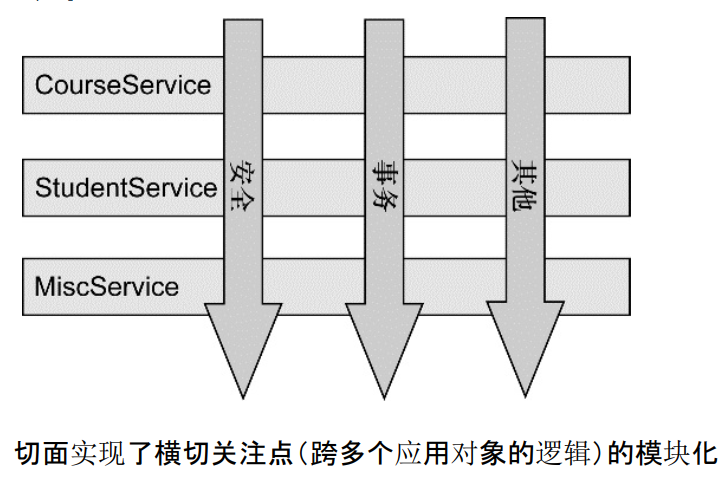

AOP （Aspect Orient Programming）--面向切面编程  
AOP是一种编程思想，将程序抽象成各个切面。  
  

1.应用场景  
=  
开发过程中有多个模块需要使用同一段代码，我们最直接的办法就是将其抽象出来，需要的时候就去调用这个方法（工具类就是一个非常经典的应用），要改动这个处理逻辑的时候，只需要修改这个抽象出来的方法就可以了。  
然鹅，事情没有这么简单，我们需要新增一个功能（这个也好办，再来一个抽象出来的方法就好了）或者删除这个方法（这个就难受了，需要找到用到的地方，然后去逐个删除），怎么办？  
这时候，AOP思想就可以被用来解决上面遇到的问题了。  
>AOP 要达到的效果是，保证开发者不修改源代码的前提下，去为系统中的业务组件添加某种通用功能。（本质是由 AOP 框架修改业务组件的多个方法的源代码，再说的明白一点AOP关键就是[代理模式](../../../设计模式/代理模式.md)的使用）  


2.AOP重要概念  
=  
| 概念 | 描述 | 
| :----: | :----:  |
| 通知（Advice） | AOP 框架中的增强处理。通知描述了切面何时执行以及如何执行增强处理。 |
|连接点（join point）|连接点表示应用执行过程中能够插入切面的一个点，这个点可以是方法的调用、异常的抛出。在 Spring AOP 中，连接点总是方法的调用。|  
|切点（PointCut）|可以插入增强处理的连接点。|  
|切面（Aspect）| 切面是通知和切点的结合。|  
|引入（Introduction）|引入允许我们向现有的类添加新的方法或者属性。|  
|织入（Weaving）| 将增强处理添加到目标对象中，并创建一个被增强的对象，这个过程就是织入。|  

3.Spring AOP的使用（注解方式）  
=  
为了构建切面，首先要能够从连接点中找到切点，然后针对该切点做点什么事（通知）  
3.1切点的寻找  
-  
  

3.2通知的使用  
-  
  

>有了切点和切面，就可以有切面了  

直接利用切点，通知来些切面类的过程中，发现不同的通知可能用的是相同的切点表达式，秉着一贯的原则，要简化代码，这时候就可以通过注解声明切点表达式  
原来的切面类里面是这样写的  
```java
    @Before("execution(* com.sharpcj.aopdemo.test1.IBuy.buy(..))")
    public void hehe() {
        System.out.println("before ...");
    }

    @After("execution(* com.sharpcj.aopdemo.test1.IBuy.buy(..))")
    public void haha() {
        System.out.println("After ...");
    }
```
简化后，是这样写的（虽然现在看着反而变多了，但是等到实际应用中比较复杂的时候，这种方式的威力才能够真正显示出来）
```java
    @Pointcut("execution(* com.sharpcj.aopdemo.test1.IBuy.buy(..))")
    public void point(){}

    @Before("point()")
    public void hehe() {
        System.out.println("before ...");
    }
    @After("point()")
    public void haha() {
        System.out.println("After ...");
    }
```

3.3引入  
-  

3.4织入  
-  


4.Spring AOP的使用（XML方式）  
=  


参考：  
1.https://www.cnblogs.com/joy99/p/10941543.html  


//TODO:内容待补充
