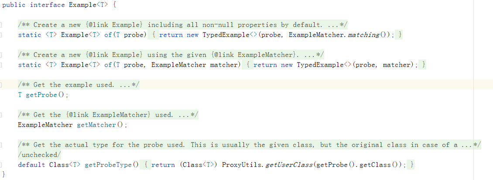

JpaRepository接口是一个分水岭，上面的接口都是为了兼容非关系型数据库的抽象封装，JpaRepository开始是对关系型数据库的抽象封装。  

JpaRepository同时继承了SimpleJpaRepository接口和QueryByExampleExecutor接口  
JpaRepository包含如下的方法：  

 快速使用：  
 我们需要使用的Repository继承JpaRepository接口即可。  


JpaRepository接口的实现类SimpleJpaRepository，是JPA关联数据库所有的Repository的接口实现类。  


JpaRepository扩展：  
QueryByExampleExecutor允许创建动态查询，并且不需要编写包含字段名称的查询  
接口源码如下
   
可以看出，其中的Example是最关键的，看懂他就很重要。  
  
里面主要有：  
Probe是用来封装查询条件的实体类，与表对应的实体用来存放条件值（查什么）  
ExampleMatcher匹配器，指定特定字段的匹配规则，如何使用查询实体中的值去匹配数据表中的数据（怎么查）  
  
Example就是一个完整的查询  
特点：  
* 支持动态查询
* 不支持过滤条件分组（查询条件都是用and连接）  
* 支持字符串的开始、包含、结束、正则和其他类型的精确匹配，由于使用实体完成查询条件的存储，就会导致同一个字段无法完成两个条件的过滤（比如：查询某一个时间类型的字段，要求其在范围a-b内）  

原理：
  

从上面可以看出来，内部类ExampleSpecification，通过Exmaple实现一套工具类
和对Predicate的构建，可以实现ExampleQuery的逻辑（两种思路：通过JpaSpecificationExecutor自定义Response的思路和对JpaSpecificationExecutor的扩展思路）  
*** 
继承JpaSpecificationExecutor的实现思路：
- 
  
可以看出，其中的Specification是最关键的，看懂他就很重要。
  
里面主要有：  
* Root<T>root  
    可以进行查询的和操作的实体对象的根，类似于表的字段
* CriteriaQuery<?>query  
    提供查询方法，select、from、where、group by、order by等。  
* CriteriaBuilder  
    条件或者是条件组合  

使用代码示例：
```java
public Page<DeviceCapability> queryByCondition(JSONObject searchCondition, Sort sort, PageUtil pageUtil) {
    logger.debug("try to qurey deviceCapability  by conditions" );
    Specification<DeviceCapability> specification = new Specification<DeviceCapability>() {
        /**
            * 构造断言
            * @param root 实体对象引用
            * @param query 规则查询对象
            * @param cb 规则构建对象
            * @return 断言
            */
        @Override
        public Predicate toPredicate(Root<DeviceCapability> root, CriteriaQuery<?> query, CriteriaBuilder cb) {
            List<Predicate> predicates = new ArrayList<>(); //所有的断言
            //这里针对设备序列号（模糊）
            if(searchCondition == null){
                return cb.and(predicates.toArray(new Predicate[0]));
            }
            if(StringUtils.isNotBlank(searchCondition.getString("deviceSerialNo"))){ //添加断言
                Predicate likeNickName = cb.like(root.get("deviceSerialNo").as(String.class),"%" + searchCondition.getString("deviceSerialNo") + "%");
                predicates.add(likeNickName);
            }
            return cb.and(predicates.toArray(new Predicate[0]));
        }
    };
    //查询
    return this.deviceCapabilityRepository.findAll(specification, PageRequest.of(pageUtil.getPageNumber(),pageUtil.getPageSize(), sort));
}
```

对于简单的查询，上面的使用方法示例，足够了。但是更好的使用，可以创建工厂：  
```java
public final class SpecificationFactory {
    /*
    * 根据字段属性模糊匹配
     */
    public static Specification containsLike(String attribute, String value){
        return ((root, query, cb) -> cb.like(root.get(attribute),"%"+value+"%"));
    }
    /*
    * 根据字段属性精确匹配
     */
    public static Specification equal(String attribute, String value){
        return ((root, query, cb) -> cb.equal(root.get(attribute),value));
    }
    /*
    * 字段在区间之间
     */
    public static Specification isBetween(String attribute, int min, int max){
        return ((root, query, cb) -> cb.between(root.get(attribute), min, max));
    }
    public static Specification isBetween(String attribute, double min, double max){
        return ((root, query, cb) -> cb.between(root.get(attribute), min, max));
    }
    public static Specification isBetween(String attribute, Date min, Date max){
        return ((root, query, cb) -> cb.between(root.get(attribute), min, max));
    }
    /*
     * in
     */
    public static Specification in(String attribute, Collection c){
        return ((root, query, cb) -> root.get(attribute).in(c));
    }
    /*
     * 大于
     */
    public static Specification greaterThan(String attribute, Long value){
        return ((root, query, cb) -> cb.greaterThan(root.get(attribute),value));
    }
    //继续增加方法，继续扩展
}

//配合Specifications使用
```  

Specifications进行使用，体检非常妙哦
```java
xxxRespository.findAll(Specifications.where(SpecificationFactory.ccontainsLike("firstName",userParam.getFirstName()))
.and(SpecificationFactory.greaterThan("version",userParam.getFirstName())),pageable)
```
Specifications是对Specification的聚合操作工具类，里面主要有：
* where  
* not  
* and
* or
***
自定义的实现思路：
- 
独立接口继承CrudRepository，独立实现类利用EntityManager操作Criteria Query API。
可以看出，我们需要先了解一下EntityManager，   
   

自定义实现Repository中获取EntityManager：
* 通过@PersistenceContext注解获取  
```java
interface xxxxclassname{
    public User XXXZmrthodname();
}

public xxxclassimpl implements xxxxclassname{
    @PersistenceContext
    EntityManager entityManager;
    //然后就可以使用了
}
```
* @Repository的子类的任何接口，通过构造方法获得  
将一个方法添加到所有的存储接口
```java
//一个中间接口来声明共享行为
@NoRepositoryBean
interface xxxxclassname<T, ID extends Serializable> extends PagingAndSortingRepository<T, ID>{
    void sharedMethod(ID, id);
}
```  
接下来的有点迷糊，没看懂，暂时不记录了......
看上起自定义的接口可以很nb，但是目前没有看懂，后续工作中遇到的时候继续学习补充
TODO
