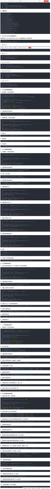

spring-data-redis针对jedis提供了如下功能:
* 连接池自动管理，提供了一个高度封装的“RedisTemplate”类  
* 针对jedis客户端中大量api进行了归类封装,将同一类型操作封装为operation接口  
```
ValueOperations：简单K-V操作
SetOperations：set类型数据操作
ZSetOperations：zset类型数据操作
HashOperations：针对map类型的数据操作
ListOperations：针对list类型的数据操作
```
* 提供了对key的“bound”(绑定)便捷化操作API，可以通过bound封装指定的key，然后进行一系列的操作而无须“显式”的再次指定Key，即BoundKeyOperations  
```
BoundValueOperations
BoundSetOperations
BoundListOperations
BoundSetOperations
BoundHashOperations
```
* 将事务操作封装，有容器控制  
* 针对数据的“序列化/反序列化”，提供了多种可选择策略(RedisSerializer)  
```
JdkSerializationRedisSerializer：POJO对象的存取场景，使用JDK本身序列化机制，将pojo类通过ObjectInputStream/ObjectOutputStream进行序列化操作，最终redis-server中将存储字节序列。是目前最常用的序列化策略。  

StringRedisSerializer：Key或者value为字符串的场景，根据指定的charset对数据的字节序列编码成string，是“new String(bytes, charset)”和“string.getBytes(charset)”的直接封装。是最轻量级和高效的策略。  

JacksonJsonRedisSerializer：jackson-json工具提供了javabean与json之间的转换能力，可以将pojo实例序列化成json格式存储在redis中，也可以将json格式的数据转换成pojo实例。因为jackson工具在序列化和反序列化时，需要明确指定Class类型，因此此策略封装起来稍微复杂。【需要jackson-mapper-asl工具支持】  
```   

针对[redis](../../../../数据库/Redis/redis.md)的五种数据类型的使用：  



参考：  
1.https://blog.csdn.net/weixin_44624117/article/details/105224210  

