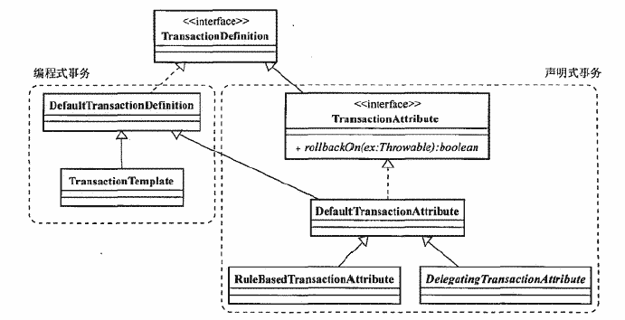

基本原则：让事务管理的关注点与数据访问关注点分离  
    

一、spring事务管理实现过程理解（统一中原）  
=  
核心接口：PlatformTransactionMannger(为应用程序提供事务界定的统一方式)，具体的实施由相应的实现类实现（不同的数据访问方式，全局事务场景）。  

实现的思路：  
以JDBC为例进行说明，JDBC是利用Connection实现事务管理的，所以在一个事务中，需要保证是同一个Connection（connection-passing）  
    
但是，这么做，就写死了connection，要换成hibernate的session怎么办？？？（但是这种想法是对的）  
  
这里引进TransactionResourceManager，对数据访问连接资源进行管理（一艘大船（具体是什么船与具体的核心接口实现类相关），要访问数据的时候，可以直接访问这艘船）

上述过程的代码实现原型  
1 核心接口（战略蓝图）：
  

2 数据访问控制（建造大船）：
  

3 核心接口的JDBC的实现类（实现对应的事务管理，确定是一艘什么船）：  
  

4 获取数据库连接并使用（访问大船）：  
  

二、大树底下好乘凉，也要看看大树张什么样子（和平年代）  
=  
从核心接口里面可以看出来，主要的接口有三个  
1.TransactionDefinition  
-  
事务属性定义：事务隔离级别、传播行为、超时时间、是否只读  
### 1.1隔离级别  
|  隔离级别 | 描述 |
| :----: | :----: |
|  ISOLATION_DEFAULT | 默认的隔离级别，read commited |
|  ISOLATION_READ_UNCOMMITTED | 隔离级别读未提交，无法避免脏读，不可重复读和幻读 |
|  ISOLATION_READ_COMMITTED | 隔离级别读已提交，无法避免不可重复读与幻读 |
|  ISOLATION_REPEATABLE_READ | 隔离级别可重复读，无法避免幻读 |
|  ISOLATION_SERIALIZABLE | 隔离级别串行，并发效率低 |

### 1.2传播行为  
>表示整个事务处理过程所跨越的业务对象将以什么样的行为参与事务  
|  事务传播行为 | 描述 |
| :----: | :----: |
|  PROPAGATION_REQUIRED | 如果当前存在一个事务，则加入当前事务；如果不存在任何事务，则创建一个事务，常作为默认事务传播行为 |
|  PROPAGATION_SUPPORTS | 如果当前存在一个事务，则加入当前事务；如果不存在事务，则直接执行（保证当前方法加入当前事务，并洞察当前事务对数据资源的更新） |
|  PROPAGATION_MANDATORY | 强制要求当前存在一个事务，如果不存在，则抛出异常（某个方法需要事务，但是自身又不管理提交与回滚） |
|  PROPAGATION_REQUIRES_NEW | 不管当前是否存在事务，都会创建新的事务；如果当前存在事务，会将当前的事务挂起（某个业务对象所做的事情不想影响到外层的事务） |
|  PROPAGATION_NOT_SUPPORTED | 不支持当前事务，在没有事务的情况下执行 |
|  PROPAGATION_NEVER | 不需要当前事务，如果存在事务，抛出异常 |
|  PROPAGATION_NESTED | 如果存在事务，在其中嵌套一个事务执行，否则类似于REQUIRED，与NEW类似，但是是在事务内部，内部事务会影响到外部的事务（大的事务划分为多个小的事务） |

>不是所有PlatformTransactionManager的事务实现类都支持PROPAGATION_NESTED

### 1.3超时时间  
TIMEOUT_DEFAULT指定事务的超时时间，默认为-1，表示采用当前事务系统默认的超时时间

### 1.4是否只读  
isReadOnly，只读事务（一些查询）

这个接口的实现类可以划分为编程式事务与声明式事务两大类  
DefaultTransactionDefinition是默认实现类，提供了各事务属性的默认值，setter方法可以进行修改  

TransactionTemplate是模板方法类  
TransactionAttribute是面向AOP的进行声明式事务管理的，添加`rollbackOn()`方法用于指定在发生哪些异常的时候回滚事务  

2.TransactionStatus  
-  
表示整个事务处理过程中的事务状态，更多的在编程式事务中使用  
查询事务的状态  
`setRollbackOnly()`标记当前事务以使其回滚  
如果支持SavePoint，可以创建嵌套事务  

3.PlatformTransactionMannger  
-  
这里式[策略模式](../../../../设计模式/设计模式headfirst.md)的一个最佳实践。  
局部事务  
  
全局事务  
JtaTransactionManager是Spring提供的支持分布式事务的实现  