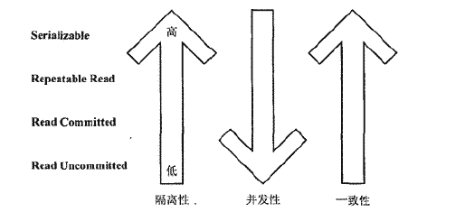
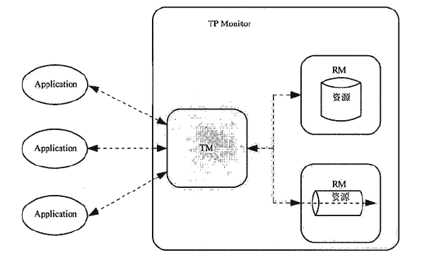
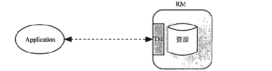

事务的目的是为了保证数据资源始终处于一种正确的状态。  
一、基础概念  
=  
4个限定的特性（ACID）：  
1. 原子性(Atomicity)  
>事务包含的操作要么都成功，要么都失败  

2. 一致性(Consistency)  
>事务操作前后资源要是一致的，银行转账为例，转账操作前后，总的数目之和不能发生变化  

3. 隔离性(Isolation)  
>多个事务之间的相互影响程度，不同的隔离级别决定了各个事务对该数据资源访问的不同行为  
隔离级别：  
| 隔离级别 | 描述 |
|  :----: |  :----: |
| Read Uncommitted | 最低的隔离级别，一个事务可以读取到另外一个事务未提交的更新结果 |
| Read Committed | 大多数据库的默认级别，一个事务在更新操作提交之后，另一个事务才可以读取到这条数据的更新结果 |
| Repeatable Read | 整个事务过程中，对同一笔数据的读取始终是一样的，不管其他事务是否在对这笔数据进行操作 |
| Serializable | 最严格的事务隔离级别，所有事务操作都必须要依次顺序执行，最为安全，但是效率较低 |

问题：  
| 问题 | 描述 |
|  :----: |  :----: |
| 脏读 | 一个事务对数据进行更新，但是还没有提交事务，这时另一个事务却可以读取到这些未提交的数据 |
| 不可重复读 | 同一个事务操作过程中，对同一笔数据读取，每次读取结果不一致（数据被更新） |
| 幻读 | 一个查询在整个事务中多次执行，执行结果集不一样，针对的是多笔记录的情况（数据记录数量增加或极少） |  

隔离级别与能够解决的问题的对应关系：  
| 隔离级别 | 脏读 | 不可重复读 | 幻读 |
|  :----: |  :----: | :----: | :----: |
| Read Uncommitted | 有 | 有 | 有 |
| Read Committed | 无 | 有 | 有 |
| Repeatable Read | 无 | 无 | 有 |
| Serializable | 无 | 无 | 无 |

  

4. 持久性(Durability)  
>事务完成之后，是不可逆转的，即使服务挂了，在起来也要是事务执行完成之后的状态  

二、基本成员  
=  
1. Resource Manager(RM)  
>负责管理数据资源的状态  

2. Transaction Processing Monitor(TPM)  
>负责协调多个RM的事务管理  

3. Transaction Manager(TM)  
>TPM的核心，直接负责RM协调，提供事务界定、事务传播等接口  

4. Application  
>独立存在或运行在容器中的应用程序  

这些成员并不是出现在所有的事务中，根据事务的分类会有不同的情况：全局事务和局部事务（区别在于事务中涉及多少个RM，而不是系统中有多少个RM）  
全局事务：事务涉及多个RM，Application需要经过TPM与RM打交道   
  
局部事务：只有一个RM，为了避免TPM协调多个RM造成的性能负担，简化协调的复杂度，不涉及TPM，Application直接与RM打交道
    

3.问题  
=  
Java开发过程中可能会遇到的RM主要有：数据库和消息服务。  
然鹅，数据库和消息服务都有很多种，每一种有自己的事务API；这还只是Java的局部事务部分；对于Java的分布式事务，还有JTA和JCA，这对于开发应用程序来说有几个重要的问题：和具体的数据访问方式绑定，代码移植性低；没有统一的异常处理；API太多样化，不易管理。。。。。。   

重点来啦：  
  

***[Spring事务框架](./Spring事务框架.md)帮我们解决了这些问题***  
-   
>按照统一的编程模型来进行事务编程，不用关心所使用的数据访问技术以及具体的是什么类型的事务资源