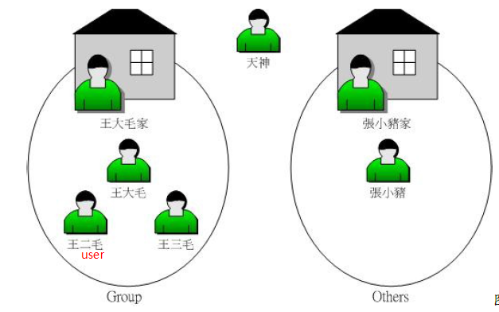
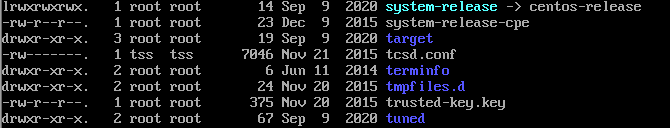
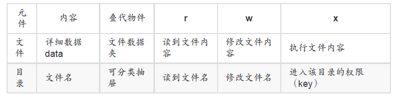

基本概念与操作  
=  
文件拥有者：Linux是个多用户多任务的系统，因此可能常常会有多人同时使用这部主机来
进行工作的情况发生， 为了考虑每个人的隐私权以及每个人喜好的工作环境，因此，这
个“文件拥有者”的角色就显的相当的重要。  
群组：团队开发资源，每组的组员之间必须要能够互相修改对方的数据， 但是其他组的组
员则不能看到本组自己的文件内容，同时，如果我自己还有私人隐密的文件，仍然可以设置成让自己
的团队成员也看不到我的文件数据，且每个帐号都可以有多个群组的支持。  
其他人:
root(最顶级的存在)
  
***注意***：所有的系统上的帐号与一般身份使用者，还有那个root的相关信息， 都是记录在`/etc/passwd`这个文件内的;至于个人的密码则是记录在`/etc/shadow`这个文件下;所有的群组名称都纪录在`/etc/group`内。

1.查看文件目录
命令行：ls -al  
解释：list all （列出所有文件的详细的权限与属性，包括隐藏文件）
结果：  
  
结果中各部分的意思：  
1.1第一栏代表这个文件的类型与权限  
 
第一个字符代表这个文件是“目录、文件或链接文件等等”：  
当为`d`则是目录;`-`则是文件;`l`则表示为链接文件;`b`则表示为设备文件里面的可供储存的周边设备;`c`则表示为设备文件里面的序列埠设备;  
接下来的字符中，以三个为一组，且均为“rwx” 的三个参数的组合。`r`代表可读
（read）、`w`代表可写（write）、`x`代表可执行（execute）这三个权限的位置不会改变，如果没有权限，就会出现减号`-`而已。第一组为“文件拥有者可具备的权限”；第二组为“加入此群组之帐号的权限”；第三组为“非本人且没有加入本群组之其他帐号的权限”。  
1.2第二栏表示有多少文件名链接到此节点（i-node）；
1.3第三栏表示这个文件（或目录）的“拥有者帐号”；  
1.4第四栏表示这个文件的所属群组；  
1.5第五栏为这个文件的容量大小，默认单位为Bytes；  
1.6第六栏为这个文件的创建日期或者是最近的修改日期；  
1.7第七栏为这个文件的文件名（如果文件名之前多一个“.”，则代表这个文件为“隐藏文件”）

2.改变文件的属性与权限  
命令行：chgrp [ -R ] dirname/filename...  
解释：-R表示递归变更，即将次目录下的所有文件所属的群组都改变为指定群组。  
示例：chgrp users initial-setup-ks.cfg  (将initial-setup-ks.cfg文件的群组变换为users，如果这个群组不存在就会报错)  

命令行：  
chown \[-R\] 帐号名称 文件或目录  
chown \[-R\] 帐号名称:群组名称 文件或目录  
解释：改变文件拥有者与群组  
示例：chown root:root initial-setup-ks.cfg  

改变文件的权限有两种方式：数字与符号  
数字类型：九个权限三个一组，分别使用数字代替：> r:4 > w:2 > x:1，还是3个一组  
命令行：chmod \[-R\] xyz 文件或目录  
解释：xyz : x/y/z就是刚刚提到的数字类型的权限属性，为rwx属性数值的相加。  
示例：chmod 644 .bashrc   

符号类型：
命令行：chmod u=rwx,g=rwx,o=rwx filename  
解释：u=rwx,go=rx 是连在一起的，中间并没有任何空白字符，借由u, g, o来代表三种
身份（user/group/others）的权限！此外，a则代表 all 亦即全部的身份！  
示例：chmod u=rwx,go=rx .bashrc  

3.拷贝文件  
命令行：cp 来源文件 目的文件  
解释：将来源文件这个文件拷贝成为目的文件  
示例：cp .bashrc .bashrc_test  

--------

linux系统下文件权限设置的意义在哪儿  
=
权限对文件的重要性    
r：可读取文件的实际***内容***，如文本文档的内容等  
w：可以编辑、新增或者是修改该文件的***内容***（但不含删除该文件）  
x：改文件具有可以被系统执行的权限（这里Windows不一样，Windows下面一个文件是否具有执行的能力是借由“ 扩展名 ”来判断的，例如：.exe,.bat, .com）  
权限对目录的重要性  
r：具有读取目录结构清单的权限  
w：具有异动该目录结构清单的权限（包括但不限于创建新的文件与目录、删除已经存在的文件与目录（不论该文件的权限为何！）、将已存在的文件或目录进行更名、搬移该目录内的文件、目录位置）   
x：代表的是使用者能否进入该目录成为工作目录的用途  


这里需要注意的是只要当前用户对目录有w权限，就可以删除其中的文件，当前用户无论是否拥有这个文件的相关权限。  

文件的种类与扩展名
=  
文件类型
-  
1.\- 一般文件  
    纯文本文件（ASCII）(cat ~/.bashrc阅读内容)  
    二进制档（binary）（cat本身就是）  
    数据格式文件（data）

2.d 目录  
3.l 链接文件  
4.设备与设备文件（device），通常都集中在/dev这个目录之下  
    b 区块（block）设备文件：一些储存数据， 以提供系统随机存取的周边设备，举
例来说，硬盘与软盘等
    c 字符（character）设备文件：亦即是一些序列埠的周边设备， 例如键盘、鼠标等
5.s 数据接口文件（sockets）：这种类型的文件通常被用在网络上的数据承接了，最常在/run或/tmp这些个目录中看到这种文件类型  
6.p 数据输送档（FIFO, pipe）：FIFO（first-in-first-out）也是一种特殊的文件类型，他主要的目的在解决多个程序同时存取一个文件所造成的错误问题。

 文件拓展名  
 -  
1 *.sh ： 脚本或批处理文件 （scripts），因为批处理文件为使用shell写成的  
2 Z, .tar, .tar.gz, .zip, *.tgz： 经过打包的压缩文件  
3 .html, .php：网页相关文件，分别代表 HTML 语法与 PHP 语法的网页文件  


文件名的长度限制  
单一文件或目录的最大容许文件名为 255Bytes，以一个 ASCII 英文占用一个 Bytes 来说，则大约可达 255 个字符长度。若是以每个中文字占用 2Bytes 来说， 最大文件名就是大约在 128 个中文字之谱！  

文件名称字符限制  
由于指令会用到一些特殊字符，尽量避免 
```
? > < ; & ! [ ] | \ ' " ` （ ） { }
```  

文件的一些基本知识学完了，接下来看看这个操作系统的一些常用目录以及是什么含义  

linux目录配置  
