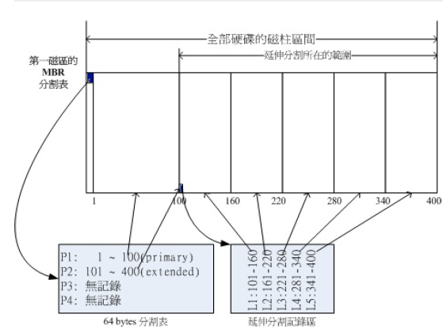

大致了解一下磁盘的硬件结构与基础概念：  
>https://www.cnblogs.com/linux-xin/p/8144663.html  

1.磁盘连接的方式与设备文件名  
= 
正常的实体机器大概使用的都是 /dev/sd[a-] 的磁盘文件名（根据Linux核心侦测到磁盘的顺序，并非与实际插槽代号有关）  

虚拟机环境下面，为了加速，可能就会使用 /dev/vd[a-p] 这种设备文件名  

2.分区
=  
2.1MSDOS （MBR） 分区表格式与限制  
-  
Master Boot Record, 主要开机纪录区（512Bytes）  
主要开机记录区（Master Boot Record, MBR）：可以安装开机管理程序的地方，有446Bytes  
分区表（partition table）：记录整颗硬盘分区的状态，有64 Bytes（最多仅能有四组记录区，每组记录区记录了该区段的启始与结束的柱面号码）  
  

分区只是操作那个分区表设置，只能写入4组（主要或延伸分区\[最多一个\]，延伸分区利用额外的分区记录跟多分区信息，会分佈在每个分区的最前面几个扇区来记载分区信息，这些分区称为逻辑分区，逻辑分区的设备名称号码由5号开始），分区的最小单位是柱面，写入磁盘的时候要参考磁盘分区表才可以。  

分区主要是为了数据的安全（数据分布在不同的区，互不影响）和读写效率的提高（减少检索范围）。  

这样的分区方式限制了磁盘容量，太大就访问不到了，针对大容量硬盘要分很多个区，麻烦  

2.2GUID partition table, GPT 磁盘分区表  
已经有 4K 的扇区设计出现，过去一个扇区大小就是 512Bytes

