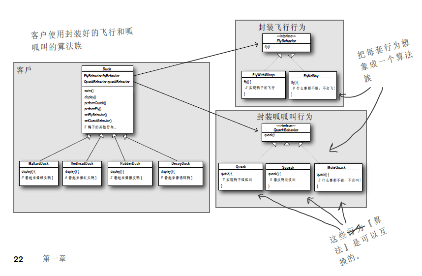
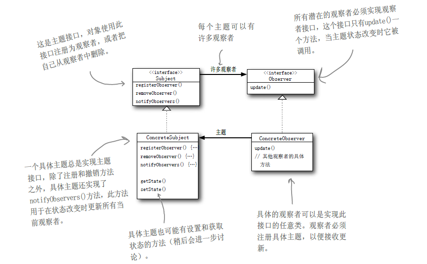
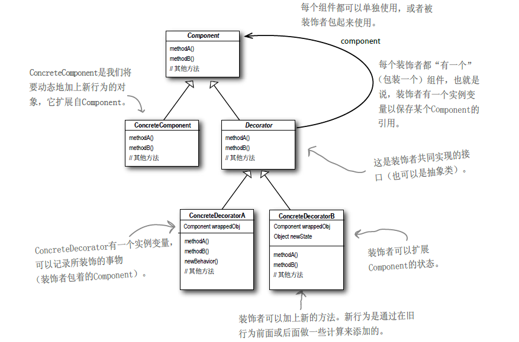
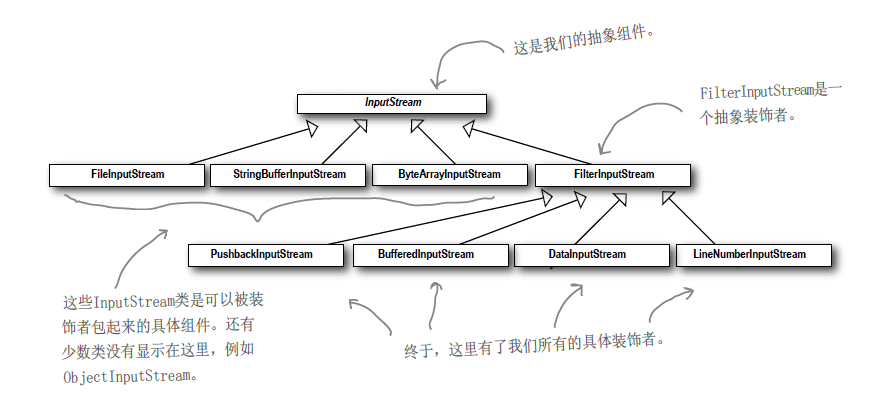
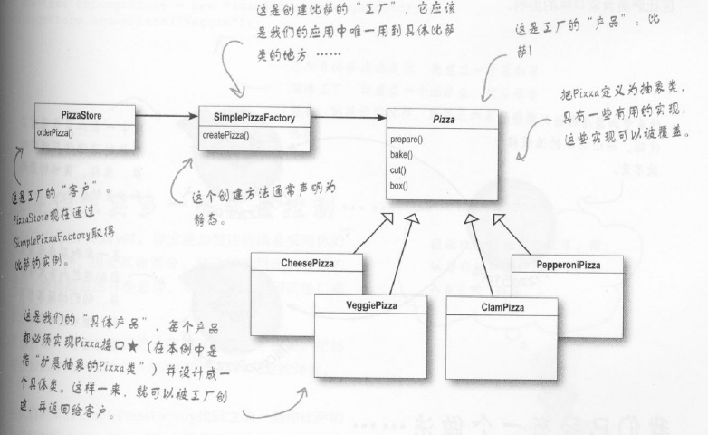
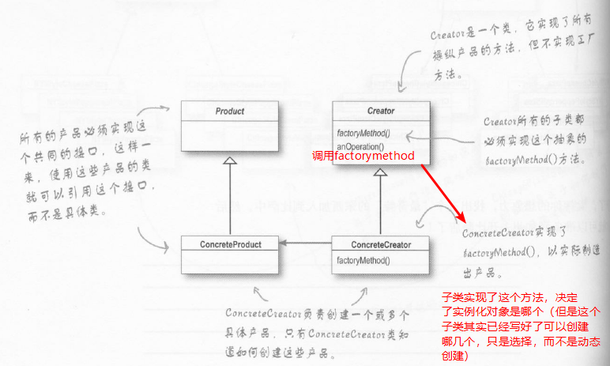

head first真的是一本设计模式学习的好书，对的起网上的一致好评

1.策略模式：为一种行为提供一组类似的策略供选择，对应为一个接口与其多个实现类

分离变化与不变的部分  
多用组合，少用继承（has a 有时候比 is a要好用）  
针对接口编程，不针对实现编程  

2.观察者模式：报社和读者的关系类比，读者订阅，报社有新报纸就推送给订阅的读者  
  

3.装饰者模式：咖啡店的咖啡可以加不同的料，还可以重复，其实就是在不断地包装原版的咖啡，但无论怎么包装，本质没有变，还是咖啡  
   
对应到java的实际源码中，最典型的就是在java的io包中的使用  
   

4.工厂模式：
简单工厂作为引入：关键在于分离变化与不变的部分（将new的过程抽离出来，放进简单工厂类中），这样，需要new新增的实现类的时候只要改工厂中相关部分即可。  
  
工厂模式：使用多个简单工厂，完成某一项功能的时候（a有a的工厂，b有b的工厂，但是a和b的功能是类似的，对a和b的公共部分要进行提取）  
   
>简单工厂与工厂  
>简单工厂直接在一个工厂类里面把所有的事情就做完了，new出来具体对象（可以封装对象的创建过程，但是弹性不如工厂模式），而工厂方法是提供一个框架，让子类来决定具体实现，子类new出来的具体对象  

