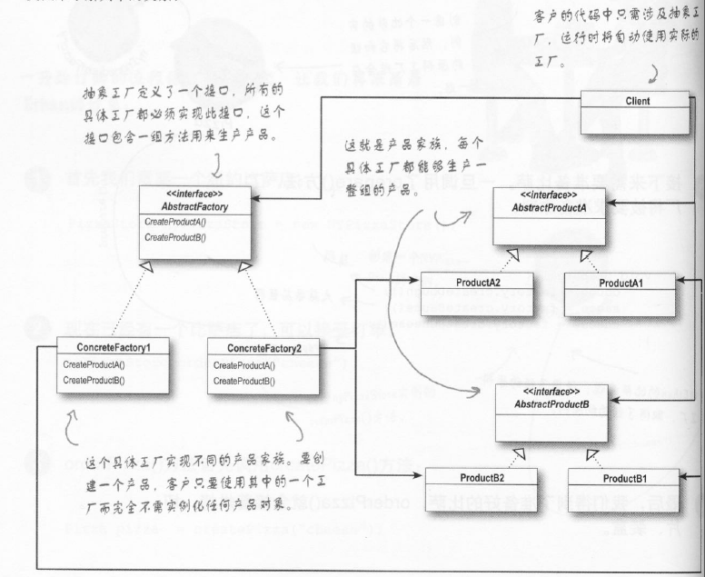
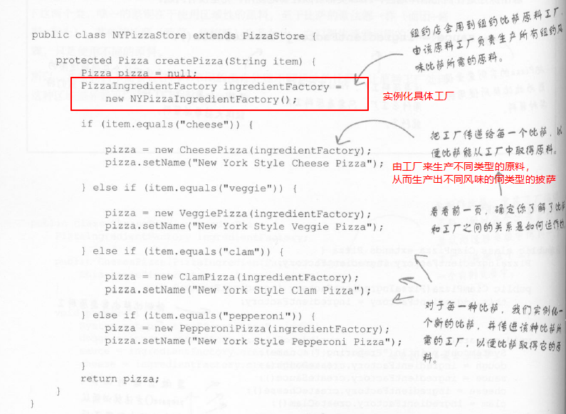
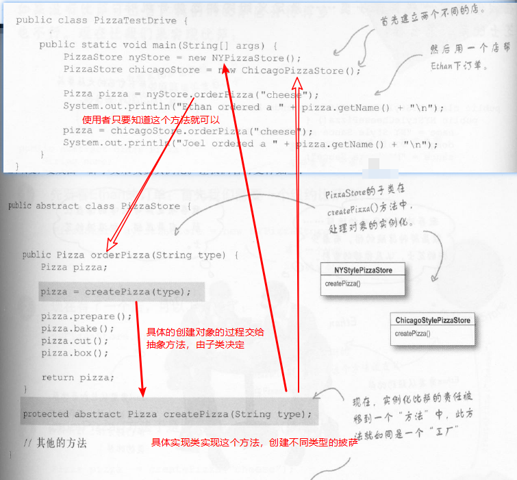
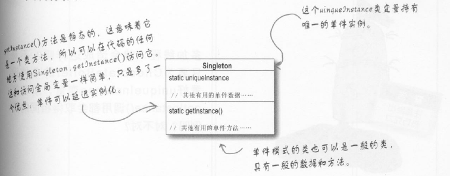
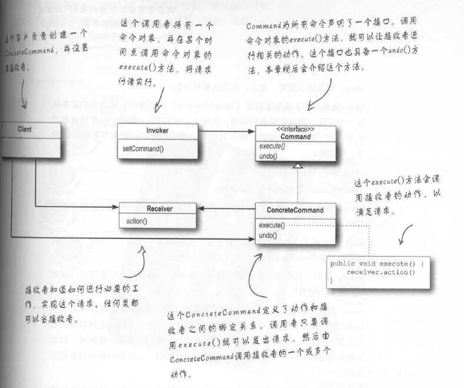

head first真的是一本设计模式学习的好书，对的起网上的一致好评

1.策略模式：为一种行为提供一组类似的策略供选择，对应为一个接口与其多个实现类

分离变化与不变的部分  
多用组合，少用继承（has a 有时候比 is a要好用）  
针对接口编程，不针对实现编程  

2.观察者模式：报社和读者的关系类比，读者订阅，报社有新报纸就推送给订阅的读者  
  

3.装饰者模式：咖啡店的咖啡可以加不同的料，还可以重复，其实就是在不断地包装原版的咖啡，但无论怎么包装，本质没有变，还是咖啡  
   
对应到java的实际源码中，最典型的就是在java的io包中的使用  
   

4.工厂模式：
简单工厂作为引入：关键在于分离变化与不变的部分（将new的过程抽离出来，放进简单工厂类中），这样，需要new新增的实现类的时候只要改工厂中相关部分即可。  
  
工厂模式：使用多个简单工厂，完成某一项功能的时候（a有a的工厂，b有b的工厂，但是a和b的功能是类似的，对a和b的公共部分要进行提取）  
   
>简单工厂与工厂  
>简单工厂直接在一个工厂类里面把所有的事情就做完了，new出来具体对象（可以封装对象的创建过程，但是弹性不如工厂模式），而工厂方法是提供一个框架，让子类来决定具体实现，子类new出来的具体对象  
  
创建产品的家族，抽象工厂模式提供一个接口，用于创建相关或依赖对象的家族，而不需要明确指定具体类。  
>抽象工厂其实就是定义了一个接口（如果这个接口里面有通用的实现方法，可以改写成抽象类），具体的工厂实现类实现了具体产品的创建，找到对应的工厂即可创建对应的一组相关产品，无需关心具体产品是什么了。（对应披萨店的例子就是，生产原料的时候只要知道纽约的披萨店去找纽约的工厂就可以，而不用关心纽约工厂生产返回的原料具体是什么）  

>区别于联系:  
>联系：  
>抽象工厂的每个方法看上去就是工厂方法，每个方法都被抽象，而子类负责具体的实现，创建某些对象。  
>区别：  
>工厂方法是通过继承实现创建不同的对象(使用者知道抽象类就可以，具体对象的创建是其中的工厂方法在具体子类中实现的)，而抽象工厂是通过对象的组合实现（想要使用工厂，就需要实例化对应的工厂，然后将其交给特定的代码，完成具体对象的创建）  
>在head first的例子里面：工厂方法通过传入的参数来确定具体需要创建的披萨类型；而抽象工厂，则是通过指定特定的工厂，来生产对应的不同口味的披萨  

  
  

5.单例模式：  
有的时候，在程序运行的过程中，只需要某类型的一个对象，多个对象会导致出错，这时候就需要单例模式。
  
>单例的关键在于：私有化构造函数，但是又要提供一个方法可以在一开始创建一个对象，要不然就是先有鸡还是先有蛋的问题  
>解决之道：（1）私有化构造函数；（2）静态方法获取对象【在这里面创建单例对象，保证只有一个对象存在】；（3）静态变量，保存目标对象  

由于多线程的使用，单例模式的使用需要考虑更多，由此引出线程安全的单例模式：  
>sychronized加锁  
>双重检查（volatile+sychronized实现的）  
>饿汉式  

6.命令模式：  
使用者只需要给出操作命令即可，具体的实现不用关心，就像顾客点菜，服务员把菜单拿走并交给厨师完成菜品的制作  
  
>命令模式的实际应用场景：日志请求，将所有的动作都记录在日志中，并在系统死机等意外情况发生之后，重新调用这些动作恢复到之前的状态（save()和load()），还有就是事务控制了，一整群事务要么全部完成，要么不进行任何的操作。  

7.适配器模式与外观模式：

