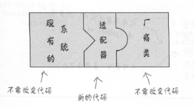
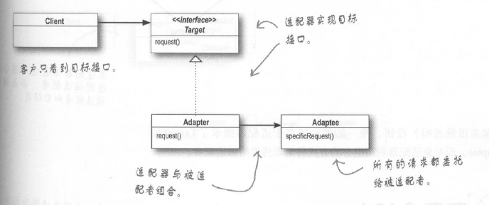
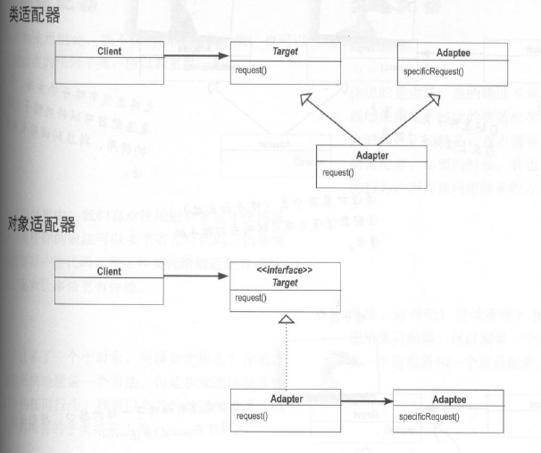
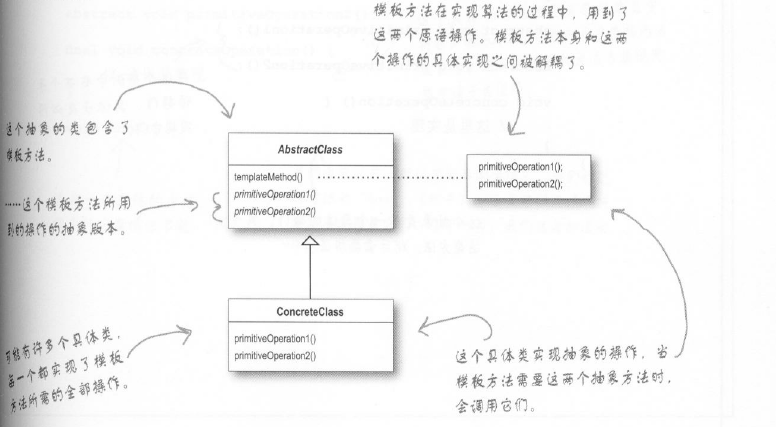
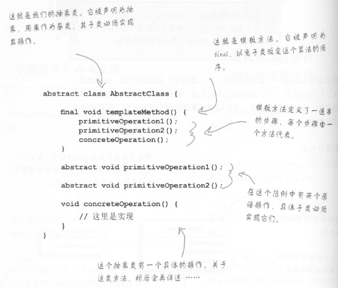
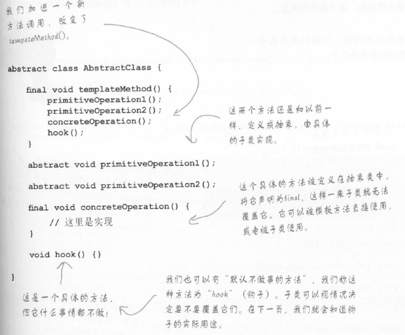
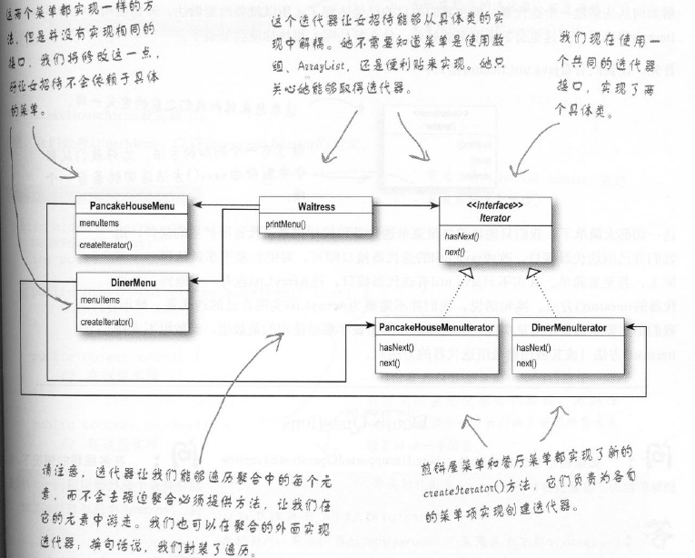
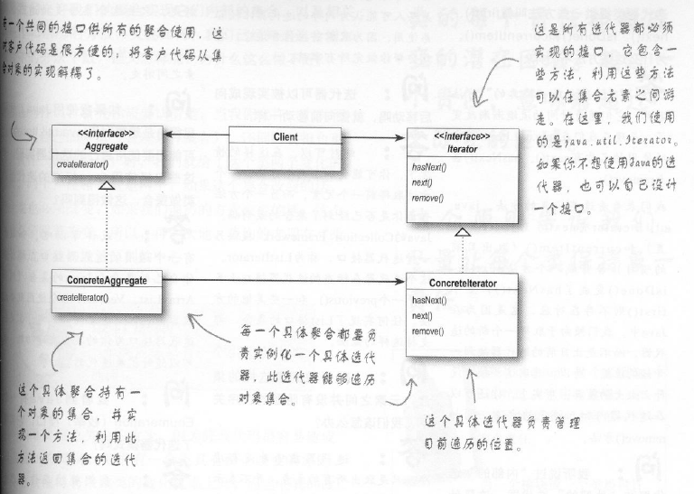
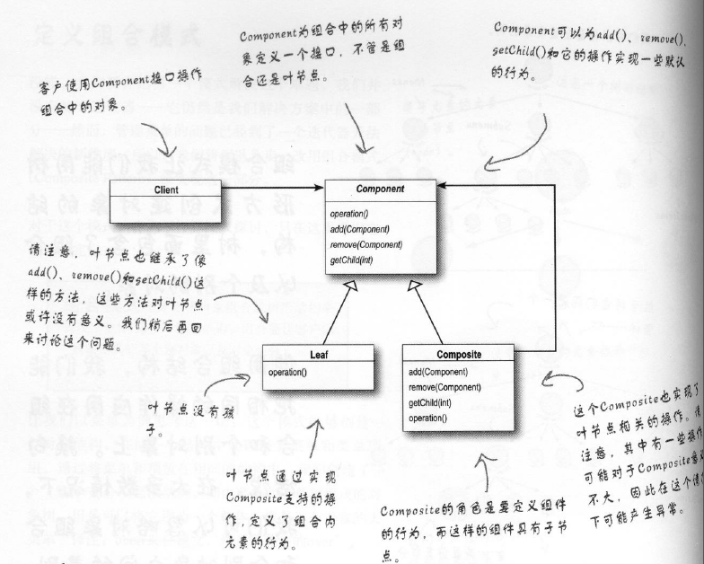
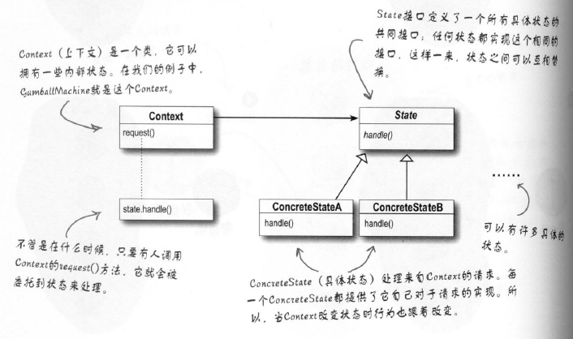

head first真的是一本设计模式学习的好书，对的起网上的一致好评

1.策略模式：为一种行为提供一组类似的策略供选择，对应为一个接口与其多个实现类

分离变化与不变的部分  
多用组合，少用继承（has a 有时候比 is a要好用）  
针对接口编程，不针对实现编程  

2.观察者模式：报社和读者的关系类比，读者订阅，报社有新报纸就推送给订阅的读者  
  

3.装饰者模式：咖啡店的咖啡可以加不同的料，还可以重复，其实就是在不断地包装原版的咖啡，但无论怎么包装，本质没有变，还是咖啡  
   
对应到java的实际源码中，最典型的就是在java的io包中的使用  
   

4.工厂模式：
简单工厂作为引入：关键在于分离变化与不变的部分（将new的过程抽离出来，放进简单工厂类中），这样，需要new新增的实现类的时候只要改工厂中相关部分即可。  
  
工厂模式：使用多个简单工厂，完成某一项功能的时候（a有a的工厂，b有b的工厂，但是a和b的功能是类似的，对a和b的公共部分要进行提取）  
   
>简单工厂与工厂  
>简单工厂直接在一个工厂类里面把所有的事情就做完了，new出来具体对象（可以封装对象的创建过程，但是弹性不如工厂模式），而工厂方法是提供一个框架，让子类来决定具体实现，子类new出来的具体对象  
  
创建产品的家族，抽象工厂模式提供一个接口，用于创建相关或依赖对象的家族，而不需要明确指定具体类。  
>抽象工厂其实就是定义了一个接口（如果这个接口里面有通用的实现方法，可以改写成抽象类），具体的工厂实现类实现了具体产品的创建，找到对应的工厂即可创建对应的一组相关产品，无需关心具体产品是什么了。（对应披萨店的例子就是，生产原料的时候只要知道纽约的披萨店去找纽约的工厂就可以，而不用关心纽约工厂生产返回的原料具体是什么）  

>区别于联系:  
>联系：  
>抽象工厂的每个方法看上去就是工厂方法，每个方法都被抽象，而子类负责具体的实现，创建某些对象。  
>区别：  
>工厂方法是通过继承实现创建不同的对象(使用者知道抽象类就可以，具体对象的创建是其中的工厂方法在具体子类中实现的)，而抽象工厂是通过对象的组合实现（想要使用工厂，就需要实例化对应的工厂，然后将其交给特定的代码，完成具体对象的创建）  
>在head first的例子里面：工厂方法通过传入的参数来确定具体需要创建的披萨类型；而抽象工厂，则是通过指定特定的工厂，来生产对应的不同口味的披萨  

  
  

5.单例模式：  
有的时候，在程序运行的过程中，只需要某类型的一个对象，多个对象会导致出错，这时候就需要单例模式。
  
>单例的关键在于：私有化构造函数，但是又要提供一个方法可以在一开始创建一个对象，要不然就是先有鸡还是先有蛋的问题  
>解决之道：（1）私有化构造函数；（2）静态方法获取对象【在这里面创建单例对象，保证只有一个对象存在】；（3）静态变量，保存目标对象  

由于多线程的使用，单例模式的使用需要考虑更多，由此引出线程安全的单例模式：  
>sychronized加锁  
>双重检查（volatile+sychronized实现的）  
>饿汉式  

6.命令模式：  
使用者只需要给出操作命令即可，具体的实现不用关心，就像顾客点菜，服务员把菜单拿走并交给厨师完成菜品的制作  
  
>命令模式的实际应用场景：日志请求，将所有的动作都记录在日志中，并在系统死机等意外情况发生之后，重新调用这些动作恢复到之前的状态（save()和load()），还有就是事务控制了，一整群事务要么全部完成，要么不进行任何的操作。  

7.适配器模式与外观模式：
就如同我们日常生活中的适配器一样，中间来一个适配器使得原来不兼容的接口可以兼容（电源插头三脚向两脚的转换）
  
  
>由于java中没有多重继承这一说，所以就不存在类适配器，类适配器继承目标类和被适配类（is a
），而对象适配器是引用（has a）
  

外观模式：简化接口操作，隐藏一些复杂的关系  
head first里面的例子就是家庭影院，由于家庭影院涉及的设备很多，要开始看电影和看完电影关掉设备有一系列的操作要完成，非常复杂，这时候就把这些接口组织起来，对外只显示几个组织后的接口，简化操作。  
  

>装饰模式、适配器模式、外观模式  
>设计意图：装饰者模式在原来接口的基础上，不改变接口，加入责任；适配器模式将一个接口转变为另一个接口；外观模式是让接口更简单。  

8.模板方法模式：  
在一个方法中定义一个算法的骨架，而将一些步骤延迟到子类中，使得子类在不改变算法结构的情况下，重新定义算法中的某些步骤。  
  
  
引入钩子，改进代码实现：  
   
>钩子用途：  
>(1)实现算法子类中的可选部分  
>(2)让子类能够有机会对模板方法中某些即将发生的步骤作出反应  
>(3)让子类有能力为其抽象类做一些决定  

实际应用中，数组排序就是就是一个模板方法的经典应用，Comparable接口的compareToff就是一个模板方法

>模板方法模式与策略模式  
>模板方法模式的目标是定义一个算法的大纲，具体的实现交给子类完成；策略模式则是定义了一个家族，相互之间可以在运行过程进行替换。   

9.迭代器模式：  
顺序遍历一个集合内部的元素，但是又不用知道内部是如何表示的；把游走的任务放在迭代器上，而不是聚合，简化聚合的接口和实现。  
  
引入钩子，改进代码实现：  
   

组合模式：  
将对象组合成树形结构来表现“整体/部分”层次机构，组合能让客户以一致的方式处理个别对象以及对象组合。  
  

迭代器模式与组合模式的例子存在着重复打印的问题，但是没有找出来，后续需要想想为啥，是在哪个地方出问题了，或者怎么样可以把过程看的更清楚一些  

10.状态模式：  
对象在内部状态改变的时候改变他的行为，对象看起来好像修改了他的类  
  
>与策略模式相比，状态模式上下文对象会根据状态改变，不需要使用者关心现在是什么状态，状态改变都是定义好了的；策略模式没有这样一组状态的装换，需要亲自控制对象使用什么策略  

11.代理模式：  
为另一个对象提供一个替身或占位符以控制对这个对象的访问（创建一个代表对象，让代表对象控制某个对象的访问，这个对象可以是远程对象，创建开销大的对象或者需要安全控制的对象）
  

[代理模式的深入理解](./代理模式.md)

